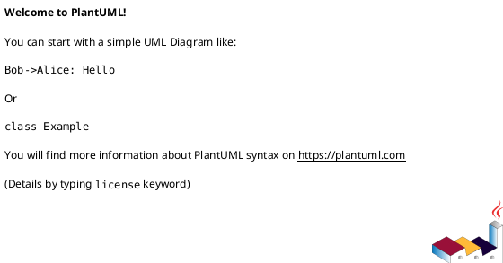
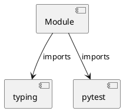

# Module Specification: conftest

* **Source Reference:** `tests/application/mcp/conftest.py`

## 1. Architectural Role & Responsibilities
**Purpose:**
Provides functionality related to conftest.

**Architecture Layer:**
- Infrastructure/Other

**Responsibilities:**
- Manage and execute operations for conftest.

**Main Workflow:**
- Initialize components and process requests for conftest.

## 2. Dependencies
**Imports:**
- `typing`
- `pytest`

**Exported Classes:**
- None

**Exported Functions:**
- `sample_goal`
- `sample_task`
- `sample_diff`
- `sample_changes`
- `insecure_diff`

## 3. Architecture & Execution
### Internal Architecture
Follows standard modular design, encapsulating state and behavior within defined classes and functions.

### Execution Flow
Sequential execution of defined functions and class methods.

### Sequence Explanation
Clients instantiate classes or call functions, which execute business logic and return results.

## 4. UML 2.0 Diagrams
### Class Diagram

### Dependency Graph

## 5. Class & Method Specifications
## 6. Module Functions
### `sample_goal()`
Return a sample goal for plan_mission tests.

**Inputs:**
- None

**Output:**
- Return Type: `str`

### `sample_task()`
Return a sample task dict for execute_code tests.

**Inputs:**
- None

**Output:**
- Return Type: `Any`

### `sample_diff()`
Return a sample code diff for security_review tests.

**Inputs:**
- None

**Output:**
- Return Type: `str`

### `sample_changes()`
Return sample file changes for run_tests tests.

**Inputs:**
- None

**Output:**
- Return Type: `Any`

### `insecure_diff()`
Return a diff with security issues for testing.

**Inputs:**
- None

**Output:**
- Return Type: `str`
