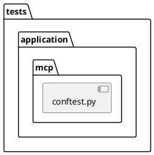
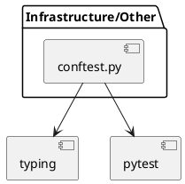
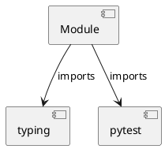

# Module Specification: conftest

* **Source Reference:** `tests/application/mcp/conftest.py`

## 1. Architectural Role & Responsibilities
**Purpose:**
Provides functionality related to conftest.

**Architecture Layer:**
- Infrastructure/Other

**Responsibilities:**
- Not explicitly defined.

**Main Workflow:**
- Not explicitly defined.

## 2. Dependencies
**Imports:**
- `typing`
- `pytest`

**Exported Classes:**
- None

**Exported Functions:**
- `sample_goal`
- `sample_task`
- `sample_diff`
- `sample_changes`
- `insecure_diff`

**Exported Interfaces:**
- Not explicitly defined.

**Public API:**
- Not explicitly defined.

## 3. Architecture & Execution
### Internal Architecture
Not explicitly defined.

### Execution Flow
Not explicitly defined.

### Sequence Explanation
Not explicitly defined.

### Examples
Not explicitly defined.

## 4. UML 2.0 Diagrams
### Class Diagram

```plantuml
@startuml
    ' No classes found in module
@enduml
```

### Package Diagram

```plantuml
@startuml
    package "tests" {
        package "application" {
            package "mcp" {
                [conftest.py]
            }
        }
    }
@enduml
```

### Sequence Diagram

```plantuml
@startuml
@enduml
```

### Component Diagram

```plantuml
@startuml
    package "Infrastructure/Other" {
        [conftest.py]
    }
    [conftest.py] --> [typing]
    [conftest.py] --> [pytest]
@enduml
```

### Dependency Graph

```plantuml
@startuml
    [Module] --> [typing] : imports
    [Module] --> [pytest] : imports
@enduml
```

## 5. Class & Method Specifications
## 6. Module Functions
### `sample_goal() -> str` (Public)
**Description:** Return a sample goal for plan_mission tests.

**Inputs:**
- None

**Output:**
- return type: `str`
- semantic meaning: Not explicitly defined.
- possible null values: Not explicitly defined.
- exceptions: Not explicitly defined.

**Side Effects:**
- Database updates: Not explicitly defined.
- File operations: Not explicitly defined.
- Network calls: Not explicitly defined.
- Cache: Not explicitly defined.
- State changes: Not explicitly defined.

**Complexity:**
- Time Complexity: Not explicitly defined.
- Space Complexity: Not explicitly defined.

**Example:**
```python
result = sample_goal()
```

### `sample_task() -> T.Dict[str, T.Any]` (Public)
**Description:** Return a sample task dict for execute_code tests.

**Inputs:**
- None

**Output:**
- return type: `T.Dict[str, T.Any]`
- semantic meaning: Not explicitly defined.
- possible null values: Not explicitly defined.
- exceptions: Not explicitly defined.

**Side Effects:**
- Database updates: Not explicitly defined.
- File operations: Not explicitly defined.
- Network calls: Not explicitly defined.
- Cache: Not explicitly defined.
- State changes: Not explicitly defined.

**Complexity:**
- Time Complexity: Not explicitly defined.
- Space Complexity: Not explicitly defined.

**Example:**
```python
result = sample_task()
```

### `sample_diff() -> str` (Public)
**Description:** Return a sample code diff for security_review tests.

**Inputs:**
- None

**Output:**
- return type: `str`
- semantic meaning: Not explicitly defined.
- possible null values: Not explicitly defined.
- exceptions: Not explicitly defined.

**Side Effects:**
- Database updates: Not explicitly defined.
- File operations: Not explicitly defined.
- Network calls: Not explicitly defined.
- Cache: Not explicitly defined.
- State changes: Not explicitly defined.

**Complexity:**
- Time Complexity: Not explicitly defined.
- Space Complexity: Not explicitly defined.

**Example:**
```python
result = sample_diff()
```

### `sample_changes() -> T.Dict[str, T.Any]` (Public)
**Description:** Return sample file changes for run_tests tests.

**Inputs:**
- None

**Output:**
- return type: `T.Dict[str, T.Any]`
- semantic meaning: Not explicitly defined.
- possible null values: Not explicitly defined.
- exceptions: Not explicitly defined.

**Side Effects:**
- Database updates: Not explicitly defined.
- File operations: Not explicitly defined.
- Network calls: Not explicitly defined.
- Cache: Not explicitly defined.
- State changes: Not explicitly defined.

**Complexity:**
- Time Complexity: Not explicitly defined.
- Space Complexity: Not explicitly defined.

**Example:**
```python
result = sample_changes()
```

### `insecure_diff() -> str` (Public)
**Description:** Return a diff with security issues for testing.

**Inputs:**
- None

**Output:**
- return type: `str`
- semantic meaning: Not explicitly defined.
- possible null values: Not explicitly defined.
- exceptions: Not explicitly defined.

**Side Effects:**
- Database updates: Not explicitly defined.
- File operations: Not explicitly defined.
- Network calls: Not explicitly defined.
- Cache: Not explicitly defined.
- State changes: Not explicitly defined.

**Complexity:**
- Time Complexity: Not explicitly defined.
- Space Complexity: Not explicitly defined.

**Example:**
```python
result = insecure_diff()
```

## 7. Call Graph
- No public API calls detected.

## 8. Cross References
- **Dependencies:** [Dependencies](../../../../dependencies/index.md)
- **Used by:** None
- **Calls:** None
- **Called from:** None
- **Related classes:** [Classes](../../../../classes/index.md)
- **Related diagrams:** [Diagrams](../../../../diagrams/index.md)
