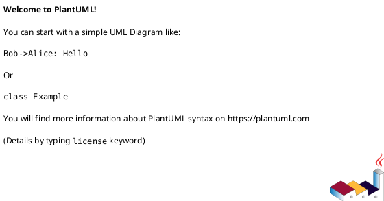
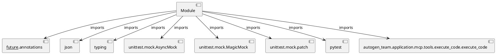

# Module Specification: test_execute_code

* **Source Reference:** `tests/application/mcp/tools/test_execute_code.py`

## 1. Architectural Role & Responsibilities
**Purpose:**
Provides functionality related to test execute code.

**Architecture Layer:**
- Infrastructure/Other

**Responsibilities:**
- Not explicitly defined.

**Main Workflow:**
- Not explicitly defined.

## 2. Dependencies
**Imports:**
- `__future__.annotations`
- `json`
- `typing`
- `unittest.mock.AsyncMock`
- `unittest.mock.MagicMock`
- `unittest.mock.patch`
- `pytest`
- `autogen_team.application.mcp.tools.execute_code.execute_code`

**Exported Classes:**
- None

**Exported Functions:**
- `test_execute_code_valid_task`
- `test_execute_code_syntax_error`
- `test_execute_code_malformed_response`
- `test_execute_code_path_traversal`

## 3. Architecture & Execution
### Internal Architecture
Not explicitly defined.

### Execution Flow
Not explicitly defined.

### Sequence Explanation
Not explicitly defined.

## 4. UML 2.0 Diagrams
### Class Diagram

### Dependency Graph

## 5. Class & Method Specifications
## 6. Module Functions
### `test_execute_code_valid_task(sample_task: T.Dict[str, T.Any], tmp_path: str)`
Test execute_code generates valid Python files.

**Inputs:**
- `sample_task`: T.Dict[str, T.Any]
- `tmp_path`: str

**Output:**
- Return Type: `None`

### `test_execute_code_syntax_error(sample_task: T.Dict[str, T.Any], tmp_path: str)`
Test execute_code detects Python syntax errors.

**Inputs:**
- `sample_task`: T.Dict[str, T.Any]
- `tmp_path`: str

**Output:**
- Return Type: `None`

### `test_execute_code_malformed_response(sample_task: T.Dict[str, T.Any], tmp_path: str)`
Test execute_code handles malformed LLM response.

**Inputs:**
- `sample_task`: T.Dict[str, T.Any]
- `tmp_path`: str

**Output:**
- Return Type: `None`

### `test_execute_code_path_traversal(sample_task: T.Dict[str, T.Any], tmp_path: str)`
Test execute_code prevents path traversal.

**Inputs:**
- `sample_task`: T.Dict[str, T.Any]
- `tmp_path`: str

**Output:**
- Return Type: `None`
