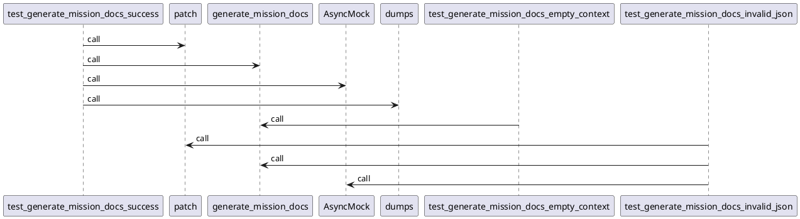
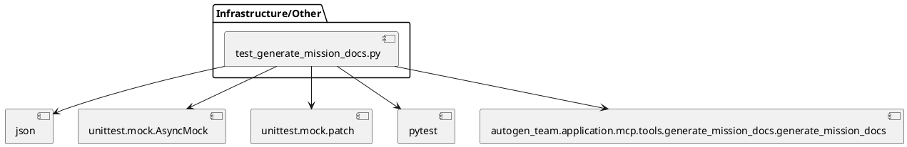
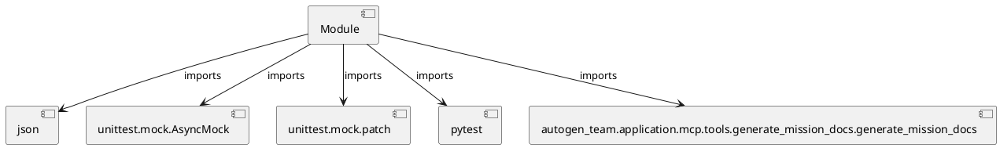
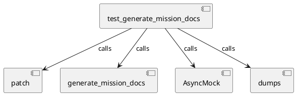

# Module Specification: test_generate_mission_docs

* **Source Reference:** `tests/application/mcp/tools/test_generate_mission_docs.py`

## 1. Architectural Role & Responsibilities
**Purpose:**
Provides functionality related to test generate mission docs.

**Architecture Layer:**
- Infrastructure/Other

**Responsibilities:**
- Manages operations and logic for test generate mission docs.

**Main Workflow:**
- Executes the primary flow defined by test generate mission docs functions and classes.

## 2. Dependencies
**Imports:**
- `json`
- `unittest.mock.AsyncMock`
- `unittest.mock.patch`
- `pytest`
- `autogen_team.application.mcp.tools.generate_mission_docs.generate_mission_docs`

**Exported Classes:**
- None

**Exported Functions:**
- `test_generate_mission_docs_success`
- `test_generate_mission_docs_empty_context`
- `test_generate_mission_docs_invalid_json`

**Exported Interfaces:**
- Not explicitly defined.

**Public API:**
- Not explicitly defined.

## 3. Architecture & Execution
### Internal Architecture
Not explicitly defined.

### Execution Flow
Not explicitly defined.

### Sequence Explanation
Not explicitly defined.

### Examples
Not explicitly defined.

## 4. UML 2.0 Diagrams
### Class Diagram

```plantuml
@startuml
    ' No classes found in module
@enduml
```

### Sequence Diagram

```plantuml
@startuml
    test_generate_mission_docs_success -> patch : call
    test_generate_mission_docs_success -> generate_mission_docs : call
    test_generate_mission_docs_success -> AsyncMock : call
    test_generate_mission_docs_success -> dumps : call
    test_generate_mission_docs_empty_context -> generate_mission_docs : call
    test_generate_mission_docs_invalid_json -> patch : call
    test_generate_mission_docs_invalid_json -> generate_mission_docs : call
    test_generate_mission_docs_invalid_json -> AsyncMock : call
@enduml
```

### Component Diagram

```plantuml
@startuml
    package "Infrastructure/Other" {
        [test_generate_mission_docs.py]
    }
    [test_generate_mission_docs.py] --> [json]
    [test_generate_mission_docs.py] --> [unittest.mock.AsyncMock]
    [test_generate_mission_docs.py] --> [unittest.mock.patch]
    [test_generate_mission_docs.py] --> [pytest]
    [test_generate_mission_docs.py] --> [autogen_team.application.mcp.tools.generate_mission_docs.generate_mission_docs]
@enduml
```

### Dependency Graph

```plantuml
@startuml
    [Module] --> [json] : imports
    [Module] --> [unittest.mock.AsyncMock] : imports
    [Module] --> [unittest.mock.patch] : imports
    [Module] --> [pytest] : imports
    [Module] --> [autogen_team.application.mcp.tools.generate_mission_docs.generate_mission_docs] : imports
@enduml
```

## 5. Class & Method Specifications
## 6. Module Functions
### `test_generate_mission_docs_success()`
Test successful documentation generation.

**Inputs:**
- None

**Output:**
- return type: `None`
- semantic meaning: Returns the result of test generate mission docs success.
- possible null values: Yes, if None allows it.
- exceptions: Standard execution exceptions.

**Side Effects:**
- Database updates: Not explicitly defined.
- File operations: Not explicitly defined.
- Network calls: Not explicitly defined.
- Cache: Not explicitly defined.
- State changes: Not explicitly defined.

### `test_generate_mission_docs_empty_context()`
Test with empty mission context.

**Inputs:**
- None

**Output:**
- return type: `None`
- semantic meaning: Returns the result of test generate mission docs empty context.
- possible null values: Yes, if None allows it.
- exceptions: Standard execution exceptions.

**Side Effects:**
- Database updates: Not explicitly defined.
- File operations: Not explicitly defined.
- Network calls: Not explicitly defined.
- Cache: Not explicitly defined.
- State changes: Not explicitly defined.

### `test_generate_mission_docs_invalid_json()`
Test handling of invalid JSON from LLM.

**Inputs:**
- None

**Output:**
- return type: `None`
- semantic meaning: Returns the result of test generate mission docs invalid json.
- possible null values: Yes, if None allows it.
- exceptions: Standard execution exceptions.

**Side Effects:**
- Database updates: Not explicitly defined.
- File operations: Not explicitly defined.
- Network calls: Not explicitly defined.
- Cache: Not explicitly defined.
- State changes: Not explicitly defined.

## 7. Call Graph

```plantuml
@startuml
[test_generate_mission_docs] --> [patch] : calls
[test_generate_mission_docs] --> [generate_mission_docs] : calls
[test_generate_mission_docs] --> [AsyncMock] : calls
[test_generate_mission_docs] --> [dumps] : calls
@enduml
```

## 8. Cross References
- **Parent module:** None
- **Child modules:** None
- **Dependencies:** `pytest`, `autogen_team.application.mcp.tools.generate_mission_docs.generate_mission_docs`, `unittest.mock.patch`, `unittest.mock.AsyncMock`, `json`
- **Used by:** None
- **Calls:** patch, generate_mission_docs, AsyncMock, dumps
- **Called from:** None
- **Related classes:** [Classes](../../../../../classes/index.md)
- **Related interfaces:** Not explicitly defined.
- **Related diagrams:** [Diagrams](../../../../../diagrams/index.md)
