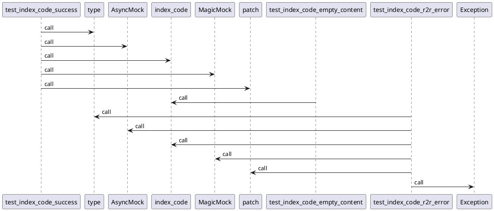
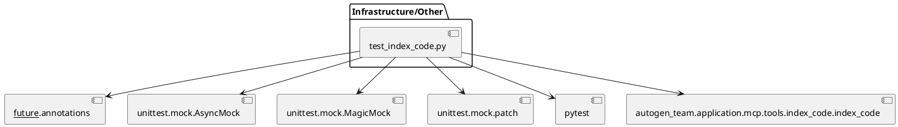
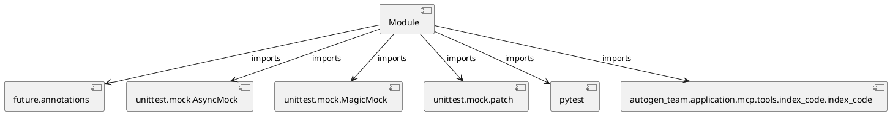
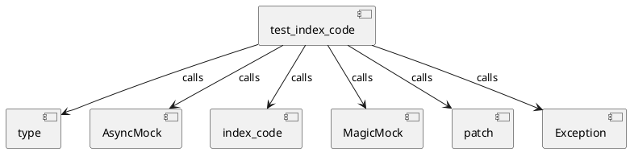

# Module Specification: test_index_code

* **Source Reference:** `tests/application/mcp/tools/test_index_code.py`

## 1. Architectural Role & Responsibilities
**Purpose:**
Provides functionality related to test index code.

**Architecture Layer:**
- Infrastructure/Other

**Responsibilities:**
- Manages operations and logic for test index code.

**Main Workflow:**
- Executes the primary flow defined by test index code functions and classes.

## 2. Dependencies
**Imports:**
- `__future__.annotations`
- `unittest.mock.AsyncMock`
- `unittest.mock.MagicMock`
- `unittest.mock.patch`
- `pytest`
- `autogen_team.application.mcp.tools.index_code.index_code`

**Exported Classes:**
- None

**Exported Functions:**
- `test_index_code_success`
- `test_index_code_empty_content`
- `test_index_code_r2r_error`

**Exported Interfaces:**
- Not explicitly defined.

**Public API:**
- Not explicitly defined.

## 3. Architecture & Execution
### Internal Architecture
Not explicitly defined.

### Execution Flow
Not explicitly defined.

### Sequence Explanation
Not explicitly defined.

### Examples
Not explicitly defined.

## 4. UML 2.0 Diagrams
### Class Diagram

```plantuml
@startuml
    ' No classes found in module
@enduml
```

### Sequence Diagram

```plantuml
@startuml
    test_index_code_success -> type : call
    test_index_code_success -> AsyncMock : call
    test_index_code_success -> index_code : call
    test_index_code_success -> MagicMock : call
    test_index_code_success -> patch : call
    test_index_code_empty_content -> index_code : call
    test_index_code_r2r_error -> type : call
    test_index_code_r2r_error -> AsyncMock : call
    test_index_code_r2r_error -> index_code : call
    test_index_code_r2r_error -> MagicMock : call
    test_index_code_r2r_error -> patch : call
    test_index_code_r2r_error -> Exception : call
@enduml
```

### Component Diagram

```plantuml
@startuml
    package "Infrastructure/Other" {
        [test_index_code.py]
    }
    [test_index_code.py] --> [__future__.annotations]
    [test_index_code.py] --> [unittest.mock.AsyncMock]
    [test_index_code.py] --> [unittest.mock.MagicMock]
    [test_index_code.py] --> [unittest.mock.patch]
    [test_index_code.py] --> [pytest]
    [test_index_code.py] --> [autogen_team.application.mcp.tools.index_code.index_code]
@enduml
```

### Dependency Graph

```plantuml
@startuml
    [Module] --> [__future__.annotations] : imports
    [Module] --> [unittest.mock.AsyncMock] : imports
    [Module] --> [unittest.mock.MagicMock] : imports
    [Module] --> [unittest.mock.patch] : imports
    [Module] --> [pytest] : imports
    [Module] --> [autogen_team.application.mcp.tools.index_code.index_code] : imports
@enduml
```

## 5. Class & Method Specifications
## 6. Module Functions
### `test_index_code_success()`
Test index_code successfully indexes a file.

**Inputs:**
- None

**Output:**
- return type: `None`
- semantic meaning: Returns the result of test index code success.
- possible null values: Yes, if None allows it.
- exceptions: Standard execution exceptions.

**Side Effects:**
- Database updates: Not explicitly defined.
- File operations: Not explicitly defined.
- Network calls: Not explicitly defined.
- Cache: Not explicitly defined.
- State changes: Not explicitly defined.

### `test_index_code_empty_content()`
Test index_code rejects empty content.

**Inputs:**
- None

**Output:**
- return type: `None`
- semantic meaning: Returns the result of test index code empty content.
- possible null values: Yes, if None allows it.
- exceptions: Standard execution exceptions.

**Side Effects:**
- Database updates: Not explicitly defined.
- File operations: Not explicitly defined.
- Network calls: Not explicitly defined.
- Cache: Not explicitly defined.
- State changes: Not explicitly defined.

### `test_index_code_r2r_error()`
Test index_code handles R2R API error.

**Inputs:**
- None

**Output:**
- return type: `None`
- semantic meaning: Returns the result of test index code r2r error.
- possible null values: Yes, if None allows it.
- exceptions: Standard execution exceptions.

**Side Effects:**
- Database updates: Not explicitly defined.
- File operations: Not explicitly defined.
- Network calls: Not explicitly defined.
- Cache: Not explicitly defined.
- State changes: Not explicitly defined.

## 7. Call Graph

```plantuml
@startuml
[test_index_code] --> [type] : calls
[test_index_code] --> [AsyncMock] : calls
[test_index_code] --> [index_code] : calls
[test_index_code] --> [MagicMock] : calls
[test_index_code] --> [patch] : calls
[test_index_code] --> [Exception] : calls
@enduml
```

## 8. Cross References
- **Parent module:** None
- **Child modules:** None
- **Dependencies:** `autogen_team.application.mcp.tools.index_code.index_code`, `pytest`, `__future__.annotations`, `unittest.mock.patch`, `unittest.mock.AsyncMock`, `unittest.mock.MagicMock`
- **Used by:** None
- **Calls:** type, AsyncMock, index_code, MagicMock, patch, Exception
- **Called from:** None
- **Related classes:** [Classes](../../../../../classes/index.md)
- **Related interfaces:** Not explicitly defined.
- **Related diagrams:** [Diagrams](../../../../../diagrams/index.md)
