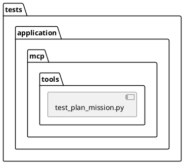
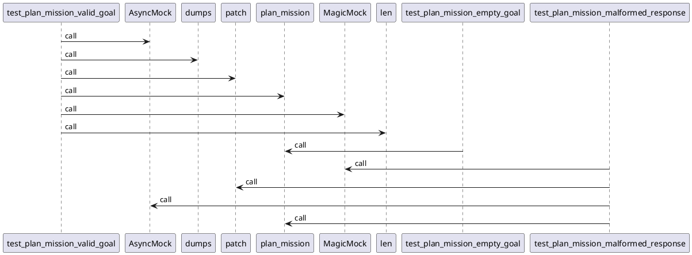
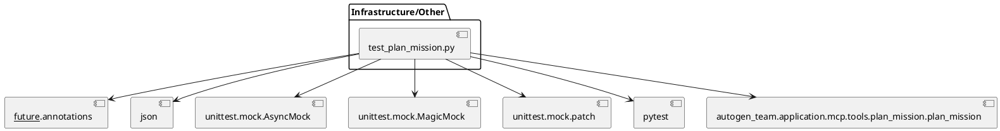
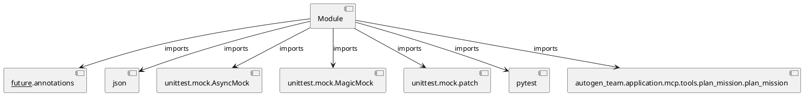
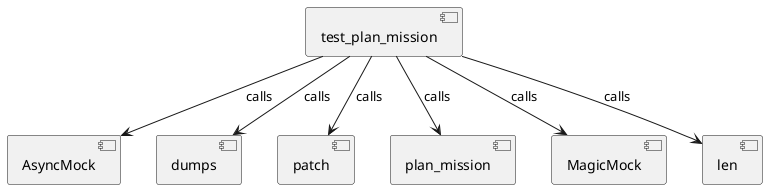

# Module Specification: test_plan_mission

* **Source Reference:** `tests/application/mcp/tools/test_plan_mission.py`

## 1. Architectural Role & Responsibilities
**Purpose:**
Provides functionality related to test plan mission.

**Architecture Layer:**
- Infrastructure/Other

**Responsibilities:**
- Not explicitly defined.

**Main Workflow:**
- Not explicitly defined.

## 2. Dependencies
**Imports:**
- `__future__.annotations`
- `json`
- `unittest.mock.AsyncMock`
- `unittest.mock.MagicMock`
- `unittest.mock.patch`
- `pytest`
- `autogen_team.application.mcp.tools.plan_mission.plan_mission`

**Exported Classes:**
- None

**Exported Functions:**
- `test_plan_mission_valid_goal`
- `test_plan_mission_empty_goal`
- `test_plan_mission_malformed_response`

**Exported Interfaces:**
- Not explicitly defined.

**Public API:**
- Not explicitly defined.

## 3. Architecture & Execution
### Internal Architecture
Not explicitly defined.

### Execution Flow
Not explicitly defined.

### Sequence Explanation
Not explicitly defined.

### Examples
Not explicitly defined.

## 4. UML 2.0 Diagrams
### Class Diagram

```plantuml
@startuml
    ' No classes found in module
@enduml
```

### Package Diagram

```plantuml
@startuml
    package "tests" {
        package "application" {
            package "mcp" {
                package "tools" {
                    [test_plan_mission.py]
                }
            }
        }
    }
@enduml
```

### Sequence Diagram

```plantuml
@startuml
    test_plan_mission_valid_goal -> AsyncMock : call
    test_plan_mission_valid_goal -> dumps : call
    test_plan_mission_valid_goal -> patch : call
    test_plan_mission_valid_goal -> plan_mission : call
    test_plan_mission_valid_goal -> MagicMock : call
    test_plan_mission_valid_goal -> len : call
    test_plan_mission_empty_goal -> plan_mission : call
    test_plan_mission_malformed_response -> MagicMock : call
    test_plan_mission_malformed_response -> patch : call
    test_plan_mission_malformed_response -> AsyncMock : call
    test_plan_mission_malformed_response -> plan_mission : call
@enduml
```

### Component Diagram

```plantuml
@startuml
    package "Infrastructure/Other" {
        [test_plan_mission.py]
    }
    [test_plan_mission.py] --> [__future__.annotations]
    [test_plan_mission.py] --> [json]
    [test_plan_mission.py] --> [unittest.mock.AsyncMock]
    [test_plan_mission.py] --> [unittest.mock.MagicMock]
    [test_plan_mission.py] --> [unittest.mock.patch]
    [test_plan_mission.py] --> [pytest]
    [test_plan_mission.py] --> [autogen_team.application.mcp.tools.plan_mission.plan_mission]
@enduml
```

### Dependency Graph

```plantuml
@startuml
    [Module] --> [__future__.annotations] : imports
    [Module] --> [json] : imports
    [Module] --> [unittest.mock.AsyncMock] : imports
    [Module] --> [unittest.mock.MagicMock] : imports
    [Module] --> [unittest.mock.patch] : imports
    [Module] --> [pytest] : imports
    [Module] --> [autogen_team.application.mcp.tools.plan_mission.plan_mission] : imports
@enduml
```

## 5. Class & Method Specifications
## 6. Module Functions
### `test_plan_mission_valid_goal(sample_goal: str) -> None` (Public)
**Description:** Test plan_mission with a valid goal returns a DAG.

**Inputs:**
- `sample_goal`
  - type: str
  - meaning: Not explicitly defined.
  - valid values: Not explicitly defined.
  - optional?: False
  - default value: None

**Output:**
- return type: `None`
- semantic meaning: Not explicitly defined.
- possible null values: Not explicitly defined.
- exceptions: Not explicitly defined.

**Side Effects:**
- Database updates: Not explicitly defined.
- File operations: Not explicitly defined.
- Network calls: Not explicitly defined.
- Cache: Not explicitly defined.
- State changes: Not explicitly defined.

**Complexity:**
- Time Complexity: Not explicitly defined.
- Space Complexity: Not explicitly defined.

**Example:**
```python
result = test_plan_mission_valid_goal(...)
```

### `test_plan_mission_empty_goal() -> None` (Public)
**Description:** Test plan_mission with empty goal returns error.

**Inputs:**
- None

**Output:**
- return type: `None`
- semantic meaning: Not explicitly defined.
- possible null values: Not explicitly defined.
- exceptions: Not explicitly defined.

**Side Effects:**
- Database updates: Not explicitly defined.
- File operations: Not explicitly defined.
- Network calls: Not explicitly defined.
- Cache: Not explicitly defined.
- State changes: Not explicitly defined.

**Complexity:**
- Time Complexity: Not explicitly defined.
- Space Complexity: Not explicitly defined.

**Example:**
```python
result = test_plan_mission_empty_goal()
```

### `test_plan_mission_malformed_response(sample_goal: str) -> None` (Public)
**Description:** Test plan_mission handles malformed LLM response.

**Inputs:**
- `sample_goal`
  - type: str
  - meaning: Not explicitly defined.
  - valid values: Not explicitly defined.
  - optional?: False
  - default value: None

**Output:**
- return type: `None`
- semantic meaning: Not explicitly defined.
- possible null values: Not explicitly defined.
- exceptions: Not explicitly defined.

**Side Effects:**
- Database updates: Not explicitly defined.
- File operations: Not explicitly defined.
- Network calls: Not explicitly defined.
- Cache: Not explicitly defined.
- State changes: Not explicitly defined.

**Complexity:**
- Time Complexity: Not explicitly defined.
- Space Complexity: Not explicitly defined.

**Example:**
```python
result = test_plan_mission_malformed_response(...)
```

## 7. Call Graph

```plantuml
@startuml
[test_plan_mission] --> [AsyncMock] : calls
[test_plan_mission] --> [dumps] : calls
[test_plan_mission] --> [patch] : calls
[test_plan_mission] --> [plan_mission] : calls
[test_plan_mission] --> [MagicMock] : calls
[test_plan_mission] --> [len] : calls
@enduml
```

## 8. Cross References
- **Dependencies:** [Dependencies](../../../../../dependencies/index.md)
- **Used by:** None
- **Calls:** AsyncMock, dumps, patch, plan_mission, MagicMock, len
- **Called from:** None
- **Related classes:** [Classes](../../../../../classes/index.md)
- **Related diagrams:** [Diagrams](../../../../../diagrams/index.md)
