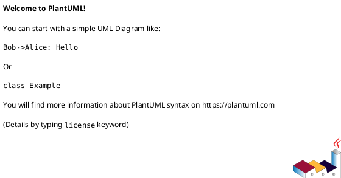
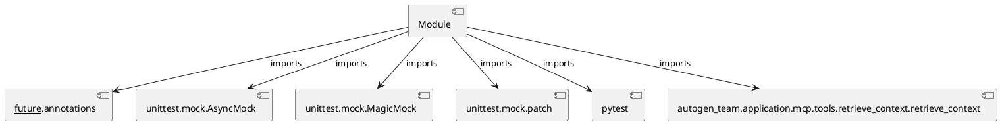

# Module Specification: test_retrieve_context

* **Source Reference:** `tests/application/mcp/tools/test_retrieve_context.py`

## 1. Architectural Role & Responsibilities
**Purpose:**
Provides functionality related to test retrieve context.

**Architecture Layer:**
- Infrastructure/Other

**Responsibilities:**
- Manage and execute operations for test_retrieve_context.

**Main Workflow:**
- Initialize components and process requests for test_retrieve_context.

## 2. Dependencies
**Imports:**
- `__future__.annotations`
- `unittest.mock.AsyncMock`
- `unittest.mock.MagicMock`
- `unittest.mock.patch`
- `pytest`
- `autogen_team.application.mcp.tools.retrieve_context.retrieve_context`

**Exported Classes:**
- None

**Exported Functions:**
- `test_retrieve_context_valid_query`
- `test_retrieve_context_empty_query`
- `test_retrieve_context_r2r_error`

## 3. Architecture & Execution
### Internal Architecture
Follows standard modular design, encapsulating state and behavior within defined classes and functions.

### Execution Flow
Sequential execution of defined functions and class methods.

### Sequence Explanation
Clients instantiate classes or call functions, which execute business logic and return results.

## 4. UML 2.0 Diagrams
### Class Diagram

### Dependency Graph

## 5. Class & Method Specifications
## 6. Module Functions
### `test_retrieve_context_valid_query()`
Test retrieve_context returns documents for a valid query.

**Inputs:**
- None

**Output:**
- Return Type: `None`

### `test_retrieve_context_empty_query()`
Test retrieve_context with empty query returns error.

**Inputs:**
- None

**Output:**
- Return Type: `None`

### `test_retrieve_context_r2r_error()`
Test retrieve_context handles R2R connection error.

**Inputs:**
- None

**Output:**
- Return Type: `None`
