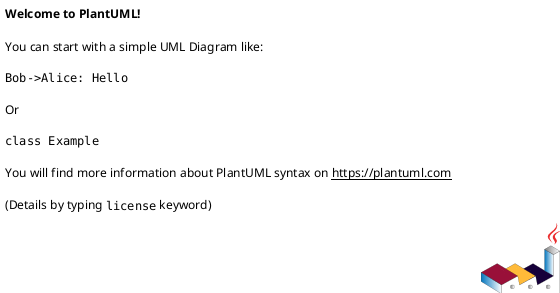
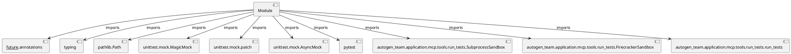

# Module Specification: test_run_tests

* **Source Reference:** `tests/application/mcp/tools/test_run_tests.py`

## 1. Architectural Role & Responsibilities
**Purpose:**
Provides functionality related to test run tests.

**Architecture Layer:**
- Infrastructure/Other

**Responsibilities:**
- Manage and execute operations for test_run_tests.

**Main Workflow:**
- Initialize components and process requests for test_run_tests.

## 2. Dependencies
**Imports:**
- `__future__.annotations`
- `typing`
- `pathlib.Path`
- `unittest.mock.MagicMock`
- `unittest.mock.patch`
- `unittest.mock.AsyncMock`
- `pytest`
- `autogen_team.application.mcp.tools.run_tests.SubprocessSandbox`
- `autogen_team.application.mcp.tools.run_tests.FirecrackerSandbox`
- `autogen_team.application.mcp.tools.run_tests.run_tests`

**Exported Classes:**
- None

**Exported Functions:**
- `test_run_tests_passing`
- `test_run_tests_failing`
- `test_run_tests_timeout`
- `test_subprocess_sandbox_direct`
- `test_run_tests_path_traversal`
- `test_run_tests_delete_action`
- `test_firecracker_sandbox_run_tests_success`
- `test_firecracker_sandbox_run_tests_failure`
- `test_subprocess_sandbox_exception`
- `test_firecracker_sandbox_run_tests_loop_running`

## 3. Architecture & Execution
### Internal Architecture
Follows standard modular design, encapsulating state and behavior within defined classes and functions.

### Execution Flow
Sequential execution of defined functions and class methods.

### Sequence Explanation
Clients instantiate classes or call functions, which execute business logic and return results.

## 4. UML 2.0 Diagrams
### Class Diagram

### Dependency Graph

## 5. Class & Method Specifications
## 6. Module Functions
### `test_run_tests_passing(sample_changes: Any, tmp_path: Path)`
Test run_tests with passing tests.

**Inputs:**
- `sample_changes`: Any
- `tmp_path`: Path

**Output:**
- Return Type: `None`

### `test_run_tests_failing(sample_changes: Any, tmp_path: Path)`
Test run_tests with failing tests.

**Inputs:**
- `sample_changes`: Any
- `tmp_path`: Path

**Output:**
- Return Type: `None`

### `test_run_tests_timeout(sample_changes: Any, tmp_path: Path)`
Test run_tests handles subprocess timeout.

**Inputs:**
- `sample_changes`: Any
- `tmp_path`: Path

**Output:**
- Return Type: `None`

### `test_subprocess_sandbox_direct()`
Test SubprocessSandbox.run_tests returns expected structure.

**Inputs:**
- None

**Output:**
- Return Type: `None`

### `test_run_tests_path_traversal(sample_changes: Any, tmp_path: Path)`
Test run_tests prevents path traversal.

**Inputs:**
- `sample_changes`: Any
- `tmp_path`: Path

**Output:**
- Return Type: `None`

### `test_run_tests_delete_action(tmp_path: Path)`
Test run_tests with delete action.

**Inputs:**
- `tmp_path`: Path

**Output:**
- Return Type: `None`

### `test_firecracker_sandbox_run_tests_success()`
Test FirecrackerSandbox.run_tests success path.

**Inputs:**
- None

**Output:**
- Return Type: `None`

### `test_firecracker_sandbox_run_tests_failure()`
Test FirecrackerSandbox.run_tests error handling.

**Inputs:**
- None

**Output:**
- Return Type: `None`

### `test_subprocess_sandbox_exception()`
Test SubprocessSandbox.run_tests generic exception.

**Inputs:**
- None

**Output:**
- Return Type: `None`

### `test_firecracker_sandbox_run_tests_loop_running()`
Test FirecrackerSandbox.run_tests when event loop is already running.

**Inputs:**
- None

**Output:**
- Return Type: `None`
