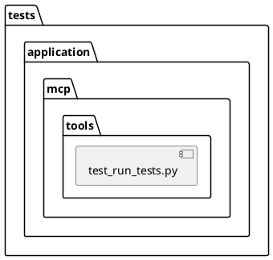
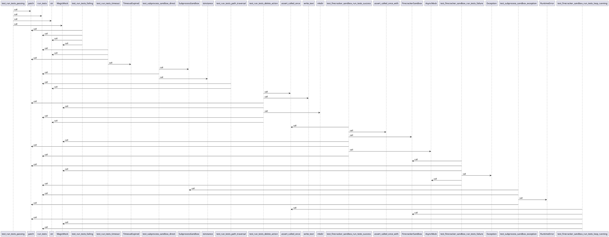
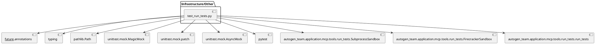
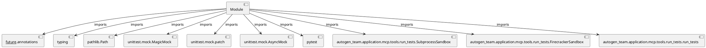
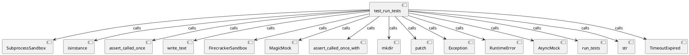

# Module Specification: test_run_tests

* **Source Reference:** `tests/application/mcp/tools/test_run_tests.py`

## 1. Architectural Role & Responsibilities
**Purpose:**
Provides functionality related to test run tests.

**Architecture Layer:**
- Infrastructure/Other

**Responsibilities:**
- Not explicitly defined.

**Main Workflow:**
- Not explicitly defined.

## 2. Dependencies
**Imports:**
- `__future__.annotations`
- `typing`
- `pathlib.Path`
- `unittest.mock.MagicMock`
- `unittest.mock.patch`
- `unittest.mock.AsyncMock`
- `pytest`
- `autogen_team.application.mcp.tools.run_tests.SubprocessSandbox`
- `autogen_team.application.mcp.tools.run_tests.FirecrackerSandbox`
- `autogen_team.application.mcp.tools.run_tests.run_tests`

**Exported Classes:**
- None

**Exported Functions:**
- `test_run_tests_passing`
- `test_run_tests_failing`
- `test_run_tests_timeout`
- `test_subprocess_sandbox_direct`
- `test_run_tests_path_traversal`
- `test_run_tests_delete_action`
- `test_firecracker_sandbox_run_tests_success`
- `test_firecracker_sandbox_run_tests_failure`
- `test_subprocess_sandbox_exception`
- `test_firecracker_sandbox_run_tests_loop_running`

**Exported Interfaces:**
- Not explicitly defined.

**Public API:**
- Not explicitly defined.

## 3. Architecture & Execution
### Internal Architecture
Not explicitly defined.

### Execution Flow
Not explicitly defined.

### Sequence Explanation
Not explicitly defined.

### Examples
Not explicitly defined.

## 4. UML 2.0 Diagrams
### Class Diagram

```plantuml
@startuml
    ' No classes found in module
@enduml
```

### Package Diagram

```plantuml
@startuml
    package "tests" {
        package "application" {
            package "mcp" {
                package "tools" {
                    [test_run_tests.py]
                }
            }
        }
    }
@enduml
```

### Sequence Diagram

```plantuml
@startuml
    test_run_tests_passing -> patch : call
    test_run_tests_passing -> run_tests : call
    test_run_tests_passing -> str : call
    test_run_tests_passing -> MagicMock : call
    test_run_tests_failing -> patch : call
    test_run_tests_failing -> run_tests : call
    test_run_tests_failing -> str : call
    test_run_tests_failing -> MagicMock : call
    test_run_tests_timeout -> run_tests : call
    test_run_tests_timeout -> str : call
    test_run_tests_timeout -> patch : call
    test_run_tests_timeout -> TimeoutExpired : call
    test_subprocess_sandbox_direct -> SubprocessSandbox : call
    test_subprocess_sandbox_direct -> run_tests : call
    test_subprocess_sandbox_direct -> isinstance : call
    test_run_tests_path_traversal -> run_tests : call
    test_run_tests_path_traversal -> str : call
    test_run_tests_delete_action -> assert_called_once : call
    test_run_tests_delete_action -> write_text : call
    test_run_tests_delete_action -> patch : call
    test_run_tests_delete_action -> MagicMock : call
    test_run_tests_delete_action -> mkdir : call
    test_run_tests_delete_action -> run_tests : call
    test_run_tests_delete_action -> str : call
    test_firecracker_sandbox_run_tests_success -> assert_called_once : call
    test_firecracker_sandbox_run_tests_success -> assert_called_once_with : call
    test_firecracker_sandbox_run_tests_success -> FirecrackerSandbox : call
    test_firecracker_sandbox_run_tests_success -> MagicMock : call
    test_firecracker_sandbox_run_tests_success -> patch : call
    test_firecracker_sandbox_run_tests_success -> AsyncMock : call
    test_firecracker_sandbox_run_tests_success -> run_tests : call
    test_firecracker_sandbox_run_tests_failure -> FirecrackerSandbox : call
    test_firecracker_sandbox_run_tests_failure -> patch : call
    test_firecracker_sandbox_run_tests_failure -> MagicMock : call
    test_firecracker_sandbox_run_tests_failure -> Exception : call
    test_firecracker_sandbox_run_tests_failure -> AsyncMock : call
    test_firecracker_sandbox_run_tests_failure -> run_tests : call
    test_subprocess_sandbox_exception -> SubprocessSandbox : call
    test_subprocess_sandbox_exception -> run_tests : call
    test_subprocess_sandbox_exception -> RuntimeError : call
    test_subprocess_sandbox_exception -> patch : call
    test_firecracker_sandbox_run_tests_loop_running -> assert_called_once : call
    test_firecracker_sandbox_run_tests_loop_running -> FirecrackerSandbox : call
    test_firecracker_sandbox_run_tests_loop_running -> patch : call
    test_firecracker_sandbox_run_tests_loop_running -> MagicMock : call
    test_firecracker_sandbox_run_tests_loop_running -> run_tests : call
@enduml
```

### Component Diagram

```plantuml
@startuml
    package "Infrastructure/Other" {
        [test_run_tests.py]
    }
    [test_run_tests.py] --> [__future__.annotations]
    [test_run_tests.py] --> [typing]
    [test_run_tests.py] --> [pathlib.Path]
    [test_run_tests.py] --> [unittest.mock.MagicMock]
    [test_run_tests.py] --> [unittest.mock.patch]
    [test_run_tests.py] --> [unittest.mock.AsyncMock]
    [test_run_tests.py] --> [pytest]
    [test_run_tests.py] --> [autogen_team.application.mcp.tools.run_tests.SubprocessSandbox]
    [test_run_tests.py] --> [autogen_team.application.mcp.tools.run_tests.FirecrackerSandbox]
    [test_run_tests.py] --> [autogen_team.application.mcp.tools.run_tests.run_tests]
@enduml
```

### Dependency Graph

```plantuml
@startuml
    [Module] --> [__future__.annotations] : imports
    [Module] --> [typing] : imports
    [Module] --> [pathlib.Path] : imports
    [Module] --> [unittest.mock.MagicMock] : imports
    [Module] --> [unittest.mock.patch] : imports
    [Module] --> [unittest.mock.AsyncMock] : imports
    [Module] --> [pytest] : imports
    [Module] --> [autogen_team.application.mcp.tools.run_tests.SubprocessSandbox] : imports
    [Module] --> [autogen_team.application.mcp.tools.run_tests.FirecrackerSandbox] : imports
    [Module] --> [autogen_team.application.mcp.tools.run_tests.run_tests] : imports
@enduml
```

## 5. Class & Method Specifications
## 6. Module Functions
### `test_run_tests_passing(sample_changes: T.Dict[str, T.Any], tmp_path: Path) -> None` (Public)
**Description:** Test run_tests with passing tests.

**Inputs:**
- `sample_changes`
  - type: T.Dict[str, T.Any]
  - meaning: Not explicitly defined.
  - valid values: Not explicitly defined.
  - optional?: False
  - default value: None
- `tmp_path`
  - type: Path
  - meaning: Not explicitly defined.
  - valid values: Not explicitly defined.
  - optional?: False
  - default value: None

**Output:**
- return type: `None`
- semantic meaning: Not explicitly defined.
- possible null values: Not explicitly defined.
- exceptions: Not explicitly defined.

**Side Effects:**
- Database updates: Not explicitly defined.
- File operations: Not explicitly defined.
- Network calls: Not explicitly defined.
- Cache: Not explicitly defined.
- State changes: Not explicitly defined.

**Complexity:**
- Time Complexity: Not explicitly defined.
- Space Complexity: Not explicitly defined.

**Example:**
```python
result = test_run_tests_passing(..., ...)
```

### `test_run_tests_failing(sample_changes: T.Dict[str, T.Any], tmp_path: Path) -> None` (Public)
**Description:** Test run_tests with failing tests.

**Inputs:**
- `sample_changes`
  - type: T.Dict[str, T.Any]
  - meaning: Not explicitly defined.
  - valid values: Not explicitly defined.
  - optional?: False
  - default value: None
- `tmp_path`
  - type: Path
  - meaning: Not explicitly defined.
  - valid values: Not explicitly defined.
  - optional?: False
  - default value: None

**Output:**
- return type: `None`
- semantic meaning: Not explicitly defined.
- possible null values: Not explicitly defined.
- exceptions: Not explicitly defined.

**Side Effects:**
- Database updates: Not explicitly defined.
- File operations: Not explicitly defined.
- Network calls: Not explicitly defined.
- Cache: Not explicitly defined.
- State changes: Not explicitly defined.

**Complexity:**
- Time Complexity: Not explicitly defined.
- Space Complexity: Not explicitly defined.

**Example:**
```python
result = test_run_tests_failing(..., ...)
```

### `test_run_tests_timeout(sample_changes: T.Dict[str, T.Any], tmp_path: Path) -> None` (Public)
**Description:** Test run_tests handles subprocess timeout.

**Inputs:**
- `sample_changes`
  - type: T.Dict[str, T.Any]
  - meaning: Not explicitly defined.
  - valid values: Not explicitly defined.
  - optional?: False
  - default value: None
- `tmp_path`
  - type: Path
  - meaning: Not explicitly defined.
  - valid values: Not explicitly defined.
  - optional?: False
  - default value: None

**Output:**
- return type: `None`
- semantic meaning: Not explicitly defined.
- possible null values: Not explicitly defined.
- exceptions: Not explicitly defined.

**Side Effects:**
- Database updates: Not explicitly defined.
- File operations: Not explicitly defined.
- Network calls: Not explicitly defined.
- Cache: Not explicitly defined.
- State changes: Not explicitly defined.

**Complexity:**
- Time Complexity: Not explicitly defined.
- Space Complexity: Not explicitly defined.

**Example:**
```python
result = test_run_tests_timeout(..., ...)
```

### `test_subprocess_sandbox_direct() -> None` (Public)
**Description:** Test SubprocessSandbox.run_tests returns expected structure.

**Inputs:**
- None

**Output:**
- return type: `None`
- semantic meaning: Not explicitly defined.
- possible null values: Not explicitly defined.
- exceptions: Not explicitly defined.

**Side Effects:**
- Database updates: Not explicitly defined.
- File operations: Not explicitly defined.
- Network calls: Not explicitly defined.
- Cache: Not explicitly defined.
- State changes: Not explicitly defined.

**Complexity:**
- Time Complexity: Not explicitly defined.
- Space Complexity: Not explicitly defined.

**Example:**
```python
result = test_subprocess_sandbox_direct()
```

### `test_run_tests_path_traversal(sample_changes: T.Dict[str, T.Any], tmp_path: Path) -> None` (Public)
**Description:** Test run_tests prevents path traversal.

**Inputs:**
- `sample_changes`
  - type: T.Dict[str, T.Any]
  - meaning: Not explicitly defined.
  - valid values: Not explicitly defined.
  - optional?: False
  - default value: None
- `tmp_path`
  - type: Path
  - meaning: Not explicitly defined.
  - valid values: Not explicitly defined.
  - optional?: False
  - default value: None

**Output:**
- return type: `None`
- semantic meaning: Not explicitly defined.
- possible null values: Not explicitly defined.
- exceptions: Not explicitly defined.

**Side Effects:**
- Database updates: Not explicitly defined.
- File operations: Not explicitly defined.
- Network calls: Not explicitly defined.
- Cache: Not explicitly defined.
- State changes: Not explicitly defined.

**Complexity:**
- Time Complexity: Not explicitly defined.
- Space Complexity: Not explicitly defined.

**Example:**
```python
result = test_run_tests_path_traversal(..., ...)
```

### `test_run_tests_delete_action(tmp_path: Path) -> None` (Public)
**Description:** Test run_tests with delete action.

**Inputs:**
- `tmp_path`
  - type: Path
  - meaning: Not explicitly defined.
  - valid values: Not explicitly defined.
  - optional?: False
  - default value: None

**Output:**
- return type: `None`
- semantic meaning: Not explicitly defined.
- possible null values: Not explicitly defined.
- exceptions: Not explicitly defined.

**Side Effects:**
- Database updates: Not explicitly defined.
- File operations: Not explicitly defined.
- Network calls: Not explicitly defined.
- Cache: Not explicitly defined.
- State changes: Not explicitly defined.

**Complexity:**
- Time Complexity: Not explicitly defined.
- Space Complexity: Not explicitly defined.

**Example:**
```python
result = test_run_tests_delete_action(...)
```

### `test_firecracker_sandbox_run_tests_success() -> None` (Public)
**Description:** Test FirecrackerSandbox.run_tests success path.

**Inputs:**
- None

**Output:**
- return type: `None`
- semantic meaning: Not explicitly defined.
- possible null values: Not explicitly defined.
- exceptions: Not explicitly defined.

**Side Effects:**
- Database updates: Not explicitly defined.
- File operations: Not explicitly defined.
- Network calls: Not explicitly defined.
- Cache: Not explicitly defined.
- State changes: Not explicitly defined.

**Complexity:**
- Time Complexity: Not explicitly defined.
- Space Complexity: Not explicitly defined.

**Example:**
```python
result = test_firecracker_sandbox_run_tests_success()
```

### `test_firecracker_sandbox_run_tests_failure() -> None` (Public)
**Description:** Test FirecrackerSandbox.run_tests error handling.

**Inputs:**
- None

**Output:**
- return type: `None`
- semantic meaning: Not explicitly defined.
- possible null values: Not explicitly defined.
- exceptions: Not explicitly defined.

**Side Effects:**
- Database updates: Not explicitly defined.
- File operations: Not explicitly defined.
- Network calls: Not explicitly defined.
- Cache: Not explicitly defined.
- State changes: Not explicitly defined.

**Complexity:**
- Time Complexity: Not explicitly defined.
- Space Complexity: Not explicitly defined.

**Example:**
```python
result = test_firecracker_sandbox_run_tests_failure()
```

### `test_subprocess_sandbox_exception() -> None` (Public)
**Description:** Test SubprocessSandbox.run_tests generic exception.

**Inputs:**
- None

**Output:**
- return type: `None`
- semantic meaning: Not explicitly defined.
- possible null values: Not explicitly defined.
- exceptions: Not explicitly defined.

**Side Effects:**
- Database updates: Not explicitly defined.
- File operations: Not explicitly defined.
- Network calls: Not explicitly defined.
- Cache: Not explicitly defined.
- State changes: Not explicitly defined.

**Complexity:**
- Time Complexity: Not explicitly defined.
- Space Complexity: Not explicitly defined.

**Example:**
```python
result = test_subprocess_sandbox_exception()
```

### `test_firecracker_sandbox_run_tests_loop_running() -> None` (Public)
**Description:** Test FirecrackerSandbox.run_tests when event loop is already running.

**Inputs:**
- None

**Output:**
- return type: `None`
- semantic meaning: Not explicitly defined.
- possible null values: Not explicitly defined.
- exceptions: Not explicitly defined.

**Side Effects:**
- Database updates: Not explicitly defined.
- File operations: Not explicitly defined.
- Network calls: Not explicitly defined.
- Cache: Not explicitly defined.
- State changes: Not explicitly defined.

**Complexity:**
- Time Complexity: Not explicitly defined.
- Space Complexity: Not explicitly defined.

**Example:**
```python
result = test_firecracker_sandbox_run_tests_loop_running()
```

## 7. Call Graph

```plantuml
@startuml
[test_run_tests] --> [SubprocessSandbox] : calls
[test_run_tests] --> [isinstance] : calls
[test_run_tests] --> [assert_called_once] : calls
[test_run_tests] --> [write_text] : calls
[test_run_tests] --> [FirecrackerSandbox] : calls
[test_run_tests] --> [MagicMock] : calls
[test_run_tests] --> [assert_called_once_with] : calls
[test_run_tests] --> [mkdir] : calls
[test_run_tests] --> [patch] : calls
[test_run_tests] --> [Exception] : calls
[test_run_tests] --> [RuntimeError] : calls
[test_run_tests] --> [AsyncMock] : calls
[test_run_tests] --> [run_tests] : calls
[test_run_tests] --> [str] : calls
[test_run_tests] --> [TimeoutExpired] : calls
@enduml
```

## 8. Cross References
- **Dependencies:** [Dependencies](../../../../../dependencies/index.md)
- **Used by:** None
- **Calls:** SubprocessSandbox, isinstance, assert_called_once, write_text, FirecrackerSandbox, MagicMock, assert_called_once_with, mkdir, patch, Exception, RuntimeError, AsyncMock, run_tests, str, TimeoutExpired
- **Called from:** None
- **Related classes:** [Classes](../../../../../classes/index.md)
- **Related diagrams:** [Diagrams](../../../../../diagrams/index.md)
