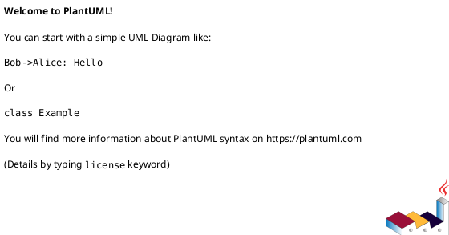
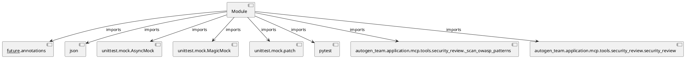

# Module Specification: test_security_review

* **Source Reference:** `tests/application/mcp/tools/test_security_review.py`

## 1. Architectural Role & Responsibilities
**Purpose:**
Provides functionality related to test security review.

**Architecture Layer:**
- Infrastructure/Other

**Responsibilities:**
- Not explicitly defined.

**Main Workflow:**
- Not explicitly defined.

## 2. Dependencies
**Imports:**
- `__future__.annotations`
- `json`
- `unittest.mock.AsyncMock`
- `unittest.mock.MagicMock`
- `unittest.mock.patch`
- `pytest`
- `autogen_team.application.mcp.tools.security_review._scan_owasp_patterns`
- `autogen_team.application.mcp.tools.security_review.security_review`

**Exported Classes:**
- None

**Exported Functions:**
- `test_owasp_scan_clean_code`
- `test_owasp_scan_command_injection`
- `test_owasp_scan_unsafe_deserialization`
- `test_owasp_scan_weak_hash`
- `test_security_review_clean_diff`
- `test_security_review_insecure_diff`
- `test_security_review_empty_diff`

## 3. Architecture & Execution
### Internal Architecture
Not explicitly defined.

### Execution Flow
Not explicitly defined.

### Sequence Explanation
Not explicitly defined.

## 4. UML 2.0 Diagrams
### Class Diagram

### Dependency Graph

## 5. Class & Method Specifications
## 6. Module Functions
### `test_owasp_scan_clean_code()`
Test OWASP scanner with clean code.

**Inputs:**
- None

**Output:**
- Return Type: `None`

### `test_owasp_scan_command_injection()`
Test OWASP scanner detects command injection.

**Inputs:**
- None

**Output:**
- Return Type: `None`

### `test_owasp_scan_unsafe_deserialization()`
Test OWASP scanner detects pickle.loads.

**Inputs:**
- None

**Output:**
- Return Type: `None`

### `test_owasp_scan_weak_hash()`
Test OWASP scanner detects weak hash usage.

**Inputs:**
- None

**Output:**
- Return Type: `None`

### `test_security_review_clean_diff(sample_diff: str)`
Test security_review approves clean code.

**Inputs:**
- `sample_diff`: str

**Output:**
- Return Type: `None`

### `test_security_review_insecure_diff(insecure_diff: str)`
Test security_review rejects insecure code.

**Inputs:**
- `insecure_diff`: str

**Output:**
- Return Type: `None`

### `test_security_review_empty_diff()`
Test security_review with empty diff.

**Inputs:**
- None

**Output:**
- Return Type: `None`
