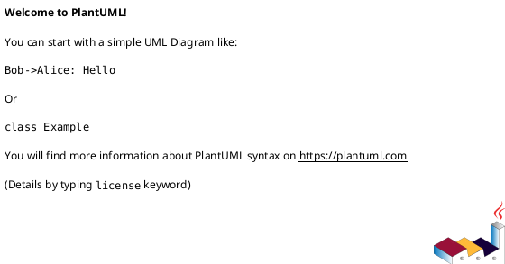

# Module Specification: test_autonomous_mission

* **Source Reference:** `tests/application/workflows/test_autonomous_mission.py`

## 1. Architectural Role & Responsibilities
**Purpose:**
Provides functionality related to test autonomous mission.

**Architecture Layer:**
- Infrastructure/Other

**Responsibilities:**
- Manage and execute operations for test_autonomous_mission.

**Main Workflow:**
- Initialize components and process requests for test_autonomous_mission.

## 2. Dependencies
**Imports:**
- `pytest`
- `unittest.mock.AsyncMock`
- `unittest.mock.MagicMock`
- `unittest.mock.patch`
- `autogen_team.application.workflows.autonomous_mission.MissionInput`
- `autogen_team.application.workflows.autonomous_mission.TaskInput`
- `autogen_team.application.workflows.autonomous_mission.MissionOutput`
- `autogen_team.application.workflows.autonomous_mission.execute_coding_task`
- `autogen_team.application.workflows.autonomous_mission.plan`
- `autogen_team.application.workflows.autonomous_mission.fan_out_tasks`
- `autogen_team.application.workflows.autonomous_mission.aggregate_and_review`
- `autogen_team.application.workflows.autonomous_mission.document_mission`

**Exported Classes:**
- None

**Exported Functions:**
- `mock_context`
- `test_execute_coding_task`
- `test_plan`
- `test_fan_out_tasks`
- `test_aggregate_and_review`
- `test_document_mission`

## 3. Architecture & Execution
### Internal Architecture
Follows standard modular design, encapsulating state and behavior within defined classes and functions.

### Execution Flow
Sequential execution of defined functions and class methods.

### Sequence Explanation
Clients instantiate classes or call functions, which execute business logic and return results.

## 4. UML 2.0 Diagrams
### Class Diagram

### Dependency Graph

```plantuml
@startuml
    [Module] --> [pytest] : imports
    [Module] --> [unittest.mock.AsyncMock] : imports
    [Module] --> [unittest.mock.MagicMock] : imports
    [Module] --> [unittest.mock.patch] : imports
    [Module] --> [autogen_team.application.workflows.autonomous_mission.MissionInput] : imports
    [Module] --> [autogen_team.application.workflows.autonomous_mission.TaskInput] : imports
    [Module] --> [autogen_team.application.workflows.autonomous_mission.MissionOutput] : imports
    [Module] --> [autogen_team.application.workflows.autonomous_mission.execute_coding_task] : imports
    [Module] --> [autogen_team.application.workflows.autonomous_mission.plan] : imports
    [Module] --> [autogen_team.application.workflows.autonomous_mission.fan_out_tasks] : imports
    [Module] --> [autogen_team.application.workflows.autonomous_mission.aggregate_and_review] : imports
    [Module] --> [autogen_team.application.workflows.autonomous_mission.document_mission] : imports
@enduml
```

## 5. Class & Method Specifications
## 6. Module Functions
### `mock_context()`
Executes the mock_context operation.

**Inputs:**
- None

**Output:**
- Return Type: `MagicMock`

### `test_execute_coding_task(mock_context: MagicMock)`
Executes the test_execute_coding_task operation.

**Inputs:**
- `mock_context`: MagicMock

**Output:**
- Return Type: `None`

### `test_plan(mock_context: MagicMock)`
Executes the test_plan operation.

**Inputs:**
- `mock_context`: MagicMock

**Output:**
- Return Type: `None`

### `test_fan_out_tasks(mock_context: MagicMock)`
Executes the test_fan_out_tasks operation.

**Inputs:**
- `mock_context`: MagicMock

**Output:**
- Return Type: `None`

### `test_aggregate_and_review(mock_context: MagicMock)`
Executes the test_aggregate_and_review operation.

**Inputs:**
- `mock_context`: MagicMock

**Output:**
- Return Type: `None`

### `test_document_mission(mock_context: MagicMock)`
Executes the test_document_mission operation.

**Inputs:**
- `mock_context`: MagicMock

**Output:**
- Return Type: `None`
