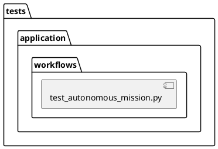
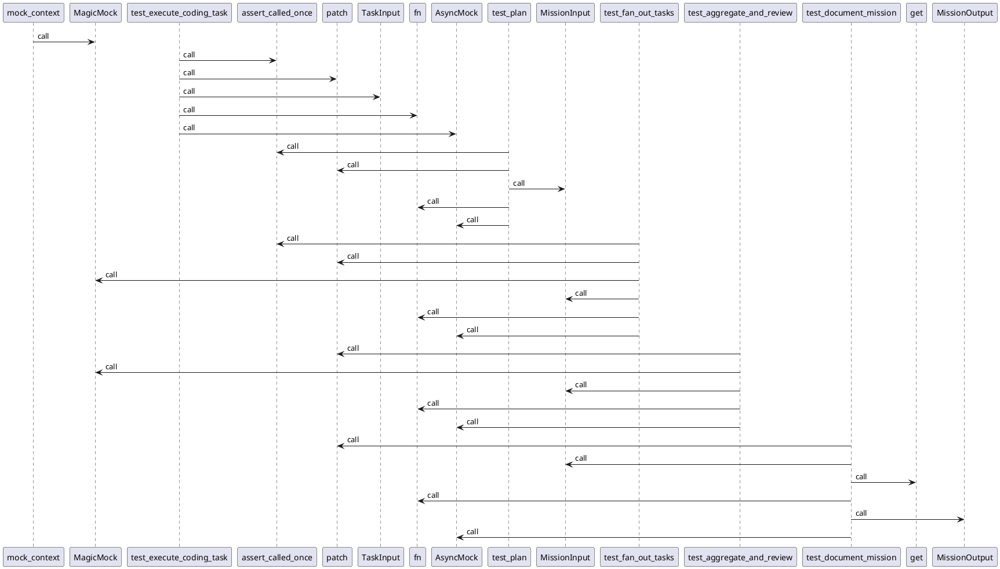
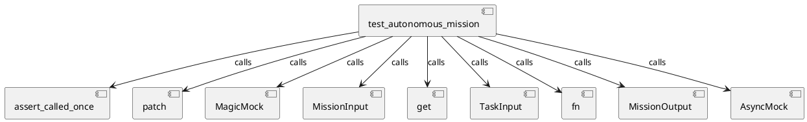

# Module Specification: test_autonomous_mission

* **Source Reference:** `tests/application/workflows/test_autonomous_mission.py`

## 1. Architectural Role & Responsibilities
**Purpose:**
Provides functionality related to test autonomous mission.

**Architecture Layer:**
- Infrastructure/Other

**Responsibilities:**
- Not explicitly defined.

**Main Workflow:**
- Not explicitly defined.

## 2. Dependencies
**Imports:**
- `pytest`
- `unittest.mock.AsyncMock`
- `unittest.mock.MagicMock`
- `unittest.mock.patch`
- `autogen_team.application.workflows.autonomous_mission.MissionInput`
- `autogen_team.application.workflows.autonomous_mission.TaskInput`
- `autogen_team.application.workflows.autonomous_mission.MissionOutput`
- `autogen_team.application.workflows.autonomous_mission.execute_coding_task`
- `autogen_team.application.workflows.autonomous_mission.plan`
- `autogen_team.application.workflows.autonomous_mission.fan_out_tasks`
- `autogen_team.application.workflows.autonomous_mission.aggregate_and_review`
- `autogen_team.application.workflows.autonomous_mission.document_mission`

**Exported Classes:**
- None

**Exported Functions:**
- `mock_context`
- `test_execute_coding_task`
- `test_plan`
- `test_fan_out_tasks`
- `test_aggregate_and_review`
- `test_document_mission`

**Exported Interfaces:**
- Not explicitly defined.

**Public API:**
- Not explicitly defined.

## 3. Architecture & Execution
### Internal Architecture
Not explicitly defined.

### Execution Flow
Not explicitly defined.

### Sequence Explanation
Not explicitly defined.

### Examples
Not explicitly defined.

## 4. UML 2.0 Diagrams
### Class Diagram

```plantuml
@startuml
    ' No classes found in module
@enduml
```

### Package Diagram

```plantuml
@startuml
    package "tests" {
        package "application" {
            package "workflows" {
                [test_autonomous_mission.py]
            }
        }
    }
@enduml
```

### Sequence Diagram

```plantuml
@startuml
    mock_context -> MagicMock : call
    test_execute_coding_task -> assert_called_once : call
    test_execute_coding_task -> patch : call
    test_execute_coding_task -> TaskInput : call
    test_execute_coding_task -> fn : call
    test_execute_coding_task -> AsyncMock : call
    test_plan -> assert_called_once : call
    test_plan -> patch : call
    test_plan -> MissionInput : call
    test_plan -> fn : call
    test_plan -> AsyncMock : call
    test_fan_out_tasks -> assert_called_once : call
    test_fan_out_tasks -> patch : call
    test_fan_out_tasks -> MagicMock : call
    test_fan_out_tasks -> MissionInput : call
    test_fan_out_tasks -> fn : call
    test_fan_out_tasks -> AsyncMock : call
    test_aggregate_and_review -> patch : call
    test_aggregate_and_review -> MagicMock : call
    test_aggregate_and_review -> MissionInput : call
    test_aggregate_and_review -> fn : call
    test_aggregate_and_review -> AsyncMock : call
    test_document_mission -> patch : call
    test_document_mission -> MissionInput : call
    test_document_mission -> get : call
    test_document_mission -> fn : call
    test_document_mission -> MissionOutput : call
    test_document_mission -> AsyncMock : call
@enduml
```

### Component Diagram

```plantuml
@startuml
    package "Infrastructure/Other" {
        [test_autonomous_mission.py]
    }
    [test_autonomous_mission.py] --> [pytest]
    [test_autonomous_mission.py] --> [unittest.mock.AsyncMock]
    [test_autonomous_mission.py] --> [unittest.mock.MagicMock]
    [test_autonomous_mission.py] --> [unittest.mock.patch]
    [test_autonomous_mission.py] --> [autogen_team.application.workflows.autonomous_mission.MissionInput]
    [test_autonomous_mission.py] --> [autogen_team.application.workflows.autonomous_mission.TaskInput]
    [test_autonomous_mission.py] --> [autogen_team.application.workflows.autonomous_mission.MissionOutput]
    [test_autonomous_mission.py] --> [autogen_team.application.workflows.autonomous_mission.execute_coding_task]
    [test_autonomous_mission.py] --> [autogen_team.application.workflows.autonomous_mission.plan]
    [test_autonomous_mission.py] --> [autogen_team.application.workflows.autonomous_mission.fan_out_tasks]
    [test_autonomous_mission.py] --> [autogen_team.application.workflows.autonomous_mission.aggregate_and_review]
    [test_autonomous_mission.py] --> [autogen_team.application.workflows.autonomous_mission.document_mission]
@enduml
```

### Dependency Graph

```plantuml
@startuml
    [Module] --> [pytest] : imports
    [Module] --> [unittest.mock.AsyncMock] : imports
    [Module] --> [unittest.mock.MagicMock] : imports
    [Module] --> [unittest.mock.patch] : imports
    [Module] --> [autogen_team.application.workflows.autonomous_mission.MissionInput] : imports
    [Module] --> [autogen_team.application.workflows.autonomous_mission.TaskInput] : imports
    [Module] --> [autogen_team.application.workflows.autonomous_mission.MissionOutput] : imports
    [Module] --> [autogen_team.application.workflows.autonomous_mission.execute_coding_task] : imports
    [Module] --> [autogen_team.application.workflows.autonomous_mission.plan] : imports
    [Module] --> [autogen_team.application.workflows.autonomous_mission.fan_out_tasks] : imports
    [Module] --> [autogen_team.application.workflows.autonomous_mission.aggregate_and_review] : imports
    [Module] --> [autogen_team.application.workflows.autonomous_mission.document_mission] : imports
@enduml
```

## 5. Class & Method Specifications
## 6. Module Functions
### `mock_context() -> MagicMock` (Public)
**Description:** No description provided.

**Inputs:**
- None

**Output:**
- return type: `MagicMock`
- semantic meaning: Not explicitly defined.
- possible null values: Not explicitly defined.
- exceptions: Not explicitly defined.

**Side Effects:**
- Database updates: Not explicitly defined.
- File operations: Not explicitly defined.
- Network calls: Not explicitly defined.
- Cache: Not explicitly defined.
- State changes: Not explicitly defined.

**Complexity:**
- Time Complexity: Not explicitly defined.
- Space Complexity: Not explicitly defined.

**Example:**
```python
result = mock_context()
```

### `test_execute_coding_task(mock_context: MagicMock) -> None` (Public)
**Description:** No description provided.

**Inputs:**
- `mock_context`
  - type: MagicMock
  - meaning: Not explicitly defined.
  - valid values: Not explicitly defined.
  - optional?: False
  - default value: None

**Output:**
- return type: `None`
- semantic meaning: Not explicitly defined.
- possible null values: Not explicitly defined.
- exceptions: Not explicitly defined.

**Side Effects:**
- Database updates: Not explicitly defined.
- File operations: Not explicitly defined.
- Network calls: Not explicitly defined.
- Cache: Not explicitly defined.
- State changes: Not explicitly defined.

**Complexity:**
- Time Complexity: Not explicitly defined.
- Space Complexity: Not explicitly defined.

**Example:**
```python
result = test_execute_coding_task(...)
```

### `test_plan(mock_context: MagicMock) -> None` (Public)
**Description:** No description provided.

**Inputs:**
- `mock_context`
  - type: MagicMock
  - meaning: Not explicitly defined.
  - valid values: Not explicitly defined.
  - optional?: False
  - default value: None

**Output:**
- return type: `None`
- semantic meaning: Not explicitly defined.
- possible null values: Not explicitly defined.
- exceptions: Not explicitly defined.

**Side Effects:**
- Database updates: Not explicitly defined.
- File operations: Not explicitly defined.
- Network calls: Not explicitly defined.
- Cache: Not explicitly defined.
- State changes: Not explicitly defined.

**Complexity:**
- Time Complexity: Not explicitly defined.
- Space Complexity: Not explicitly defined.

**Example:**
```python
result = test_plan(...)
```

### `test_fan_out_tasks(mock_context: MagicMock) -> None` (Public)
**Description:** No description provided.

**Inputs:**
- `mock_context`
  - type: MagicMock
  - meaning: Not explicitly defined.
  - valid values: Not explicitly defined.
  - optional?: False
  - default value: None

**Output:**
- return type: `None`
- semantic meaning: Not explicitly defined.
- possible null values: Not explicitly defined.
- exceptions: Not explicitly defined.

**Side Effects:**
- Database updates: Not explicitly defined.
- File operations: Not explicitly defined.
- Network calls: Not explicitly defined.
- Cache: Not explicitly defined.
- State changes: Not explicitly defined.

**Complexity:**
- Time Complexity: Not explicitly defined.
- Space Complexity: Not explicitly defined.

**Example:**
```python
result = test_fan_out_tasks(...)
```

### `test_aggregate_and_review(mock_context: MagicMock) -> None` (Public)
**Description:** No description provided.

**Inputs:**
- `mock_context`
  - type: MagicMock
  - meaning: Not explicitly defined.
  - valid values: Not explicitly defined.
  - optional?: False
  - default value: None

**Output:**
- return type: `None`
- semantic meaning: Not explicitly defined.
- possible null values: Not explicitly defined.
- exceptions: Not explicitly defined.

**Side Effects:**
- Database updates: Not explicitly defined.
- File operations: Not explicitly defined.
- Network calls: Not explicitly defined.
- Cache: Not explicitly defined.
- State changes: Not explicitly defined.

**Complexity:**
- Time Complexity: Not explicitly defined.
- Space Complexity: Not explicitly defined.

**Example:**
```python
result = test_aggregate_and_review(...)
```

### `test_document_mission(mock_context: MagicMock) -> None` (Public)
**Description:** No description provided.

**Inputs:**
- `mock_context`
  - type: MagicMock
  - meaning: Not explicitly defined.
  - valid values: Not explicitly defined.
  - optional?: False
  - default value: None

**Output:**
- return type: `None`
- semantic meaning: Not explicitly defined.
- possible null values: Not explicitly defined.
- exceptions: Not explicitly defined.

**Side Effects:**
- Database updates: Not explicitly defined.
- File operations: Not explicitly defined.
- Network calls: Not explicitly defined.
- Cache: Not explicitly defined.
- State changes: Not explicitly defined.

**Complexity:**
- Time Complexity: Not explicitly defined.
- Space Complexity: Not explicitly defined.

**Example:**
```python
result = test_document_mission(...)
```

## 7. Call Graph

```plantuml
@startuml
[test_autonomous_mission] --> [assert_called_once] : calls
[test_autonomous_mission] --> [patch] : calls
[test_autonomous_mission] --> [MagicMock] : calls
[test_autonomous_mission] --> [MissionInput] : calls
[test_autonomous_mission] --> [get] : calls
[test_autonomous_mission] --> [TaskInput] : calls
[test_autonomous_mission] --> [fn] : calls
[test_autonomous_mission] --> [MissionOutput] : calls
[test_autonomous_mission] --> [AsyncMock] : calls
@enduml
```

## 8. Cross References
- **Dependencies:** [Dependencies](../../../../dependencies/index.md)
- **Used by:** None
- **Calls:** assert_called_once, patch, MagicMock, MissionInput, get, TaskInput, fn, MissionOutput, AsyncMock
- **Called from:** None
- **Related classes:** [Classes](../../../../classes/index.md)
- **Related diagrams:** [Diagrams](../../../../diagrams/index.md)
