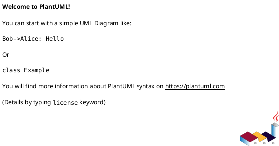

# Module Specification: conftest

* **Source Reference:** `tests/conftest.py`

## 1. Architectural Role & Responsibilities
**Purpose:**
Provides functionality related to conftest.

**Architecture Layer:**
- Infrastructure/Other

**Responsibilities:**
- Manage and execute operations for conftest.

**Main Workflow:**
- Initialize components and process requests for conftest.

## 2. Dependencies
**Imports:**
- `os`
- `typing`
- `typing.Any`
- `typing.cast`
- `omegaconf`
- `pytest`
- `_pytest.logging`
- `agent_framework.Message`
- `agent_framework.openai.OpenAIChatClient`
- `autogen_team.core.schemas`
- `autogen_team.data_access.adapters.datasets`
- `autogen_team.evaluation.metrics`
- `autogen_team.infrastructure.services`
- `autogen_team.infrastructure.utils.searchers`
- `autogen_team.infrastructure.utils.signers`
- `autogen_team.infrastructure.utils.splitters`
- `autogen_team.models.entities`
- `autogen_team.registry.adapters.mlflow_adapter`
- `mocogpt.GptServer`
- `mocogpt.gpt_server`
- `openai.OpenAI`

**Exported Classes:**
- None

**Exported Functions:**
- `_patched_prepare`
- `tests_path`
- `data_path`
- `confs_path`
- `inputs_path`
- `targets_path`
- `outputs_path`
- `tmp_outputs_path`
- `tmp_models_explanations_path`
- `tmp_samples_explanations_path`
- `extra_config`
- `inputs_reader`
- `inputs_samples_reader`
- `targets_reader`
- `outputs_reader`
- `tmp_outputs_writer`
- `tmp_models_explanations_writer`
- `tmp_samples_explanations_writer`
- `inputs`
- `inputs_samples`
- `targets`
- `outputs`
- `train_test_splitter`
- `time_series_splitter`
- `searcher`
- `train_test_sets`
- `model`
- `metric`
- `signer`
- `logger_service`
- `logger_caplog`
- `alerts_service`
- `mlflow_service`
- `chtgpt_service`
- `tests_path_resolver`
- `tmp_path_resolver`
- `signature`
- `saver`
- `loader`
- `register`
- `model_version`
- `model_alias`

## 3. Architecture & Execution
### Internal Architecture
Follows standard modular design, encapsulating state and behavior within defined classes and functions.

### Execution Flow
Sequential execution of defined functions and class methods.

### Sequence Explanation
Clients instantiate classes or call functions, which execute business logic and return results.

## 4. UML 2.0 Diagrams
### Class Diagram

### Dependency Graph

```plantuml
@startuml
    [Module] --> [os] : imports
    [Module] --> [typing] : imports
    [Module] --> [typing.Any] : imports
    [Module] --> [typing.cast] : imports
    [Module] --> [omegaconf] : imports
    [Module] --> [pytest] : imports
    [Module] --> [_pytest.logging] : imports
    [Module] --> [agent_framework.Message] : imports
    [Module] --> [agent_framework.openai.OpenAIChatClient] : imports
    [Module] --> [autogen_team.core.schemas] : imports
    [Module] --> [autogen_team.data_access.adapters.datasets] : imports
    [Module] --> [autogen_team.evaluation.metrics] : imports
    [Module] --> [autogen_team.infrastructure.services] : imports
    [Module] --> [autogen_team.infrastructure.utils.searchers] : imports
    [Module] --> [autogen_team.infrastructure.utils.signers] : imports
    [Module] --> [autogen_team.infrastructure.utils.splitters] : imports
    [Module] --> [autogen_team.models.entities] : imports
    [Module] --> [autogen_team.registry.adapters.mlflow_adapter] : imports
    [Module] --> [mocogpt.GptServer] : imports
    [Module] --> [mocogpt.gpt_server] : imports
    [Module] --> [openai.OpenAI] : imports
@enduml
```

## 5. Class & Method Specifications
## 6. Module Functions
### `_patched_prepare(self: OpenAIChatClient, message: Message)`
Executes the _patched_prepare operation.

**Inputs:**
- `self`: OpenAIChatClient
- `message`: Message

**Output:**
- Return Type: `Any`

### `tests_path()`
Return the path of the tests folder.

**Inputs:**
- None

**Output:**
- Return Type: `str`

### `data_path(tests_path: str)`
Return the path of the data folder.

**Inputs:**
- `tests_path`: str

**Output:**
- Return Type: `str`

### `confs_path(tests_path: str)`
Return the path of the confs folder.

**Inputs:**
- `tests_path`: str

**Output:**
- Return Type: `str`

### `inputs_path(data_path: str)`
Return the path of the inputs dataset.

**Inputs:**
- `data_path`: str

**Output:**
- Return Type: `str`

### `targets_path(data_path: str)`
Return the path of the targets dataset.

**Inputs:**
- `data_path`: str

**Output:**
- Return Type: `str`

### `outputs_path(data_path: str)`
Return the path of the outputs dataset.

**Inputs:**
- `data_path`: str

**Output:**
- Return Type: `str`

### `tmp_outputs_path(tmp_path: str)`
Return a tmp path for the outputs dataset.

**Inputs:**
- `tmp_path`: str

**Output:**
- Return Type: `str`

### `tmp_models_explanations_path(tmp_path: str)`
Return a tmp path for the model explanations dataset.

**Inputs:**
- `tmp_path`: str

**Output:**
- Return Type: `str`

### `tmp_samples_explanations_path(tmp_path: str)`
Return a tmp path for the samples explanations dataset.

**Inputs:**
- `tmp_path`: str

**Output:**
- Return Type: `str`

### `extra_config()`
Extra config for scripts.

**Inputs:**
- None

**Output:**
- Return Type: `str`

### `inputs_reader(inputs_path: str)`
Return a reader for the inputs dataset.

**Inputs:**
- `inputs_path`: str

**Output:**
- Return Type: `Any`

### `inputs_samples_reader(inputs_path: str)`
Return a reader for the inputs samples dataset.

**Inputs:**
- `inputs_path`: str

**Output:**
- Return Type: `Any`

### `targets_reader(targets_path: str)`
Return a reader for the targets dataset.

**Inputs:**
- `targets_path`: str

**Output:**
- Return Type: `Any`

### `outputs_reader(outputs_path: str, inputs_reader: Any, targets_reader: Any)`
Return a reader for the outputs dataset.

**Inputs:**
- `outputs_path`: str
- `inputs_reader`: Any
- `targets_reader`: Any

**Output:**
- Return Type: `Any`

### `tmp_outputs_writer(tmp_outputs_path: str)`
Return a writer for the tmp outputs dataset.

**Inputs:**
- `tmp_outputs_path`: str

**Output:**
- Return Type: `Any`

### `tmp_models_explanations_writer(tmp_models_explanations_path: str)`
Return a writer for the tmp model explanations dataset.

**Inputs:**
- `tmp_models_explanations_path`: str

**Output:**
- Return Type: `Any`

### `tmp_samples_explanations_writer(tmp_samples_explanations_path: str)`
Return a writer for the tmp samples explanations dataset.

**Inputs:**
- `tmp_samples_explanations_path`: str

**Output:**
- Return Type: `Any`

### `inputs(inputs_reader: Any)`
Return the inputs data.

**Inputs:**
- `inputs_reader`: Any

**Output:**
- Return Type: `Any`

### `inputs_samples(inputs_samples_reader: Any)`
Return the inputs samples data.

**Inputs:**
- `inputs_samples_reader`: Any

**Output:**
- Return Type: `Any`

### `targets(targets_reader: Any)`
Return the targets data.

**Inputs:**
- `targets_reader`: Any

**Output:**
- Return Type: `Any`

### `outputs(outputs_reader: Any)`
Return the outputs data.

**Inputs:**
- `outputs_reader`: Any

**Output:**
- Return Type: `Any`

### `train_test_splitter()`
Return the default train test splitter.

**Inputs:**
- None

**Output:**
- Return Type: `Any`

### `time_series_splitter()`
Return the default time series splitter.

**Inputs:**
- None

**Output:**
- Return Type: `Any`

### `searcher()`
Return the default searcher object.

**Inputs:**
- None

**Output:**
- Return Type: `Any`

### `train_test_sets(train_test_splitter: Any, inputs: Any, targets: Any)`
Return the inputs and targets train and test sets from the splitter.

**Inputs:**
- `train_test_splitter`: Any
- `inputs`: Any
- `targets`: Any

**Output:**
- Return Type: `Any`

### `model(train_test_sets: tuple[...])`
Return a train model for testing.

**Inputs:**
- `train_test_sets`: tuple[...]

**Output:**
- Return Type: `Any`

### `metric()`
Return the default metric.

**Inputs:**
- None

**Output:**
- Return Type: `Any`

### `signer()`
Return a model signer.

**Inputs:**
- None

**Output:**
- Return Type: `Any`

### `logger_service()`
Return and start the logger service.

**Inputs:**
- None

**Output:**
- Return Type: `Any`

### `logger_caplog(caplog: Any, logger_service: Any)`
Extend pytest caplog fixture with the logger service (loguru).

**Inputs:**
- `caplog`: Any
- `logger_service`: Any

**Output:**
- Return Type: `Any`

### `alerts_service()`
Return and start the alerter service.

**Inputs:**
- None

**Output:**
- Return Type: `Any`

### `mlflow_service(tmp_path: str)`
Return and start the mlflow service.

**Inputs:**
- `tmp_path`: str

**Output:**
- Return Type: `Any`

### `chtgpt_service(targets: Any, inputs_samples: Any)`
Return and start the logger service.

**Inputs:**
- `targets`: Any
- `inputs_samples`: Any

**Output:**
- Return Type: `GptServer`

### `tests_path_resolver(tests_path: str)`
Register the tests path resolver with OmegaConf.

**Inputs:**
- `tests_path`: str

**Output:**
- Return Type: `str`

### `tmp_path_resolver(tmp_path: str)`
Register the tmp path resolver with OmegaConf.

**Inputs:**
- `tmp_path`: str

**Output:**
- Return Type: `str`

### `signature(signer: Any, inputs: Any, outputs: Any)`
Return the signature for the testing model.

**Inputs:**
- `signer`: Any
- `inputs`: Any
- `outputs`: Any

**Output:**
- Return Type: `Any`

### `saver()`
Return the default model saver.

**Inputs:**
- None

**Output:**
- Return Type: `Any`

### `loader()`
Return the default model loader.

**Inputs:**
- None

**Output:**
- Return Type: `Any`

### `register()`
Return the default model register.

**Inputs:**
- None

**Output:**
- Return Type: `Any`

### `model_version(model: Any, inputs: Any, signature: Any, saver: Any, register: Any, mlflow_service: Any)`
Save and register the default model version.

**Inputs:**
- `model`: Any
- `inputs`: Any
- `signature`: Any
- `saver`: Any
- `register`: Any
- `mlflow_service`: Any

**Output:**
- Return Type: `Any`

### `model_alias(model_version: Any, mlflow_service: Any)`
Promote the default model version with an alias.

**Inputs:**
- `model_version`: Any
- `mlflow_service`: Any

**Output:**
- Return Type: `Any`
