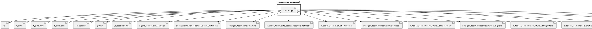
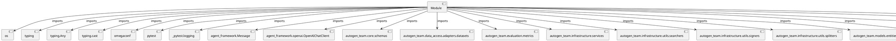
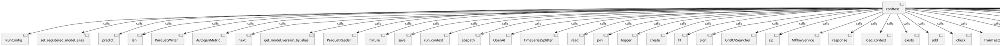

# Module Specification: conftest

* **Source Reference:** `tests/conftest.py`

## 1. Architectural Role & Responsibilities
**Purpose:**
Provides functionality related to conftest.

**Architecture Layer:**
- Infrastructure/Other

**Responsibilities:**
- Manages operations and logic for conftest.

**Main Workflow:**
- Executes the primary flow defined by conftest functions and classes.

## 2. Dependencies
**Imports:**
- `os`
- `typing`
- `typing.Any`
- `typing.cast`
- `omegaconf`
- `pytest`
- `_pytest.logging`
- `agent_framework.Message`
- `agent_framework.openai.OpenAIChatClient`
- `autogen_team.core.schemas`
- `autogen_team.data_access.adapters.datasets`
- `autogen_team.evaluation.metrics`
- `autogen_team.infrastructure.services`
- `autogen_team.infrastructure.utils.searchers`
- `autogen_team.infrastructure.utils.signers`
- `autogen_team.infrastructure.utils.splitters`
- `autogen_team.models.entities`
- `autogen_team.registry.adapters.mlflow_adapter`
- `mocogpt.GptServer`
- `mocogpt.gpt_server`
- `openai.OpenAI`

**Exported Classes:**
- None

**Exported Functions:**
- `_patched_prepare`
- `tests_path`
- `data_path`
- `confs_path`
- `inputs_path`
- `targets_path`
- `outputs_path`
- `tmp_outputs_path`
- `tmp_models_explanations_path`
- `tmp_samples_explanations_path`
- `extra_config`
- `inputs_reader`
- `inputs_samples_reader`
- `targets_reader`
- `outputs_reader`
- `tmp_outputs_writer`
- `tmp_models_explanations_writer`
- `tmp_samples_explanations_writer`
- `inputs`
- `inputs_samples`
- `targets`
- `outputs`
- `train_test_splitter`
- `time_series_splitter`
- `searcher`
- `train_test_sets`
- `model`
- `metric`
- `signer`
- `logger_service`
- `logger_caplog`
- `alerts_service`
- `mlflow_service`
- `chtgpt_service`
- `tests_path_resolver`
- `tmp_path_resolver`
- `signature`
- `saver`
- `loader`
- `register`
- `model_version`
- `model_alias`

**Exported Interfaces:**
- Not explicitly defined.

**Public API:**
- Not explicitly defined.

## 3. Architecture & Execution
### Internal Architecture
Not explicitly defined.

### Execution Flow
Not explicitly defined.

### Sequence Explanation
Not explicitly defined.

### Examples
Not explicitly defined.

## 4. UML 2.0 Diagrams
### Class Diagram

```plantuml
@startuml
    ' No classes found in module
@enduml
```

### Sequence Diagram

```plantuml
@startuml
    _patched_prepare -> _orig_prepare : call
    _patched_prepare -> get : call
    _patched_prepare -> len : call
    _patched_prepare -> isinstance : call
    tests_path -> abspath : call
    tests_path -> dirname : call
    tests_path -> fixture : call
    data_path -> fixture : call
    data_path -> join : call
    confs_path -> fixture : call
    confs_path -> join : call
    inputs_path -> fixture : call
    inputs_path -> join : call
    targets_path -> fixture : call
    targets_path -> join : call
    outputs_path -> fixture : call
    outputs_path -> join : call
    tmp_outputs_path -> fixture : call
    tmp_outputs_path -> join : call
    tmp_models_explanations_path -> fixture : call
    tmp_models_explanations_path -> join : call
    tmp_samples_explanations_path -> fixture : call
    tmp_samples_explanations_path -> join : call
    extra_config -> fixture : call
    inputs_reader -> ParquetReader : call
    inputs_reader -> fixture : call
    inputs_samples_reader -> ParquetReader : call
    inputs_samples_reader -> fixture : call
    targets_reader -> ParquetReader : call
    targets_reader -> fixture : call
    outputs_reader -> check : call
    outputs_reader -> predict : call
    outputs_reader -> read : call
    outputs_reader -> ParquetWriter : call
    outputs_reader -> BaselineAutogenModel : call
    outputs_reader -> fit : call
    outputs_reader -> ParquetReader : call
    outputs_reader -> fixture : call
    outputs_reader -> load_context : call
    outputs_reader -> write : call
    outputs_reader -> exists : call
    tmp_outputs_writer -> fixture : call
    tmp_outputs_writer -> ParquetWriter : call
    tmp_models_explanations_writer -> fixture : call
    tmp_models_explanations_writer -> ParquetWriter : call
    tmp_samples_explanations_writer -> fixture : call
    tmp_samples_explanations_writer -> ParquetWriter : call
    inputs -> check : call
    inputs -> fixture : call
    inputs -> read : call
    inputs_samples -> check : call
    inputs_samples -> fixture : call
    inputs_samples -> read : call
    targets -> check : call
    targets -> fixture : call
    targets -> read : call
    outputs -> check : call
    outputs -> fixture : call
    outputs -> read : call
    train_test_splitter -> TrainTestSplitter : call
    train_test_splitter -> fixture : call
    time_series_splitter -> TimeSeriesSplitter : call
    time_series_splitter -> fixture : call
    searcher -> cast : call
    searcher -> GridCVSearcher : call
    searcher -> fixture : call
    train_test_sets -> next : call
    train_test_sets -> split : call
    train_test_sets -> cast : call
    train_test_sets -> fixture : call
    model -> load_context : call
    model -> BaselineAutogenModel : call
    model -> fixture : call
    model -> fit : call
    metric -> fixture : call
    metric -> AutogenMetric : call
    signer -> InferSigner : call
    signer -> fixture : call
    logger_service -> start : call
    logger_service -> stop : call
    logger_service -> fixture : call
    logger_service -> LoggerService : call
    logger_caplog -> remove : call
    logger_caplog -> logger : call
    logger_caplog -> add : call
    alerts_service -> start : call
    alerts_service -> stop : call
    alerts_service -> fixture : call
    alerts_service -> AlertsService : call
    mlflow_service -> start : call
    mlflow_service -> stop : call
    mlflow_service -> fixture : call
    mlflow_service -> MlflowService : call
    chtgpt_service -> OpenAI : call
    chtgpt_service -> create : call
    chtgpt_service -> zip : call
    chtgpt_service -> request : call
    chtgpt_service -> fixture : call
    chtgpt_service -> gpt_server : call
    chtgpt_service -> response : call
    tests_path_resolver -> register_new_resolver : call
    tests_path_resolver -> fixture : call
    tmp_path_resolver -> register_new_resolver : call
    tmp_path_resolver -> fixture : call
    signature -> sign : call
    signature -> fixture : call
    saver -> fixture : call
    saver -> CustomSaver : call
    loader -> fixture : call
    loader -> CustomLoader : call
    register -> fixture : call
    register -> MlflowRegister : call
    model_version -> RunConfig : call
    model_version -> register : call
    model_version -> save : call
    model_version -> fixture : call
    model_version -> run_context : call
    model_alias -> set_registered_model_alias : call
    model_alias -> client : call
    model_alias -> get_model_version_by_alias : call
    model_alias -> fixture : call
@enduml
```

### Component Diagram

```plantuml
@startuml
    package "Infrastructure/Other" {
        [conftest.py]
    }
    [conftest.py] --> [os]
    [conftest.py] --> [typing]
    [conftest.py] --> [typing.Any]
    [conftest.py] --> [typing.cast]
    [conftest.py] --> [omegaconf]
    [conftest.py] --> [pytest]
    [conftest.py] --> [_pytest.logging]
    [conftest.py] --> [agent_framework.Message]
    [conftest.py] --> [agent_framework.openai.OpenAIChatClient]
    [conftest.py] --> [autogen_team.core.schemas]
    [conftest.py] --> [autogen_team.data_access.adapters.datasets]
    [conftest.py] --> [autogen_team.evaluation.metrics]
    [conftest.py] --> [autogen_team.infrastructure.services]
    [conftest.py] --> [autogen_team.infrastructure.utils.searchers]
    [conftest.py] --> [autogen_team.infrastructure.utils.signers]
    [conftest.py] --> [autogen_team.infrastructure.utils.splitters]
    [conftest.py] --> [autogen_team.models.entities]
    [conftest.py] --> [autogen_team.registry.adapters.mlflow_adapter]
    [conftest.py] --> [mocogpt.GptServer]
    [conftest.py] --> [mocogpt.gpt_server]
    [conftest.py] --> [openai.OpenAI]
@enduml
```

### Dependency Graph

```plantuml
@startuml
    [Module] --> [os] : imports
    [Module] --> [typing] : imports
    [Module] --> [typing.Any] : imports
    [Module] --> [typing.cast] : imports
    [Module] --> [omegaconf] : imports
    [Module] --> [pytest] : imports
    [Module] --> [_pytest.logging] : imports
    [Module] --> [agent_framework.Message] : imports
    [Module] --> [agent_framework.openai.OpenAIChatClient] : imports
    [Module] --> [autogen_team.core.schemas] : imports
    [Module] --> [autogen_team.data_access.adapters.datasets] : imports
    [Module] --> [autogen_team.evaluation.metrics] : imports
    [Module] --> [autogen_team.infrastructure.services] : imports
    [Module] --> [autogen_team.infrastructure.utils.searchers] : imports
    [Module] --> [autogen_team.infrastructure.utils.signers] : imports
    [Module] --> [autogen_team.infrastructure.utils.splitters] : imports
    [Module] --> [autogen_team.models.entities] : imports
    [Module] --> [autogen_team.registry.adapters.mlflow_adapter] : imports
    [Module] --> [mocogpt.GptServer] : imports
    [Module] --> [mocogpt.gpt_server] : imports
    [Module] --> [openai.OpenAI] : imports
@enduml
```

## 5. Class & Method Specifications
## 6. Module Functions
### `_patched_prepare(self: OpenAIChatClient, message: Message)`
Executes the  patched prepare operation.

**Inputs:**
- `self`
  - type: OpenAIChatClient
  - meaning: Represents the self parameter.
  - valid values: Any valid OpenAIChatClient.
  - optional?: False
  - default value: None
- `message`
  - type: Message
  - meaning: Represents the message parameter.
  - valid values: Any valid Message.
  - optional?: False
  - default value: None

**Output:**
- return type: `T.List[T.Dict[str, T.Any]]`
- semantic meaning: Returns the result of  patched prepare.
- possible null values: Yes, if T.List[T.Dict[str, T.Any]] allows it.
- exceptions: Standard execution exceptions.

**Side Effects:**
- Database updates: Not explicitly defined.
- File operations: Not explicitly defined.
- Network calls: Not explicitly defined.
- Cache: Not explicitly defined.
- State changes: Not explicitly defined.

### `tests_path()`
Return the path of the tests folder.

**Inputs:**
- None

**Output:**
- return type: `str`
- semantic meaning: Returns the result of tests path.
- possible null values: Yes, if str allows it.
- exceptions: Standard execution exceptions.

**Side Effects:**
- Database updates: Not explicitly defined.
- File operations: Not explicitly defined.
- Network calls: Not explicitly defined.
- Cache: Not explicitly defined.
- State changes: Not explicitly defined.

### `data_path(tests_path: str)`
Return the path of the data folder.

**Inputs:**
- `tests_path`
  - type: str
  - meaning: Represents the tests path parameter.
  - valid values: Any valid str.
  - optional?: False
  - default value: None

**Output:**
- return type: `str`
- semantic meaning: Returns the result of data path.
- possible null values: Yes, if str allows it.
- exceptions: Standard execution exceptions.

**Side Effects:**
- Database updates: Not explicitly defined.
- File operations: Not explicitly defined.
- Network calls: Not explicitly defined.
- Cache: Not explicitly defined.
- State changes: Not explicitly defined.

### `confs_path(tests_path: str)`
Return the path of the confs folder.

**Inputs:**
- `tests_path`
  - type: str
  - meaning: Represents the tests path parameter.
  - valid values: Any valid str.
  - optional?: False
  - default value: None

**Output:**
- return type: `str`
- semantic meaning: Returns the result of confs path.
- possible null values: Yes, if str allows it.
- exceptions: Standard execution exceptions.

**Side Effects:**
- Database updates: Not explicitly defined.
- File operations: Not explicitly defined.
- Network calls: Not explicitly defined.
- Cache: Not explicitly defined.
- State changes: Not explicitly defined.

### `inputs_path(data_path: str)`
Return the path of the inputs dataset.

**Inputs:**
- `data_path`
  - type: str
  - meaning: Represents the data path parameter.
  - valid values: Any valid str.
  - optional?: False
  - default value: None

**Output:**
- return type: `str`
- semantic meaning: Returns the result of inputs path.
- possible null values: Yes, if str allows it.
- exceptions: Standard execution exceptions.

**Side Effects:**
- Database updates: Not explicitly defined.
- File operations: Not explicitly defined.
- Network calls: Not explicitly defined.
- Cache: Not explicitly defined.
- State changes: Not explicitly defined.

### `targets_path(data_path: str)`
Return the path of the targets dataset.

**Inputs:**
- `data_path`
  - type: str
  - meaning: Represents the data path parameter.
  - valid values: Any valid str.
  - optional?: False
  - default value: None

**Output:**
- return type: `str`
- semantic meaning: Returns the result of targets path.
- possible null values: Yes, if str allows it.
- exceptions: Standard execution exceptions.

**Side Effects:**
- Database updates: Not explicitly defined.
- File operations: Not explicitly defined.
- Network calls: Not explicitly defined.
- Cache: Not explicitly defined.
- State changes: Not explicitly defined.

### `outputs_path(data_path: str)`
Return the path of the outputs dataset.

**Inputs:**
- `data_path`
  - type: str
  - meaning: Represents the data path parameter.
  - valid values: Any valid str.
  - optional?: False
  - default value: None

**Output:**
- return type: `str`
- semantic meaning: Returns the result of outputs path.
- possible null values: Yes, if str allows it.
- exceptions: Standard execution exceptions.

**Side Effects:**
- Database updates: Not explicitly defined.
- File operations: Not explicitly defined.
- Network calls: Not explicitly defined.
- Cache: Not explicitly defined.
- State changes: Not explicitly defined.

### `tmp_outputs_path(tmp_path: str)`
Return a tmp path for the outputs dataset.

**Inputs:**
- `tmp_path`
  - type: str
  - meaning: Represents the tmp path parameter.
  - valid values: Any valid str.
  - optional?: False
  - default value: None

**Output:**
- return type: `str`
- semantic meaning: Returns the result of tmp outputs path.
- possible null values: Yes, if str allows it.
- exceptions: Standard execution exceptions.

**Side Effects:**
- Database updates: Not explicitly defined.
- File operations: Not explicitly defined.
- Network calls: Not explicitly defined.
- Cache: Not explicitly defined.
- State changes: Not explicitly defined.

### `tmp_models_explanations_path(tmp_path: str)`
Return a tmp path for the model explanations dataset.

**Inputs:**
- `tmp_path`
  - type: str
  - meaning: Represents the tmp path parameter.
  - valid values: Any valid str.
  - optional?: False
  - default value: None

**Output:**
- return type: `str`
- semantic meaning: Returns the result of tmp models explanations path.
- possible null values: Yes, if str allows it.
- exceptions: Standard execution exceptions.

**Side Effects:**
- Database updates: Not explicitly defined.
- File operations: Not explicitly defined.
- Network calls: Not explicitly defined.
- Cache: Not explicitly defined.
- State changes: Not explicitly defined.

### `tmp_samples_explanations_path(tmp_path: str)`
Return a tmp path for the samples explanations dataset.

**Inputs:**
- `tmp_path`
  - type: str
  - meaning: Represents the tmp path parameter.
  - valid values: Any valid str.
  - optional?: False
  - default value: None

**Output:**
- return type: `str`
- semantic meaning: Returns the result of tmp samples explanations path.
- possible null values: Yes, if str allows it.
- exceptions: Standard execution exceptions.

**Side Effects:**
- Database updates: Not explicitly defined.
- File operations: Not explicitly defined.
- Network calls: Not explicitly defined.
- Cache: Not explicitly defined.
- State changes: Not explicitly defined.

### `extra_config()`
Extra config for scripts.

**Inputs:**
- None

**Output:**
- return type: `str`
- semantic meaning: Returns the result of extra config.
- possible null values: Yes, if str allows it.
- exceptions: Standard execution exceptions.

**Side Effects:**
- Database updates: Not explicitly defined.
- File operations: Not explicitly defined.
- Network calls: Not explicitly defined.
- Cache: Not explicitly defined.
- State changes: Not explicitly defined.

### `inputs_reader(inputs_path: str)`
Return a reader for the inputs dataset.

**Inputs:**
- `inputs_path`
  - type: str
  - meaning: Represents the inputs path parameter.
  - valid values: Any valid str.
  - optional?: False
  - default value: None

**Output:**
- return type: `datasets.ParquetReader`
- semantic meaning: Returns the result of inputs reader.
- possible null values: Yes, if datasets.ParquetReader allows it.
- exceptions: Standard execution exceptions.

**Side Effects:**
- Database updates: Not explicitly defined.
- File operations: Not explicitly defined.
- Network calls: Not explicitly defined.
- Cache: Not explicitly defined.
- State changes: Not explicitly defined.

### `inputs_samples_reader(inputs_path: str)`
Return a reader for the inputs samples dataset.

**Inputs:**
- `inputs_path`
  - type: str
  - meaning: Represents the inputs path parameter.
  - valid values: Any valid str.
  - optional?: False
  - default value: None

**Output:**
- return type: `datasets.ParquetReader`
- semantic meaning: Returns the result of inputs samples reader.
- possible null values: Yes, if datasets.ParquetReader allows it.
- exceptions: Standard execution exceptions.

**Side Effects:**
- Database updates: Not explicitly defined.
- File operations: Not explicitly defined.
- Network calls: Not explicitly defined.
- Cache: Not explicitly defined.
- State changes: Not explicitly defined.

### `targets_reader(targets_path: str)`
Return a reader for the targets dataset.

**Inputs:**
- `targets_path`
  - type: str
  - meaning: Represents the targets path parameter.
  - valid values: Any valid str.
  - optional?: False
  - default value: None

**Output:**
- return type: `datasets.ParquetReader`
- semantic meaning: Returns the result of targets reader.
- possible null values: Yes, if datasets.ParquetReader allows it.
- exceptions: Standard execution exceptions.

**Side Effects:**
- Database updates: Not explicitly defined.
- File operations: Not explicitly defined.
- Network calls: Not explicitly defined.
- Cache: Not explicitly defined.
- State changes: Not explicitly defined.

### `outputs_reader(outputs_path: str, inputs_reader: datasets.ParquetReader, targets_reader: datasets.ParquetReader)`
Return a reader for the outputs dataset.

**Inputs:**
- `outputs_path`
  - type: str
  - meaning: Represents the outputs path parameter.
  - valid values: Any valid str.
  - optional?: False
  - default value: None
- `inputs_reader`
  - type: datasets.ParquetReader
  - meaning: Represents the inputs reader parameter.
  - valid values: Any valid datasets.ParquetReader.
  - optional?: False
  - default value: None
- `targets_reader`
  - type: datasets.ParquetReader
  - meaning: Represents the targets reader parameter.
  - valid values: Any valid datasets.ParquetReader.
  - optional?: False
  - default value: None

**Output:**
- return type: `datasets.ParquetReader`
- semantic meaning: Returns the result of outputs reader.
- possible null values: Yes, if datasets.ParquetReader allows it.
- exceptions: Standard execution exceptions.

**Side Effects:**
- Database updates: Not explicitly defined.
- File operations: Not explicitly defined.
- Network calls: Not explicitly defined.
- Cache: Not explicitly defined.
- State changes: Not explicitly defined.

### `tmp_outputs_writer(tmp_outputs_path: str)`
Return a writer for the tmp outputs dataset.

**Inputs:**
- `tmp_outputs_path`
  - type: str
  - meaning: Represents the tmp outputs path parameter.
  - valid values: Any valid str.
  - optional?: False
  - default value: None

**Output:**
- return type: `datasets.ParquetWriter`
- semantic meaning: Returns the result of tmp outputs writer.
- possible null values: Yes, if datasets.ParquetWriter allows it.
- exceptions: Standard execution exceptions.

**Side Effects:**
- Database updates: Not explicitly defined.
- File operations: Not explicitly defined.
- Network calls: Not explicitly defined.
- Cache: Not explicitly defined.
- State changes: Not explicitly defined.

### `tmp_models_explanations_writer(tmp_models_explanations_path: str)`
Return a writer for the tmp model explanations dataset.

**Inputs:**
- `tmp_models_explanations_path`
  - type: str
  - meaning: Represents the tmp models explanations path parameter.
  - valid values: Any valid str.
  - optional?: False
  - default value: None

**Output:**
- return type: `datasets.ParquetWriter`
- semantic meaning: Returns the result of tmp models explanations writer.
- possible null values: Yes, if datasets.ParquetWriter allows it.
- exceptions: Standard execution exceptions.

**Side Effects:**
- Database updates: Not explicitly defined.
- File operations: Not explicitly defined.
- Network calls: Not explicitly defined.
- Cache: Not explicitly defined.
- State changes: Not explicitly defined.

### `tmp_samples_explanations_writer(tmp_samples_explanations_path: str)`
Return a writer for the tmp samples explanations dataset.

**Inputs:**
- `tmp_samples_explanations_path`
  - type: str
  - meaning: Represents the tmp samples explanations path parameter.
  - valid values: Any valid str.
  - optional?: False
  - default value: None

**Output:**
- return type: `datasets.ParquetWriter`
- semantic meaning: Returns the result of tmp samples explanations writer.
- possible null values: Yes, if datasets.ParquetWriter allows it.
- exceptions: Standard execution exceptions.

**Side Effects:**
- Database updates: Not explicitly defined.
- File operations: Not explicitly defined.
- Network calls: Not explicitly defined.
- Cache: Not explicitly defined.
- State changes: Not explicitly defined.

### `inputs(inputs_reader: datasets.ParquetReader)`
Return the inputs data.

**Inputs:**
- `inputs_reader`
  - type: datasets.ParquetReader
  - meaning: Represents the inputs reader parameter.
  - valid values: Any valid datasets.ParquetReader.
  - optional?: False
  - default value: None

**Output:**
- return type: `schemas.Inputs`
- semantic meaning: Returns the result of inputs.
- possible null values: Yes, if schemas.Inputs allows it.
- exceptions: Standard execution exceptions.

**Side Effects:**
- Database updates: Not explicitly defined.
- File operations: Not explicitly defined.
- Network calls: Not explicitly defined.
- Cache: Not explicitly defined.
- State changes: Not explicitly defined.

### `inputs_samples(inputs_samples_reader: datasets.ParquetReader)`
Return the inputs samples data.

**Inputs:**
- `inputs_samples_reader`
  - type: datasets.ParquetReader
  - meaning: Represents the inputs samples reader parameter.
  - valid values: Any valid datasets.ParquetReader.
  - optional?: False
  - default value: None

**Output:**
- return type: `schemas.Inputs`
- semantic meaning: Returns the result of inputs samples.
- possible null values: Yes, if schemas.Inputs allows it.
- exceptions: Standard execution exceptions.

**Side Effects:**
- Database updates: Not explicitly defined.
- File operations: Not explicitly defined.
- Network calls: Not explicitly defined.
- Cache: Not explicitly defined.
- State changes: Not explicitly defined.

### `targets(targets_reader: datasets.ParquetReader)`
Return the targets data.

**Inputs:**
- `targets_reader`
  - type: datasets.ParquetReader
  - meaning: Represents the targets reader parameter.
  - valid values: Any valid datasets.ParquetReader.
  - optional?: False
  - default value: None

**Output:**
- return type: `schemas.Targets`
- semantic meaning: Returns the result of targets.
- possible null values: Yes, if schemas.Targets allows it.
- exceptions: Standard execution exceptions.

**Side Effects:**
- Database updates: Not explicitly defined.
- File operations: Not explicitly defined.
- Network calls: Not explicitly defined.
- Cache: Not explicitly defined.
- State changes: Not explicitly defined.

### `outputs(outputs_reader: datasets.ParquetReader)`
Return the outputs data.

**Inputs:**
- `outputs_reader`
  - type: datasets.ParquetReader
  - meaning: Represents the outputs reader parameter.
  - valid values: Any valid datasets.ParquetReader.
  - optional?: False
  - default value: None

**Output:**
- return type: `schemas.Outputs`
- semantic meaning: Returns the result of outputs.
- possible null values: Yes, if schemas.Outputs allows it.
- exceptions: Standard execution exceptions.

**Side Effects:**
- Database updates: Not explicitly defined.
- File operations: Not explicitly defined.
- Network calls: Not explicitly defined.
- Cache: Not explicitly defined.
- State changes: Not explicitly defined.

### `train_test_splitter()`
Return the default train test splitter.

**Inputs:**
- None

**Output:**
- return type: `splitters.TrainTestSplitter`
- semantic meaning: Returns the result of train test splitter.
- possible null values: Yes, if splitters.TrainTestSplitter allows it.
- exceptions: Standard execution exceptions.

**Side Effects:**
- Database updates: Not explicitly defined.
- File operations: Not explicitly defined.
- Network calls: Not explicitly defined.
- Cache: Not explicitly defined.
- State changes: Not explicitly defined.

### `time_series_splitter()`
Return the default time series splitter.

**Inputs:**
- None

**Output:**
- return type: `splitters.TimeSeriesSplitter`
- semantic meaning: Returns the result of time series splitter.
- possible null values: Yes, if splitters.TimeSeriesSplitter allows it.
- exceptions: Standard execution exceptions.

**Side Effects:**
- Database updates: Not explicitly defined.
- File operations: Not explicitly defined.
- Network calls: Not explicitly defined.
- Cache: Not explicitly defined.
- State changes: Not explicitly defined.

### `searcher()`
Return the default searcher object.

**Inputs:**
- None

**Output:**
- return type: `searchers.Searcher`
- semantic meaning: Returns the result of searcher.
- possible null values: Yes, if searchers.Searcher allows it.
- exceptions: Standard execution exceptions.

**Side Effects:**
- Database updates: Not explicitly defined.
- File operations: Not explicitly defined.
- Network calls: Not explicitly defined.
- Cache: Not explicitly defined.
- State changes: Not explicitly defined.

### `train_test_sets(train_test_splitter: splitters.Splitter, inputs: schemas.Inputs, targets: schemas.Targets)`
Return the inputs and targets train and test sets from the splitter.

**Inputs:**
- `train_test_splitter`
  - type: splitters.Splitter
  - meaning: Represents the train test splitter parameter.
  - valid values: Any valid splitters.Splitter.
  - optional?: False
  - default value: None
- `inputs`
  - type: schemas.Inputs
  - meaning: Represents the inputs parameter.
  - valid values: Any valid schemas.Inputs.
  - optional?: False
  - default value: None
- `targets`
  - type: schemas.Targets
  - meaning: Represents the targets parameter.
  - valid values: Any valid schemas.Targets.
  - optional?: False
  - default value: None

**Output:**
- return type: `tuple[schemas.Inputs, schemas.Targets, schemas.Inputs, schemas.Targets]`
- semantic meaning: Returns the result of train test sets.
- possible null values: Yes, if tuple[schemas.Inputs, schemas.Targets, schemas.Inputs, schemas.Targets] allows it.
- exceptions: Standard execution exceptions.

**Side Effects:**
- Database updates: Not explicitly defined.
- File operations: Not explicitly defined.
- Network calls: Not explicitly defined.
- Cache: Not explicitly defined.
- State changes: Not explicitly defined.

### `model(train_test_sets: tuple[schemas.Inputs, schemas.Targets, schemas.Inputs, schemas.Targets])`
Return a train model for testing.

**Inputs:**
- `train_test_sets`
  - type: tuple[schemas.Inputs, schemas.Targets, schemas.Inputs, schemas.Targets]
  - meaning: Represents the train test sets parameter.
  - valid values: Any valid tuple[schemas.Inputs, schemas.Targets, schemas.Inputs, schemas.Targets].
  - optional?: False
  - default value: None

**Output:**
- return type: `models.BaselineAutogenModel`
- semantic meaning: Returns the result of model.
- possible null values: Yes, if models.BaselineAutogenModel allows it.
- exceptions: Standard execution exceptions.

**Side Effects:**
- Database updates: Not explicitly defined.
- File operations: Not explicitly defined.
- Network calls: Not explicitly defined.
- Cache: Not explicitly defined.
- State changes: Not explicitly defined.

### `metric()`
Return the default metric.

**Inputs:**
- None

**Output:**
- return type: `metrics.AutogenMetric`
- semantic meaning: Returns the result of metric.
- possible null values: Yes, if metrics.AutogenMetric allows it.
- exceptions: Standard execution exceptions.

**Side Effects:**
- Database updates: Not explicitly defined.
- File operations: Not explicitly defined.
- Network calls: Not explicitly defined.
- Cache: Not explicitly defined.
- State changes: Not explicitly defined.

### `signer()`
Return a model signer.

**Inputs:**
- None

**Output:**
- return type: `signers.Signer`
- semantic meaning: Returns the result of signer.
- possible null values: Yes, if signers.Signer allows it.
- exceptions: Standard execution exceptions.

**Side Effects:**
- Database updates: Not explicitly defined.
- File operations: Not explicitly defined.
- Network calls: Not explicitly defined.
- Cache: Not explicitly defined.
- State changes: Not explicitly defined.

### `logger_service()`
Return and start the logger service.

**Inputs:**
- None

**Output:**
- return type: `T.Generator[services.LoggerService, None, None]`
- semantic meaning: Returns the result of logger service.
- possible null values: Yes, if T.Generator[services.LoggerService, None, None] allows it.
- exceptions: Standard execution exceptions.

**Side Effects:**
- Database updates: Not explicitly defined.
- File operations: Not explicitly defined.
- Network calls: Not explicitly defined.
- Cache: Not explicitly defined.
- State changes: Not explicitly defined.

### `logger_caplog(caplog: pl.LogCaptureFixture, logger_service: services.LoggerService)`
Extend pytest caplog fixture with the logger service (loguru).

**Inputs:**
- `caplog`
  - type: pl.LogCaptureFixture
  - meaning: Represents the caplog parameter.
  - valid values: Any valid pl.LogCaptureFixture.
  - optional?: False
  - default value: None
- `logger_service`
  - type: services.LoggerService
  - meaning: Represents the logger service parameter.
  - valid values: Any valid services.LoggerService.
  - optional?: False
  - default value: None

**Output:**
- return type: `T.Generator[pl.LogCaptureFixture, None, None]`
- semantic meaning: Returns the result of logger caplog.
- possible null values: Yes, if T.Generator[pl.LogCaptureFixture, None, None] allows it.
- exceptions: Standard execution exceptions.

**Side Effects:**
- Database updates: Not explicitly defined.
- File operations: Not explicitly defined.
- Network calls: Not explicitly defined.
- Cache: Not explicitly defined.
- State changes: Not explicitly defined.

### `alerts_service()`
Return and start the alerter service.

**Inputs:**
- None

**Output:**
- return type: `T.Generator[services.AlertsService, None, None]`
- semantic meaning: Returns the result of alerts service.
- possible null values: Yes, if T.Generator[services.AlertsService, None, None] allows it.
- exceptions: Standard execution exceptions.

**Side Effects:**
- Database updates: Not explicitly defined.
- File operations: Not explicitly defined.
- Network calls: Not explicitly defined.
- Cache: Not explicitly defined.
- State changes: Not explicitly defined.

### `mlflow_service(tmp_path: str)`
Return and start the mlflow service.

**Inputs:**
- `tmp_path`
  - type: str
  - meaning: Represents the tmp path parameter.
  - valid values: Any valid str.
  - optional?: False
  - default value: None

**Output:**
- return type: `T.Generator[services.MlflowService, None, None]`
- semantic meaning: Returns the result of mlflow service.
- possible null values: Yes, if T.Generator[services.MlflowService, None, None] allows it.
- exceptions: Standard execution exceptions.

**Side Effects:**
- Database updates: Not explicitly defined.
- File operations: Not explicitly defined.
- Network calls: Not explicitly defined.
- Cache: Not explicitly defined.
- State changes: Not explicitly defined.

### `chtgpt_service(targets: schemas.Targets, inputs_samples: schemas.Inputs)`
Return and start the logger service.

**Inputs:**
- `targets`
  - type: schemas.Targets
  - meaning: Represents the targets parameter.
  - valid values: Any valid schemas.Targets.
  - optional?: False
  - default value: None
- `inputs_samples`
  - type: schemas.Inputs
  - meaning: Represents the inputs samples parameter.
  - valid values: Any valid schemas.Inputs.
  - optional?: False
  - default value: None

**Output:**
- return type: `GptServer`
- semantic meaning: Returns the result of chtgpt service.
- possible null values: Yes, if GptServer allows it.
- exceptions: Standard execution exceptions.

**Side Effects:**
- Database updates: Not explicitly defined.
- File operations: Not explicitly defined.
- Network calls: Not explicitly defined.
- Cache: Not explicitly defined.
- State changes: Not explicitly defined.

### `tests_path_resolver(tests_path: str)`
Register the tests path resolver with OmegaConf.

**Inputs:**
- `tests_path`
  - type: str
  - meaning: Represents the tests path parameter.
  - valid values: Any valid str.
  - optional?: False
  - default value: None

**Output:**
- return type: `str`
- semantic meaning: Returns the result of tests path resolver.
- possible null values: Yes, if str allows it.
- exceptions: Standard execution exceptions.

**Side Effects:**
- Database updates: Not explicitly defined.
- File operations: Not explicitly defined.
- Network calls: Not explicitly defined.
- Cache: Not explicitly defined.
- State changes: Not explicitly defined.

### `tmp_path_resolver(tmp_path: str)`
Register the tmp path resolver with OmegaConf.

**Inputs:**
- `tmp_path`
  - type: str
  - meaning: Represents the tmp path parameter.
  - valid values: Any valid str.
  - optional?: False
  - default value: None

**Output:**
- return type: `str`
- semantic meaning: Returns the result of tmp path resolver.
- possible null values: Yes, if str allows it.
- exceptions: Standard execution exceptions.

**Side Effects:**
- Database updates: Not explicitly defined.
- File operations: Not explicitly defined.
- Network calls: Not explicitly defined.
- Cache: Not explicitly defined.
- State changes: Not explicitly defined.

### `signature(signer: signers.Signer, inputs: schemas.Inputs, outputs: schemas.Outputs)`
Return the signature for the testing model.

**Inputs:**
- `signer`
  - type: signers.Signer
  - meaning: Represents the signer parameter.
  - valid values: Any valid signers.Signer.
  - optional?: False
  - default value: None
- `inputs`
  - type: schemas.Inputs
  - meaning: Represents the inputs parameter.
  - valid values: Any valid schemas.Inputs.
  - optional?: False
  - default value: None
- `outputs`
  - type: schemas.Outputs
  - meaning: Represents the outputs parameter.
  - valid values: Any valid schemas.Outputs.
  - optional?: False
  - default value: None

**Output:**
- return type: `signers.Signature`
- semantic meaning: Returns the result of signature.
- possible null values: Yes, if signers.Signature allows it.
- exceptions: Standard execution exceptions.

**Side Effects:**
- Database updates: Not explicitly defined.
- File operations: Not explicitly defined.
- Network calls: Not explicitly defined.
- Cache: Not explicitly defined.
- State changes: Not explicitly defined.

### `saver()`
Return the default model saver.

**Inputs:**
- None

**Output:**
- return type: `registries.CustomSaver`
- semantic meaning: Returns the result of saver.
- possible null values: Yes, if registries.CustomSaver allows it.
- exceptions: Standard execution exceptions.

**Side Effects:**
- Database updates: Not explicitly defined.
- File operations: Not explicitly defined.
- Network calls: Not explicitly defined.
- Cache: Not explicitly defined.
- State changes: Not explicitly defined.

### `loader()`
Return the default model loader.

**Inputs:**
- None

**Output:**
- return type: `registries.CustomLoader`
- semantic meaning: Returns the result of loader.
- possible null values: Yes, if registries.CustomLoader allows it.
- exceptions: Standard execution exceptions.

**Side Effects:**
- Database updates: Not explicitly defined.
- File operations: Not explicitly defined.
- Network calls: Not explicitly defined.
- Cache: Not explicitly defined.
- State changes: Not explicitly defined.

### `register()`
Return the default model register.

**Inputs:**
- None

**Output:**
- return type: `registries.MlflowRegister`
- semantic meaning: Returns the result of register.
- possible null values: Yes, if registries.MlflowRegister allows it.
- exceptions: Standard execution exceptions.

**Side Effects:**
- Database updates: Not explicitly defined.
- File operations: Not explicitly defined.
- Network calls: Not explicitly defined.
- Cache: Not explicitly defined.
- State changes: Not explicitly defined.

### `model_version(model: models.Model, inputs: schemas.Inputs, signature: signers.Signature, saver: registries.Saver, register: registries.Register, mlflow_service: services.MlflowService)`
Save and register the default model version.

**Inputs:**
- `model`
  - type: models.Model
  - meaning: Represents the model parameter.
  - valid values: Any valid models.Model.
  - optional?: False
  - default value: None
- `inputs`
  - type: schemas.Inputs
  - meaning: Represents the inputs parameter.
  - valid values: Any valid schemas.Inputs.
  - optional?: False
  - default value: None
- `signature`
  - type: signers.Signature
  - meaning: Represents the signature parameter.
  - valid values: Any valid signers.Signature.
  - optional?: False
  - default value: None
- `saver`
  - type: registries.Saver
  - meaning: Represents the saver parameter.
  - valid values: Any valid registries.Saver.
  - optional?: False
  - default value: None
- `register`
  - type: registries.Register
  - meaning: Represents the register parameter.
  - valid values: Any valid registries.Register.
  - optional?: False
  - default value: None
- `mlflow_service`
  - type: services.MlflowService
  - meaning: Represents the mlflow service parameter.
  - valid values: Any valid services.MlflowService.
  - optional?: False
  - default value: None

**Output:**
- return type: `registries.Version`
- semantic meaning: Returns the result of model version.
- possible null values: Yes, if registries.Version allows it.
- exceptions: Standard execution exceptions.

**Side Effects:**
- Database updates: Not explicitly defined.
- File operations: Not explicitly defined.
- Network calls: Not explicitly defined.
- Cache: Not explicitly defined.
- State changes: Not explicitly defined.

### `model_alias(model_version: registries.Version, mlflow_service: services.MlflowService)`
Promote the default model version with an alias.

**Inputs:**
- `model_version`
  - type: registries.Version
  - meaning: Represents the model version parameter.
  - valid values: Any valid registries.Version.
  - optional?: False
  - default value: None
- `mlflow_service`
  - type: services.MlflowService
  - meaning: Represents the mlflow service parameter.
  - valid values: Any valid services.MlflowService.
  - optional?: False
  - default value: None

**Output:**
- return type: `registries.Alias`
- semantic meaning: Returns the result of model alias.
- possible null values: Yes, if registries.Alias allows it.
- exceptions: Standard execution exceptions.

**Side Effects:**
- Database updates: Not explicitly defined.
- File operations: Not explicitly defined.
- Network calls: Not explicitly defined.
- Cache: Not explicitly defined.
- State changes: Not explicitly defined.

## 7. Call Graph

```plantuml
@startuml
[conftest] --> [RunConfig] : calls
[conftest] --> [set_registered_model_alias] : calls
[conftest] --> [predict] : calls
[conftest] --> [len] : calls
[conftest] --> [ParquetWriter] : calls
[conftest] --> [AutogenMetric] : calls
[conftest] --> [next] : calls
[conftest] --> [get_model_version_by_alias] : calls
[conftest] --> [ParquetReader] : calls
[conftest] --> [fixture] : calls
[conftest] --> [save] : calls
[conftest] --> [run_context] : calls
[conftest] --> [abspath] : calls
[conftest] --> [OpenAI] : calls
[conftest] --> [TimeSeriesSplitter] : calls
[conftest] --> [read] : calls
[conftest] --> [join] : calls
[conftest] --> [logger] : calls
[conftest] --> [create] : calls
[conftest] --> [fit] : calls
[conftest] --> [sign] : calls
[conftest] --> [GridCVSearcher] : calls
[conftest] --> [zip] : calls
[conftest] --> [MlflowService] : calls
[conftest] --> [response] : calls
[conftest] --> [load_context] : calls
[conftest] --> [exists] : calls
[conftest] --> [add] : calls
[conftest] --> [check] : calls
[conftest] --> [TrainTestSplitter] : calls
[conftest] --> [split] : calls
[conftest] --> [start] : calls
[conftest] --> [cast] : calls
[conftest] --> [request] : calls
[conftest] --> [gpt_server] : calls
[conftest] --> [CustomLoader] : calls
[conftest] --> [isinstance] : calls
[conftest] --> [dirname] : calls
[conftest] --> [stop] : calls
[conftest] --> [write] : calls
[conftest] --> [AlertsService] : calls
[conftest] --> [_orig_prepare] : calls
[conftest] --> [register_new_resolver] : calls
[conftest] --> [BaselineAutogenModel] : calls
[conftest] --> [register] : calls
[conftest] --> [LoggerService] : calls
[conftest] --> [CustomSaver] : calls
[conftest] --> [client] : calls
[conftest] --> [remove] : calls
[conftest] --> [get] : calls
[conftest] --> [MlflowRegister] : calls
[conftest] --> [InferSigner] : calls
@enduml
```

## 8. Cross References
- **Parent module:** __init__.md
- **Child modules:** None
- **Dependencies:** `typing.cast`, `typing`, `autogen_team.infrastructure.services`, `mocogpt.GptServer`, `_pytest.logging`, `autogen_team.models.entities`, `openai.OpenAI`, `autogen_team.data_access.adapters.datasets`, `typing.Any`, `autogen_team.infrastructure.utils.signers`, `autogen_team.registry.adapters.mlflow_adapter`, `autogen_team.infrastructure.utils.splitters`, `agent_framework.openai.OpenAIChatClient`, `agent_framework.Message`, `autogen_team.evaluation.metrics`, `mocogpt.gpt_server`, `os`, `pytest`, `omegaconf`, `autogen_team.core.schemas`, `autogen_team.infrastructure.utils.searchers`
- **Used by:** None
- **Calls:** RunConfig, set_registered_model_alias, predict, len, ParquetWriter, AutogenMetric, next, get_model_version_by_alias, ParquetReader, fixture, save, run_context, abspath, OpenAI, TimeSeriesSplitter, read, join, logger, create, fit, sign, GridCVSearcher, zip, MlflowService, response, load_context, exists, add, check, TrainTestSplitter, split, start, cast, request, gpt_server, CustomLoader, isinstance, dirname, stop, write, AlertsService, _orig_prepare, register_new_resolver, BaselineAutogenModel, register, LoggerService, CustomSaver, client, remove, get, MlflowRegister, InferSigner
- **Called from:** test_coverage_gap_fillers.md, registry/adapters/test_registries.md, ../src/autogen_team/application/jobs/training.md
- **Related classes:** [Classes](../../classes/index.md)
- **Related interfaces:** Not explicitly defined.
- **Related diagrams:** [Diagrams](../../diagrams/index.md)
