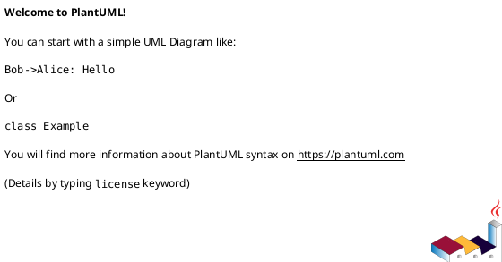
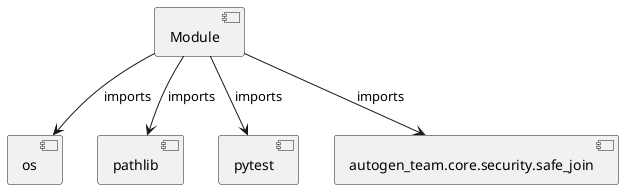

# Module Specification: test_security

* **Source Reference:** `tests/core/test_security.py`

## 1. Architectural Role & Responsibilities
**Purpose:**
Provides functionality related to test security.

**Architecture Layer:**
- Infrastructure/Other

**Responsibilities:**
- Not explicitly defined.

**Main Workflow:**
- Not explicitly defined.

## 2. Dependencies
**Imports:**
- `os`
- `pathlib`
- `pytest`
- `autogen_team.core.security.safe_join`

**Exported Classes:**
- None

**Exported Functions:**
- `test_safe_join_valid`
- `test_safe_join_nested_valid`
- `test_safe_join_traversal`
- `test_safe_join_traversal_complex`
- `test_safe_join_absolute_escape`
- `test_safe_join_directory_prefix_edge_case`

## 3. Architecture & Execution
### Internal Architecture
Not explicitly defined.

### Execution Flow
Not explicitly defined.

### Sequence Explanation
Not explicitly defined.

## 4. UML 2.0 Diagrams
### Class Diagram

### Dependency Graph

## 5. Class & Method Specifications
## 6. Module Functions
### `test_safe_join_valid(tmp_path: pathlib.Path)`
Test safe_join with valid relative paths.

**Inputs:**
- `tmp_path`: pathlib.Path

**Output:**
- Return Type: `None`

### `test_safe_join_nested_valid(tmp_path: pathlib.Path)`
Test safe_join with nested valid paths.

**Inputs:**
- `tmp_path`: pathlib.Path

**Output:**
- Return Type: `None`

### `test_safe_join_traversal(tmp_path: pathlib.Path)`
Test safe_join prevents directory traversal.

**Inputs:**
- `tmp_path`: pathlib.Path

**Output:**
- Return Type: `None`

### `test_safe_join_traversal_complex(tmp_path: pathlib.Path)`
Test safe_join prevents complex traversal.

**Inputs:**
- `tmp_path`: pathlib.Path

**Output:**
- Return Type: `None`

### `test_safe_join_absolute_escape(tmp_path: pathlib.Path)`
Test safe_join prevents absolute paths escaping base.

**Inputs:**
- `tmp_path`: pathlib.Path

**Output:**
- Return Type: `None`

### `test_safe_join_directory_prefix_edge_case(tmp_path: pathlib.Path)`
Test that safe_join handles directory prefix edge cases correctly.

**Inputs:**
- `tmp_path`: pathlib.Path

**Output:**
- Return Type: `None`
