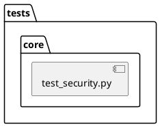
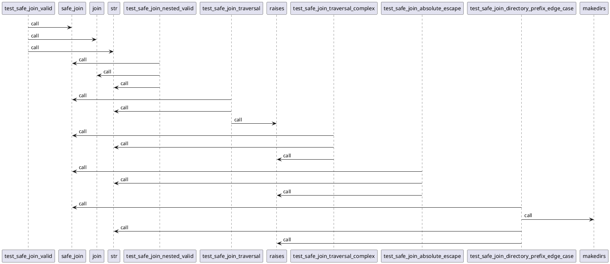
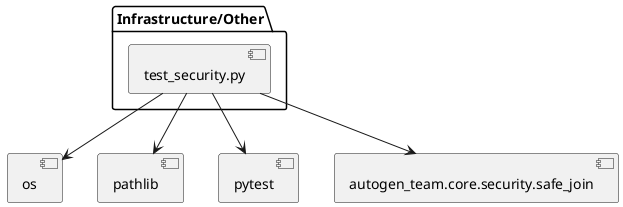
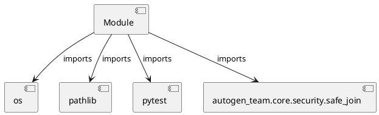
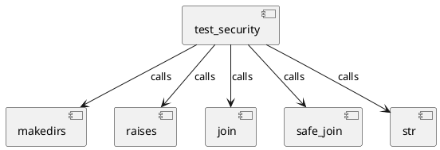

# Module Specification: test_security

* **Source Reference:** `tests/core/test_security.py`

## 1. Architectural Role & Responsibilities
**Purpose:**
Provides functionality related to test security.

**Architecture Layer:**
- Infrastructure/Other

**Responsibilities:**
- Not explicitly defined.

**Main Workflow:**
- Not explicitly defined.

## 2. Dependencies
**Imports:**
- `os`
- `pathlib`
- `pytest`
- `autogen_team.core.security.safe_join`

**Exported Classes:**
- None

**Exported Functions:**
- `test_safe_join_valid`
- `test_safe_join_nested_valid`
- `test_safe_join_traversal`
- `test_safe_join_traversal_complex`
- `test_safe_join_absolute_escape`
- `test_safe_join_directory_prefix_edge_case`

**Exported Interfaces:**
- Not explicitly defined.

**Public API:**
- Not explicitly defined.

## 3. Architecture & Execution
### Internal Architecture
Not explicitly defined.

### Execution Flow
Not explicitly defined.

### Sequence Explanation
Not explicitly defined.

### Examples
Not explicitly defined.

## 4. UML 2.0 Diagrams
### Class Diagram

```plantuml
@startuml
    ' No classes found in module
@enduml
```

### Package Diagram

```plantuml
@startuml
    package "tests" {
        package "core" {
            [test_security.py]
        }
    }
@enduml
```

### Sequence Diagram

```plantuml
@startuml
    test_safe_join_valid -> safe_join : call
    test_safe_join_valid -> join : call
    test_safe_join_valid -> str : call
    test_safe_join_nested_valid -> safe_join : call
    test_safe_join_nested_valid -> join : call
    test_safe_join_nested_valid -> str : call
    test_safe_join_traversal -> safe_join : call
    test_safe_join_traversal -> str : call
    test_safe_join_traversal -> raises : call
    test_safe_join_traversal_complex -> safe_join : call
    test_safe_join_traversal_complex -> str : call
    test_safe_join_traversal_complex -> raises : call
    test_safe_join_absolute_escape -> safe_join : call
    test_safe_join_absolute_escape -> str : call
    test_safe_join_absolute_escape -> raises : call
    test_safe_join_directory_prefix_edge_case -> safe_join : call
    test_safe_join_directory_prefix_edge_case -> makedirs : call
    test_safe_join_directory_prefix_edge_case -> str : call
    test_safe_join_directory_prefix_edge_case -> raises : call
@enduml
```

### Component Diagram

```plantuml
@startuml
    package "Infrastructure/Other" {
        [test_security.py]
    }
    [test_security.py] --> [os]
    [test_security.py] --> [pathlib]
    [test_security.py] --> [pytest]
    [test_security.py] --> [autogen_team.core.security.safe_join]
@enduml
```

### Dependency Graph

```plantuml
@startuml
    [Module] --> [os] : imports
    [Module] --> [pathlib] : imports
    [Module] --> [pytest] : imports
    [Module] --> [autogen_team.core.security.safe_join] : imports
@enduml
```

## 5. Class & Method Specifications
## 6. Module Functions
### `test_safe_join_valid(tmp_path: pathlib.Path) -> None` (Public)
**Description:** Test safe_join with valid relative paths.

**Inputs:**
- `tmp_path`
  - type: pathlib.Path
  - meaning: Not explicitly defined.
  - valid values: Not explicitly defined.
  - optional?: False
  - default value: None

**Output:**
- return type: `None`
- semantic meaning: Not explicitly defined.
- possible null values: Not explicitly defined.
- exceptions: Not explicitly defined.

**Side Effects:**
- Database updates: Not explicitly defined.
- File operations: Not explicitly defined.
- Network calls: Not explicitly defined.
- Cache: Not explicitly defined.
- State changes: Not explicitly defined.

**Complexity:**
- Time Complexity: Not explicitly defined.
- Space Complexity: Not explicitly defined.

**Example:**
```python
result = test_safe_join_valid(...)
```

### `test_safe_join_nested_valid(tmp_path: pathlib.Path) -> None` (Public)
**Description:** Test safe_join with nested valid paths.

**Inputs:**
- `tmp_path`
  - type: pathlib.Path
  - meaning: Not explicitly defined.
  - valid values: Not explicitly defined.
  - optional?: False
  - default value: None

**Output:**
- return type: `None`
- semantic meaning: Not explicitly defined.
- possible null values: Not explicitly defined.
- exceptions: Not explicitly defined.

**Side Effects:**
- Database updates: Not explicitly defined.
- File operations: Not explicitly defined.
- Network calls: Not explicitly defined.
- Cache: Not explicitly defined.
- State changes: Not explicitly defined.

**Complexity:**
- Time Complexity: Not explicitly defined.
- Space Complexity: Not explicitly defined.

**Example:**
```python
result = test_safe_join_nested_valid(...)
```

### `test_safe_join_traversal(tmp_path: pathlib.Path) -> None` (Public)
**Description:** Test safe_join prevents directory traversal.

**Inputs:**
- `tmp_path`
  - type: pathlib.Path
  - meaning: Not explicitly defined.
  - valid values: Not explicitly defined.
  - optional?: False
  - default value: None

**Output:**
- return type: `None`
- semantic meaning: Not explicitly defined.
- possible null values: Not explicitly defined.
- exceptions: Not explicitly defined.

**Side Effects:**
- Database updates: Not explicitly defined.
- File operations: Not explicitly defined.
- Network calls: Not explicitly defined.
- Cache: Not explicitly defined.
- State changes: Not explicitly defined.

**Complexity:**
- Time Complexity: Not explicitly defined.
- Space Complexity: Not explicitly defined.

**Example:**
```python
result = test_safe_join_traversal(...)
```

### `test_safe_join_traversal_complex(tmp_path: pathlib.Path) -> None` (Public)
**Description:** Test safe_join prevents complex traversal.

**Inputs:**
- `tmp_path`
  - type: pathlib.Path
  - meaning: Not explicitly defined.
  - valid values: Not explicitly defined.
  - optional?: False
  - default value: None

**Output:**
- return type: `None`
- semantic meaning: Not explicitly defined.
- possible null values: Not explicitly defined.
- exceptions: Not explicitly defined.

**Side Effects:**
- Database updates: Not explicitly defined.
- File operations: Not explicitly defined.
- Network calls: Not explicitly defined.
- Cache: Not explicitly defined.
- State changes: Not explicitly defined.

**Complexity:**
- Time Complexity: Not explicitly defined.
- Space Complexity: Not explicitly defined.

**Example:**
```python
result = test_safe_join_traversal_complex(...)
```

### `test_safe_join_absolute_escape(tmp_path: pathlib.Path) -> None` (Public)
**Description:** Test safe_join prevents absolute paths escaping base.

**Inputs:**
- `tmp_path`
  - type: pathlib.Path
  - meaning: Not explicitly defined.
  - valid values: Not explicitly defined.
  - optional?: False
  - default value: None

**Output:**
- return type: `None`
- semantic meaning: Not explicitly defined.
- possible null values: Not explicitly defined.
- exceptions: Not explicitly defined.

**Side Effects:**
- Database updates: Not explicitly defined.
- File operations: Not explicitly defined.
- Network calls: Not explicitly defined.
- Cache: Not explicitly defined.
- State changes: Not explicitly defined.

**Complexity:**
- Time Complexity: Not explicitly defined.
- Space Complexity: Not explicitly defined.

**Example:**
```python
result = test_safe_join_absolute_escape(...)
```

### `test_safe_join_directory_prefix_edge_case(tmp_path: pathlib.Path) -> None` (Public)
**Description:** Test that safe_join handles directory prefix edge cases correctly.

**Inputs:**
- `tmp_path`
  - type: pathlib.Path
  - meaning: Not explicitly defined.
  - valid values: Not explicitly defined.
  - optional?: False
  - default value: None

**Output:**
- return type: `None`
- semantic meaning: Not explicitly defined.
- possible null values: Not explicitly defined.
- exceptions: Not explicitly defined.

**Side Effects:**
- Database updates: Not explicitly defined.
- File operations: Not explicitly defined.
- Network calls: Not explicitly defined.
- Cache: Not explicitly defined.
- State changes: Not explicitly defined.

**Complexity:**
- Time Complexity: Not explicitly defined.
- Space Complexity: Not explicitly defined.

**Example:**
```python
result = test_safe_join_directory_prefix_edge_case(...)
```

## 7. Call Graph

```plantuml
@startuml
[test_security] --> [makedirs] : calls
[test_security] --> [raises] : calls
[test_security] --> [join] : calls
[test_security] --> [safe_join] : calls
[test_security] --> [str] : calls
@enduml
```

## 8. Cross References
- **Dependencies:** [Dependencies](../../../dependencies/index.md)
- **Used by:** None
- **Calls:** makedirs, raises, join, safe_join, str
- **Called from:** None
- **Related classes:** [Classes](../../../classes/index.md)
- **Related diagrams:** [Diagrams](../../../diagrams/index.md)
