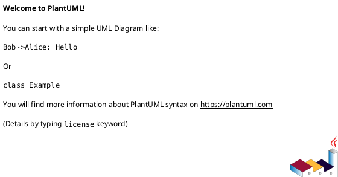
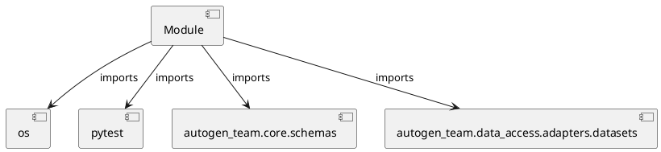

# Module Specification: test_datasets

* **Source Reference:** `tests/data_access/adapters/test_datasets.py`

## 1. Architectural Role & Responsibilities
**Purpose:**
Provides functionality related to test datasets.

**Architecture Layer:**
- Repositories

**Responsibilities:**
- Manage and execute operations for test_datasets.

**Main Workflow:**
- Initialize components and process requests for test_datasets.

## 2. Dependencies
**Imports:**
- `os`
- `pytest`
- `autogen_team.core.schemas`
- `autogen_team.data_access.adapters.datasets`

**Exported Classes:**
- None

**Exported Functions:**
- `test_parquet_reader`
- `test_parquet_writer`

## 3. Architecture & Execution
### Internal Architecture
Follows standard modular design, encapsulating state and behavior within defined classes and functions.

### Execution Flow
Sequential execution of defined functions and class methods.

### Sequence Explanation
Clients instantiate classes or call functions, which execute business logic and return results.

## 4. UML 2.0 Diagrams
### Class Diagram

### Dependency Graph

## 5. Class & Method Specifications
## 6. Module Functions
### `test_parquet_reader(limit: Any, inputs_path: str)`
Executes the test_parquet_reader operation.

**Inputs:**
- `limit`: Any
- `inputs_path`: str

**Output:**
- Return Type: `None`

### `test_parquet_writer(targets: Any, tmp_outputs_path: str)`
Executes the test_parquet_writer operation.

**Inputs:**
- `targets`: Any
- `tmp_outputs_path`: str

**Output:**
- Return Type: `None`
