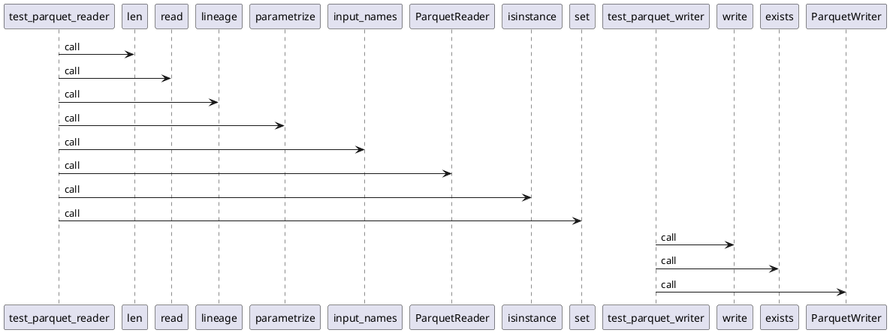
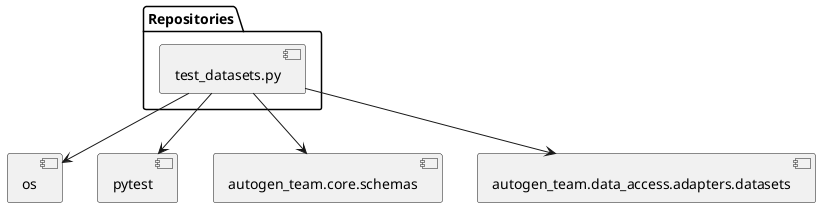
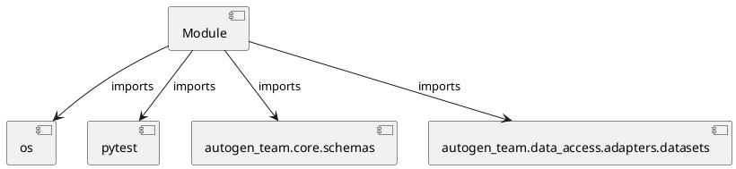
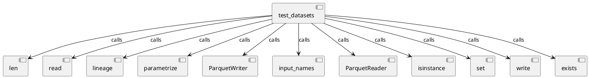

# Module Specification: test_datasets

* **Source Reference:** `tests/data_access/adapters/test_datasets.py`

## 1. Architectural Role & Responsibilities
**Purpose:**
Provides functionality related to test datasets.

**Architecture Layer:**
- Repositories

**Responsibilities:**
- Manages operations and logic for test datasets.

**Main Workflow:**
- Executes the primary flow defined by test datasets functions and classes.

## 2. Dependencies
**Imports:**
- `os`
- `pytest`
- `autogen_team.core.schemas`
- `autogen_team.data_access.adapters.datasets`

**Exported Classes:**
- None

**Exported Functions:**
- `test_parquet_reader`
- `test_parquet_writer`

**Exported Interfaces:**
- Not explicitly defined.

**Public API:**
- Not explicitly defined.

## 3. Architecture & Execution
### Internal Architecture
Not explicitly defined.

### Execution Flow
Not explicitly defined.

### Sequence Explanation
Not explicitly defined.

### Examples
Not explicitly defined.

## 4. UML 2.0 Diagrams
### Class Diagram

```plantuml
@startuml
    ' No classes found in module
@enduml
```

### Sequence Diagram

```plantuml
@startuml
    test_parquet_reader -> len : call
    test_parquet_reader -> read : call
    test_parquet_reader -> lineage : call
    test_parquet_reader -> parametrize : call
    test_parquet_reader -> input_names : call
    test_parquet_reader -> ParquetReader : call
    test_parquet_reader -> isinstance : call
    test_parquet_reader -> set : call
    test_parquet_writer -> write : call
    test_parquet_writer -> exists : call
    test_parquet_writer -> ParquetWriter : call
@enduml
```

### Component Diagram

```plantuml
@startuml
    package "Repositories" {
        [test_datasets.py]
    }
    [test_datasets.py] --> [os]
    [test_datasets.py] --> [pytest]
    [test_datasets.py] --> [autogen_team.core.schemas]
    [test_datasets.py] --> [autogen_team.data_access.adapters.datasets]
@enduml
```

### Dependency Graph

```plantuml
@startuml
    [Module] --> [os] : imports
    [Module] --> [pytest] : imports
    [Module] --> [autogen_team.core.schemas] : imports
    [Module] --> [autogen_team.data_access.adapters.datasets] : imports
@enduml
```

## 5. Class & Method Specifications
## 6. Module Functions
### `test_parquet_reader(limit: int | None, inputs_path: str)`
Executes the test parquet reader operation.

**Inputs:**
- `limit`
  - type: int | None
  - meaning: Represents the limit parameter.
  - valid values: Any valid int | None.
  - optional?: False
  - default value: None
- `inputs_path`
  - type: str
  - meaning: Represents the inputs path parameter.
  - valid values: Any valid str.
  - optional?: False
  - default value: None

**Output:**
- return type: `None`
- semantic meaning: Returns the result of test parquet reader.
- possible null values: Yes, if None allows it.
- exceptions: Standard execution exceptions.

**Side Effects:**
- Database updates: Not explicitly defined.
- File operations: Not explicitly defined.
- Network calls: Not explicitly defined.
- Cache: Not explicitly defined.
- State changes: Not explicitly defined.

### `test_parquet_writer(targets: schemas.Targets, tmp_outputs_path: str)`
Executes the test parquet writer operation.

**Inputs:**
- `targets`
  - type: schemas.Targets
  - meaning: Represents the targets parameter.
  - valid values: Any valid schemas.Targets.
  - optional?: False
  - default value: None
- `tmp_outputs_path`
  - type: str
  - meaning: Represents the tmp outputs path parameter.
  - valid values: Any valid str.
  - optional?: False
  - default value: None

**Output:**
- return type: `None`
- semantic meaning: Returns the result of test parquet writer.
- possible null values: Yes, if None allows it.
- exceptions: Standard execution exceptions.

**Side Effects:**
- Database updates: Not explicitly defined.
- File operations: Not explicitly defined.
- Network calls: Not explicitly defined.
- Cache: Not explicitly defined.
- State changes: Not explicitly defined.

## 7. Call Graph

```plantuml
@startuml
[test_datasets] --> [len] : calls
[test_datasets] --> [read] : calls
[test_datasets] --> [lineage] : calls
[test_datasets] --> [parametrize] : calls
[test_datasets] --> [ParquetWriter] : calls
[test_datasets] --> [input_names] : calls
[test_datasets] --> [ParquetReader] : calls
[test_datasets] --> [isinstance] : calls
[test_datasets] --> [set] : calls
[test_datasets] --> [write] : calls
[test_datasets] --> [exists] : calls
@enduml
```

## 8. Cross References
- **Parent module:** None
- **Child modules:** None
- **Dependencies:** `pytest`, `os`, `autogen_team.data_access.adapters.datasets`, `autogen_team.core.schemas`
- **Used by:** None
- **Calls:** len, read, lineage, parametrize, ParquetWriter, input_names, ParquetReader, isinstance, set, write, exists
- **Called from:** None
- **Related classes:** [Classes](../../../../classes/index.md)
- **Related interfaces:** Not explicitly defined.
- **Related diagrams:** [Diagrams](../../../../diagrams/index.md)
