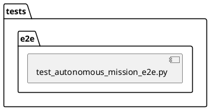
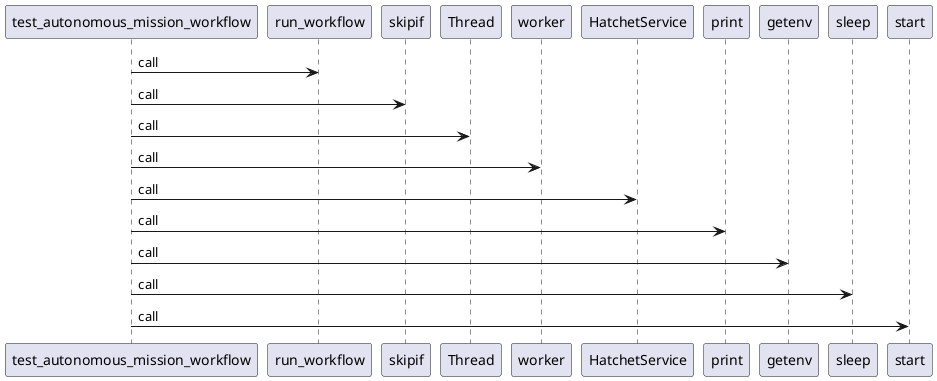
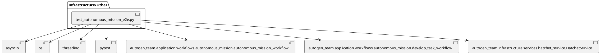
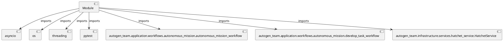
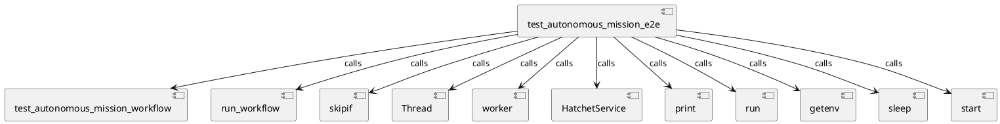

# Module Specification: test_autonomous_mission_e2e

* **Source Reference:** `tests/e2e/test_autonomous_mission_e2e.py`

## 1. Architectural Role & Responsibilities
**Purpose:**
Provides functionality related to test autonomous mission e2e.

**Architecture Layer:**
- Infrastructure/Other

**Responsibilities:**
- Not explicitly defined.

**Main Workflow:**
- Not explicitly defined.

## 2. Dependencies
**Imports:**
- `asyncio`
- `os`
- `threading`
- `pytest`
- `autogen_team.application.workflows.autonomous_mission.autonomous_mission_workflow`
- `autogen_team.application.workflows.autonomous_mission.develop_task_workflow`
- `autogen_team.infrastructure.services.hatchet_service.HatchetService`

**Exported Classes:**
- None

**Exported Functions:**
- `test_autonomous_mission_workflow`

**Exported Interfaces:**
- Not explicitly defined.

**Public API:**
- Not explicitly defined.

## 3. Architecture & Execution
### Internal Architecture
Not explicitly defined.

### Execution Flow
Not explicitly defined.

### Sequence Explanation
Not explicitly defined.

### Examples
Not explicitly defined.

## 4. UML 2.0 Diagrams
### Class Diagram

```plantuml
@startuml
    ' No classes found in module
@enduml
```

### Package Diagram

```plantuml
@startuml
    package "tests" {
        package "e2e" {
            [test_autonomous_mission_e2e.py]
        }
    }
@enduml
```

### Sequence Diagram

```plantuml
@startuml
    test_autonomous_mission_workflow -> run_workflow : call
    test_autonomous_mission_workflow -> skipif : call
    test_autonomous_mission_workflow -> Thread : call
    test_autonomous_mission_workflow -> worker : call
    test_autonomous_mission_workflow -> HatchetService : call
    test_autonomous_mission_workflow -> print : call
    test_autonomous_mission_workflow -> getenv : call
    test_autonomous_mission_workflow -> sleep : call
    test_autonomous_mission_workflow -> start : call
@enduml
```

### Component Diagram

```plantuml
@startuml
    package "Infrastructure/Other" {
        [test_autonomous_mission_e2e.py]
    }
    [test_autonomous_mission_e2e.py] --> [asyncio]
    [test_autonomous_mission_e2e.py] --> [os]
    [test_autonomous_mission_e2e.py] --> [threading]
    [test_autonomous_mission_e2e.py] --> [pytest]
    [test_autonomous_mission_e2e.py] --> [autogen_team.application.workflows.autonomous_mission.autonomous_mission_workflow]
    [test_autonomous_mission_e2e.py] --> [autogen_team.application.workflows.autonomous_mission.develop_task_workflow]
    [test_autonomous_mission_e2e.py] --> [autogen_team.infrastructure.services.hatchet_service.HatchetService]
@enduml
```

### Dependency Graph

```plantuml
@startuml
    [Module] --> [asyncio] : imports
    [Module] --> [os] : imports
    [Module] --> [threading] : imports
    [Module] --> [pytest] : imports
    [Module] --> [autogen_team.application.workflows.autonomous_mission.autonomous_mission_workflow] : imports
    [Module] --> [autogen_team.application.workflows.autonomous_mission.develop_task_workflow] : imports
    [Module] --> [autogen_team.infrastructure.services.hatchet_service.HatchetService] : imports
@enduml
```

## 5. Class & Method Specifications
## 6. Module Functions
### `test_autonomous_mission_workflow() -> None` (Public)
**Description:** E2E: register both parent and child workflows and trigger a run.

**Inputs:**
- None

**Output:**
- return type: `None`
- semantic meaning: Not explicitly defined.
- possible null values: Not explicitly defined.
- exceptions: Not explicitly defined.

**Side Effects:**
- Database updates: Not explicitly defined.
- File operations: Not explicitly defined.
- Network calls: Not explicitly defined.
- Cache: Not explicitly defined.
- State changes: Not explicitly defined.

**Complexity:**
- Time Complexity: Not explicitly defined.
- Space Complexity: Not explicitly defined.

**Example:**
```python
result = test_autonomous_mission_workflow()
```

## 7. Call Graph

```plantuml
@startuml
[test_autonomous_mission_e2e] --> [test_autonomous_mission_workflow] : calls
[test_autonomous_mission_e2e] --> [run_workflow] : calls
[test_autonomous_mission_e2e] --> [skipif] : calls
[test_autonomous_mission_e2e] --> [Thread] : calls
[test_autonomous_mission_e2e] --> [worker] : calls
[test_autonomous_mission_e2e] --> [HatchetService] : calls
[test_autonomous_mission_e2e] --> [print] : calls
[test_autonomous_mission_e2e] --> [run] : calls
[test_autonomous_mission_e2e] --> [getenv] : calls
[test_autonomous_mission_e2e] --> [sleep] : calls
[test_autonomous_mission_e2e] --> [start] : calls
@enduml
```

## 8. Cross References
- **Dependencies:** [Dependencies](../../../dependencies/index.md)
- **Used by:** None
- **Calls:** test_autonomous_mission_workflow, run_workflow, skipif, Thread, worker, HatchetService, print, run, getenv, sleep, start
- **Called from:** None
- **Related classes:** [Classes](../../../classes/index.md)
- **Related diagrams:** [Diagrams](../../../diagrams/index.md)
