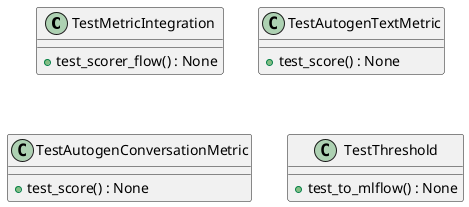

# Module Specification: test_metrics

* **Source Reference:** `tests/evaluation/metrics/test_metrics.py`

## 1. Architectural Role & Responsibilities
**Purpose:**
Provides functionality related to test metrics.

**Architecture Layer:**
- Infrastructure/Other

**Responsibilities:**
- Not explicitly defined.

**Main Workflow:**
- Not explicitly defined.

## 2. Dependencies
**Imports:**
- `typing.Any`
- `typing.Dict`
- `typing.Iterator`
- `typing.List`
- `typing.Literal`
- `typing.Optional`
- `unittest.mock.MagicMock`
- `unittest.mock.patch`
- `pandas`
- `pytest`
- `autogen_team.evaluation.metrics.AutogenConversationMetric`
- `autogen_team.evaluation.metrics.AutogenMetric`
- `autogen_team.evaluation.metrics.Threshold`

**Exported Classes:**
- `TestMetricIntegration`
- `TestAutogenTextMetric`
- `TestAutogenConversationMetric`
- `TestThreshold`

**Exported Functions:**
- `mock_schemas`

## 3. Architecture & Execution
### Internal Architecture
Not explicitly defined.

### Execution Flow
Not explicitly defined.

### Sequence Explanation
Not explicitly defined.

## 4. UML 2.0 Diagrams
### Class Diagram


### Dependency Graph

```plantuml
@startuml
    [Module] --> [typing.Any] : imports
    [Module] --> [typing.Dict] : imports
    [Module] --> [typing.Iterator] : imports
    [Module] --> [typing.List] : imports
    [Module] --> [typing.Literal] : imports
    [Module] --> [typing.Optional] : imports
    [Module] --> [unittest.mock.MagicMock] : imports
    [Module] --> [unittest.mock.patch] : imports
    [Module] --> [pandas] : imports
    [Module] --> [pytest] : imports
    [Module] --> [autogen_team.evaluation.metrics.AutogenConversationMetric] : imports
    [Module] --> [autogen_team.evaluation.metrics.AutogenMetric] : imports
    [Module] --> [autogen_team.evaluation.metrics.Threshold] : imports
@enduml
```


## 5. Class & Method Specifications
### `TestMetricIntegration` ([`tests/evaluation/metrics/test_metrics.py`](/tests/evaluation/metrics/test_metrics.py))
#### Overview
Provides state and behavior management for TestMetricIntegration.

#### Attributes
- None found.

#### Methods
##### `test_scorer_flow(self) -> None` (Public)
**Description:** No description provided.

**Inputs:**
- None

**Output:**
- Return Type: `None`
- Semantic Meaning: Not explicitly defined.

**Side Effects:**
- Not explicitly defined.

**Complexity:**
- Time Complexity: Not explicitly defined.
- Space Complexity: Not explicitly defined.

**Example:**
```python
result = TestMetricIntegration.test_scorer_flow()
```

### `TestAutogenTextMetric` ([`tests/evaluation/metrics/test_metrics.py`](/tests/evaluation/metrics/test_metrics.py))
#### Overview
Provides state and behavior management for TestAutogenTextMetric.

#### Attributes
- None found.

#### Methods
##### `test_score(self, metric_type: Literal['exact_match', 'similarity', 'length_ratio'], y_true: List[str], y_pred: List[str], expected: float, threshold: Optional[float]) -> None` (Public)
**Description:** No description provided.

**Inputs:**
- `metric_type`: Literal['exact_match', 'similarity', 'length_ratio']
- `y_true`: List[str]
- `y_pred`: List[str]
- `expected`: float
- `threshold`: Optional[float]

**Output:**
- Return Type: `None`
- Semantic Meaning: Not explicitly defined.

**Side Effects:**
- Not explicitly defined.

**Complexity:**
- Time Complexity: Not explicitly defined.
- Space Complexity: Not explicitly defined.

**Example:**
```python
result = TestAutogenTextMetric.test_score(..., ..., ..., ..., ...)
```

### `TestAutogenConversationMetric` ([`tests/evaluation/metrics/test_metrics.py`](/tests/evaluation/metrics/test_metrics.py))
#### Overview
Provides state and behavior management for TestAutogenConversationMetric.

#### Attributes
- None found.

#### Methods
##### `test_score(self, metadata: List[Dict[str, Any]], check_term: bool, check_err: bool, expected: float) -> None` (Public)
**Description:** No description provided.

**Inputs:**
- `metadata`: List[Dict[str, Any]]
- `check_term`: bool
- `check_err`: bool
- `expected`: float

**Output:**
- Return Type: `None`
- Semantic Meaning: Not explicitly defined.

**Side Effects:**
- Not explicitly defined.

**Complexity:**
- Time Complexity: Not explicitly defined.
- Space Complexity: Not explicitly defined.

**Example:**
```python
result = TestAutogenConversationMetric.test_score(..., ..., ..., ...)
```

### `TestThreshold` ([`tests/evaluation/metrics/test_metrics.py`](/tests/evaluation/metrics/test_metrics.py))
#### Overview
Provides state and behavior management for TestThreshold.

#### Attributes
- None found.

#### Methods
##### `test_to_mlflow(self, threshold: float, greater_is_better: bool) -> None` (Public)
**Description:** No description provided.

**Inputs:**
- `threshold`: float
- `greater_is_better`: bool

**Output:**
- Return Type: `None`
- Semantic Meaning: Not explicitly defined.

**Side Effects:**
- Not explicitly defined.

**Complexity:**
- Time Complexity: Not explicitly defined.
- Space Complexity: Not explicitly defined.

**Example:**
```python
result = TestThreshold.test_to_mlflow(..., ...)
```

## 6. Module Functions
### `mock_schemas()`
No description provided.

**Inputs:**
- None

**Output:**
- Return Type: `Iterator[MagicMock]`
