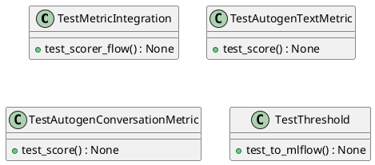
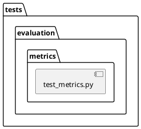
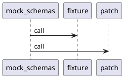
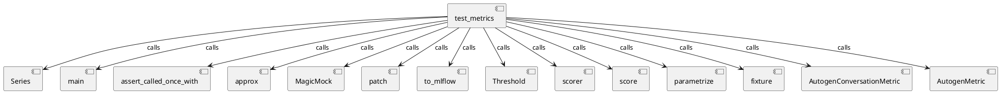

# Module Specification: test_metrics

* **Source Reference:** `tests/evaluation/metrics/test_metrics.py`

## 1. Architectural Role & Responsibilities
**Purpose:**
Provides functionality related to test metrics.

**Architecture Layer:**
- Infrastructure/Other

**Responsibilities:**
- Not explicitly defined.

**Main Workflow:**
- Not explicitly defined.

## 2. Dependencies
**Imports:**
- `typing.Any`
- `typing.Dict`
- `typing.Iterator`
- `typing.List`
- `typing.Literal`
- `typing.Optional`
- `unittest.mock.MagicMock`
- `unittest.mock.patch`
- `pandas`
- `pytest`
- `autogen_team.evaluation.metrics.AutogenConversationMetric`
- `autogen_team.evaluation.metrics.AutogenMetric`
- `autogen_team.evaluation.metrics.Threshold`

**Exported Classes:**
- `TestMetricIntegration`
- `TestAutogenTextMetric`
- `TestAutogenConversationMetric`
- `TestThreshold`

**Exported Functions:**
- `mock_schemas`

**Exported Interfaces:**
- Not explicitly defined.

**Public API:**
- Not explicitly defined.

## 3. Architecture & Execution
### Internal Architecture
Not explicitly defined.

### Execution Flow
Not explicitly defined.

### Sequence Explanation
Not explicitly defined.

### Examples
Not explicitly defined.

## 4. UML 2.0 Diagrams
### Class Diagram

```plantuml
@startuml
    class TestMetricIntegration {
        +test_scorer_flow() : None
    }
    class TestAutogenTextMetric {
        +test_score() : None
    }
    class TestAutogenConversationMetric {
        +test_score() : None
    }
    class TestThreshold {
        +test_to_mlflow() : None
    }
@enduml
```

### Package Diagram

```plantuml
@startuml
    package "tests" {
        package "evaluation" {
            package "metrics" {
                [test_metrics.py]
            }
        }
    }
@enduml
```

### Sequence Diagram

```plantuml
@startuml
    mock_schemas -> fixture : call
    mock_schemas -> patch : call
@enduml
```

### Component Diagram

```plantuml
@startuml
    package "Infrastructure/Other" {
        [test_metrics.py]
    }
    [test_metrics.py] --> [typing.Any]
    [test_metrics.py] --> [typing.Dict]
    [test_metrics.py] --> [typing.Iterator]
    [test_metrics.py] --> [typing.List]
    [test_metrics.py] --> [typing.Literal]
    [test_metrics.py] --> [typing.Optional]
    [test_metrics.py] --> [unittest.mock.MagicMock]
    [test_metrics.py] --> [unittest.mock.patch]
    [test_metrics.py] --> [pandas]
    [test_metrics.py] --> [pytest]
    [test_metrics.py] --> [autogen_team.evaluation.metrics.AutogenConversationMetric]
    [test_metrics.py] --> [autogen_team.evaluation.metrics.AutogenMetric]
    [test_metrics.py] --> [autogen_team.evaluation.metrics.Threshold]
@enduml
```

### Dependency Graph

```plantuml
@startuml
    [Module] --> [typing.Any] : imports
    [Module] --> [typing.Dict] : imports
    [Module] --> [typing.Iterator] : imports
    [Module] --> [typing.List] : imports
    [Module] --> [typing.Literal] : imports
    [Module] --> [typing.Optional] : imports
    [Module] --> [unittest.mock.MagicMock] : imports
    [Module] --> [unittest.mock.patch] : imports
    [Module] --> [pandas] : imports
    [Module] --> [pytest] : imports
    [Module] --> [autogen_team.evaluation.metrics.AutogenConversationMetric] : imports
    [Module] --> [autogen_team.evaluation.metrics.AutogenMetric] : imports
    [Module] --> [autogen_team.evaluation.metrics.Threshold] : imports
@enduml
```

## 5. Class & Method Specifications
### `TestMetricIntegration` ([`tests/evaluation/metrics/test_metrics.py`](/tests/evaluation/metrics/test_metrics.py))
#### Overview
Provides state and behavior management for TestMetricIntegration.

#### Attributes
- None found.

#### Methods
##### `test_scorer_flow(self) -> None` (Public)
**Description:** No description provided.

**Inputs:**
- None

**Output:**
- return type: `None`
- semantic meaning: Not explicitly defined.
- possible null values: Not explicitly defined.
- exceptions: Not explicitly defined.

**Side Effects:**
- Database updates: Not explicitly defined.
- File operations: Not explicitly defined.
- Network calls: Not explicitly defined.
- Cache: Not explicitly defined.
- State changes: Not explicitly defined.

**Complexity:**
- Time Complexity: Not explicitly defined.
- Space Complexity: Not explicitly defined.

**Example:**
```python
result = TestMetricIntegration.test_scorer_flow()
```

### `TestAutogenTextMetric` ([`tests/evaluation/metrics/test_metrics.py`](/tests/evaluation/metrics/test_metrics.py))
#### Overview
Provides state and behavior management for TestAutogenTextMetric.

#### Attributes
- None found.

#### Methods
##### `test_score(self, metric_type: Literal['exact_match', 'similarity', 'length_ratio'], y_true: List[str], y_pred: List[str], expected: float, threshold: Optional[float]) -> None` (Public)
**Description:** No description provided.

**Inputs:**
- `metric_type`
  - type: Literal['exact_match', 'similarity', 'length_ratio']
  - meaning: Not explicitly defined.
  - valid values: Not explicitly defined.
  - optional?: False
  - default value: None
- `y_true`
  - type: List[str]
  - meaning: Not explicitly defined.
  - valid values: Not explicitly defined.
  - optional?: False
  - default value: None
- `y_pred`
  - type: List[str]
  - meaning: Not explicitly defined.
  - valid values: Not explicitly defined.
  - optional?: False
  - default value: None
- `expected`
  - type: float
  - meaning: Not explicitly defined.
  - valid values: Not explicitly defined.
  - optional?: False
  - default value: None
- `threshold`
  - type: Optional[float]
  - meaning: Not explicitly defined.
  - valid values: Not explicitly defined.
  - optional?: False
  - default value: None

**Output:**
- return type: `None`
- semantic meaning: Not explicitly defined.
- possible null values: Not explicitly defined.
- exceptions: Not explicitly defined.

**Side Effects:**
- Database updates: Not explicitly defined.
- File operations: Not explicitly defined.
- Network calls: Not explicitly defined.
- Cache: Not explicitly defined.
- State changes: Not explicitly defined.

**Complexity:**
- Time Complexity: Not explicitly defined.
- Space Complexity: Not explicitly defined.

**Example:**
```python
result = TestAutogenTextMetric.test_score(..., ..., ..., ..., ...)
```

### `TestAutogenConversationMetric` ([`tests/evaluation/metrics/test_metrics.py`](/tests/evaluation/metrics/test_metrics.py))
#### Overview
Provides state and behavior management for TestAutogenConversationMetric.

#### Attributes
- None found.

#### Methods
##### `test_score(self, metadata: List[Dict[str, Any]], check_term: bool, check_err: bool, expected: float) -> None` (Public)
**Description:** No description provided.

**Inputs:**
- `metadata`
  - type: List[Dict[str, Any]]
  - meaning: Not explicitly defined.
  - valid values: Not explicitly defined.
  - optional?: False
  - default value: None
- `check_term`
  - type: bool
  - meaning: Not explicitly defined.
  - valid values: Not explicitly defined.
  - optional?: False
  - default value: None
- `check_err`
  - type: bool
  - meaning: Not explicitly defined.
  - valid values: Not explicitly defined.
  - optional?: False
  - default value: None
- `expected`
  - type: float
  - meaning: Not explicitly defined.
  - valid values: Not explicitly defined.
  - optional?: False
  - default value: None

**Output:**
- return type: `None`
- semantic meaning: Not explicitly defined.
- possible null values: Not explicitly defined.
- exceptions: Not explicitly defined.

**Side Effects:**
- Database updates: Not explicitly defined.
- File operations: Not explicitly defined.
- Network calls: Not explicitly defined.
- Cache: Not explicitly defined.
- State changes: Not explicitly defined.

**Complexity:**
- Time Complexity: Not explicitly defined.
- Space Complexity: Not explicitly defined.

**Example:**
```python
result = TestAutogenConversationMetric.test_score(..., ..., ..., ...)
```

### `TestThreshold` ([`tests/evaluation/metrics/test_metrics.py`](/tests/evaluation/metrics/test_metrics.py))
#### Overview
Provides state and behavior management for TestThreshold.

#### Attributes
- None found.

#### Methods
##### `test_to_mlflow(self, threshold: float, greater_is_better: bool) -> None` (Public)
**Description:** No description provided.

**Inputs:**
- `threshold`
  - type: float
  - meaning: Not explicitly defined.
  - valid values: Not explicitly defined.
  - optional?: False
  - default value: None
- `greater_is_better`
  - type: bool
  - meaning: Not explicitly defined.
  - valid values: Not explicitly defined.
  - optional?: False
  - default value: None

**Output:**
- return type: `None`
- semantic meaning: Not explicitly defined.
- possible null values: Not explicitly defined.
- exceptions: Not explicitly defined.

**Side Effects:**
- Database updates: Not explicitly defined.
- File operations: Not explicitly defined.
- Network calls: Not explicitly defined.
- Cache: Not explicitly defined.
- State changes: Not explicitly defined.

**Complexity:**
- Time Complexity: Not explicitly defined.
- Space Complexity: Not explicitly defined.

**Example:**
```python
result = TestThreshold.test_to_mlflow(..., ...)
```

## 6. Module Functions
### `mock_schemas() -> Iterator[MagicMock]` (Public)
**Description:** No description provided.

**Inputs:**
- None

**Output:**
- return type: `Iterator[MagicMock]`
- semantic meaning: Not explicitly defined.
- possible null values: Not explicitly defined.
- exceptions: Not explicitly defined.

**Side Effects:**
- Database updates: Not explicitly defined.
- File operations: Not explicitly defined.
- Network calls: Not explicitly defined.
- Cache: Not explicitly defined.
- State changes: Not explicitly defined.

**Complexity:**
- Time Complexity: Not explicitly defined.
- Space Complexity: Not explicitly defined.

**Example:**
```python
result = mock_schemas()
```

## 7. Call Graph

```plantuml
@startuml
[test_metrics] --> [Series] : calls
[test_metrics] --> [main] : calls
[test_metrics] --> [assert_called_once_with] : calls
[test_metrics] --> [approx] : calls
[test_metrics] --> [MagicMock] : calls
[test_metrics] --> [patch] : calls
[test_metrics] --> [to_mlflow] : calls
[test_metrics] --> [Threshold] : calls
[test_metrics] --> [scorer] : calls
[test_metrics] --> [score] : calls
[test_metrics] --> [parametrize] : calls
[test_metrics] --> [fixture] : calls
[test_metrics] --> [AutogenConversationMetric] : calls
[test_metrics] --> [AutogenMetric] : calls
@enduml
```

## 8. Cross References
- **Dependencies:** [Dependencies](../../../../dependencies/index.md)
- **Used by:** None
- **Calls:** Series, main, assert_called_once_with, approx, MagicMock, patch, to_mlflow, Threshold, scorer, score, parametrize, fixture, AutogenConversationMetric, AutogenMetric
- **Called from:** None
- **Related classes:** [Classes](../../../../classes/index.md)
- **Related diagrams:** [Diagrams](../../../../diagrams/index.md)
