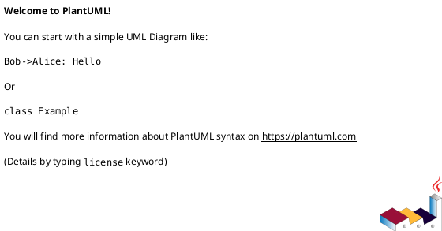
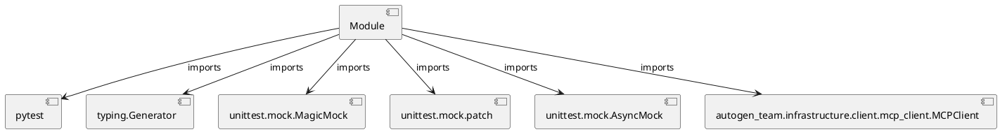

# Module Specification: test_mcp_client

* **Source Reference:** `tests/infrastructure/client/test_mcp_client.py`

## 1. Architectural Role & Responsibilities
**Purpose:**
Provides functionality related to test mcp client.

**Architecture Layer:**
- Infrastructure/Other

**Responsibilities:**
- Not explicitly defined.

**Main Workflow:**
- Not explicitly defined.

## 2. Dependencies
**Imports:**
- `pytest`
- `typing.Generator`
- `unittest.mock.MagicMock`
- `unittest.mock.patch`
- `unittest.mock.AsyncMock`
- `autogen_team.infrastructure.client.mcp_client.MCPClient`

**Exported Classes:**
- None

**Exported Functions:**
- `mcp_client`
- `test_mcp_client_connect_success`
- `test_mcp_client_disconnect`
- `test_mcp_client_call_tool_success`
- `test_mcp_client_call_tool_not_json`
- `test_mcp_client_call_tool_no_session`
- `test_mcp_client_call_tool_runtime_error`

## 3. Architecture & Execution
### Internal Architecture
Not explicitly defined.

### Execution Flow
Not explicitly defined.

### Sequence Explanation
Not explicitly defined.

## 4. UML 2.0 Diagrams
### Class Diagram

### Dependency Graph

## 5. Class & Method Specifications
## 6. Module Functions
### `mcp_client()`
Fixture to provide an MCPClient instance.

**Inputs:**
- None

**Output:**
- Return Type: `Generator[MCPClient, None, None]`

### `test_mcp_client_connect_success(mcp_client: MCPClient)`
No description provided.

**Inputs:**
- `mcp_client`: MCPClient

**Output:**
- Return Type: `None`

### `test_mcp_client_disconnect(mcp_client: MCPClient)`
No description provided.

**Inputs:**
- `mcp_client`: MCPClient

**Output:**
- Return Type: `None`

### `test_mcp_client_call_tool_success(mcp_client: MCPClient)`
No description provided.

**Inputs:**
- `mcp_client`: MCPClient

**Output:**
- Return Type: `None`

### `test_mcp_client_call_tool_not_json(mcp_client: MCPClient)`
No description provided.

**Inputs:**
- `mcp_client`: MCPClient

**Output:**
- Return Type: `None`

### `test_mcp_client_call_tool_no_session(mcp_client: MCPClient)`
No description provided.

**Inputs:**
- `mcp_client`: MCPClient

**Output:**
- Return Type: `None`

### `test_mcp_client_call_tool_runtime_error(mcp_client: MCPClient)`
No description provided.

**Inputs:**
- `mcp_client`: MCPClient

**Output:**
- Return Type: `None`
