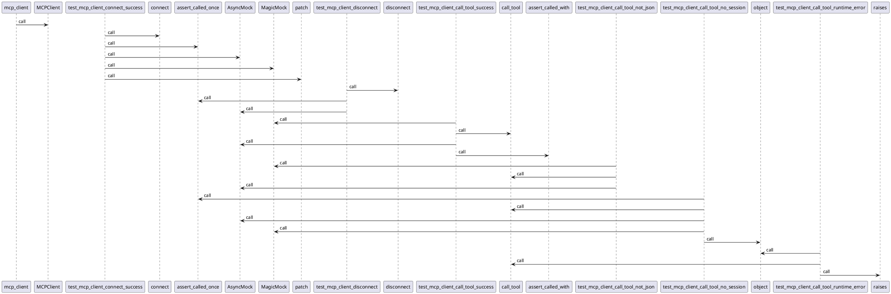
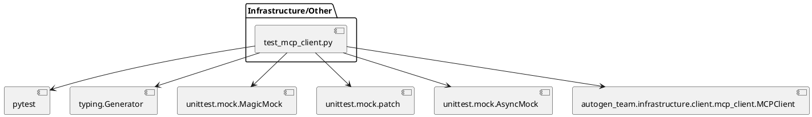
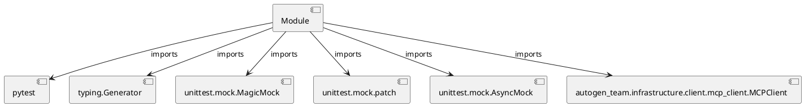
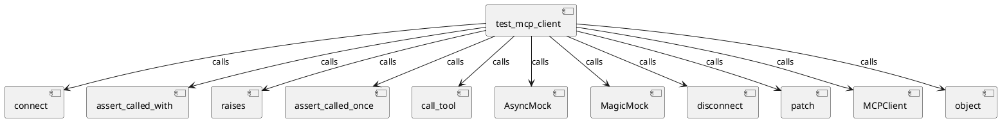

# Module Specification: test_mcp_client

* **Source Reference:** `tests/infrastructure/client/test_mcp_client.py`

## 1. Architectural Role & Responsibilities
**Purpose:**
Provides functionality related to test mcp client.

**Architecture Layer:**
- Infrastructure/Other

**Responsibilities:**
- Manages operations and logic for test mcp client.

**Main Workflow:**
- Executes the primary flow defined by test mcp client functions and classes.

## 2. Dependencies
**Imports:**
- `pytest`
- `typing.Generator`
- `unittest.mock.MagicMock`
- `unittest.mock.patch`
- `unittest.mock.AsyncMock`
- `autogen_team.infrastructure.client.mcp_client.MCPClient`

**Exported Classes:**
- None

**Exported Functions:**
- `mcp_client`
- `test_mcp_client_connect_success`
- `test_mcp_client_disconnect`
- `test_mcp_client_call_tool_success`
- `test_mcp_client_call_tool_not_json`
- `test_mcp_client_call_tool_no_session`
- `test_mcp_client_call_tool_runtime_error`

**Exported Interfaces:**
- Not explicitly defined.

**Public API:**
- Not explicitly defined.

## 3. Architecture & Execution
### Internal Architecture
Not explicitly defined.

### Execution Flow
Not explicitly defined.

### Sequence Explanation
Not explicitly defined.

### Examples
Not explicitly defined.

## 4. UML 2.0 Diagrams
### Class Diagram

```plantuml
@startuml
    ' No classes found in module
@enduml
```

### Sequence Diagram

```plantuml
@startuml
    mcp_client -> MCPClient : call
    test_mcp_client_connect_success -> connect : call
    test_mcp_client_connect_success -> assert_called_once : call
    test_mcp_client_connect_success -> AsyncMock : call
    test_mcp_client_connect_success -> MagicMock : call
    test_mcp_client_connect_success -> patch : call
    test_mcp_client_disconnect -> disconnect : call
    test_mcp_client_disconnect -> assert_called_once : call
    test_mcp_client_disconnect -> AsyncMock : call
    test_mcp_client_call_tool_success -> MagicMock : call
    test_mcp_client_call_tool_success -> call_tool : call
    test_mcp_client_call_tool_success -> AsyncMock : call
    test_mcp_client_call_tool_success -> assert_called_with : call
    test_mcp_client_call_tool_not_json -> MagicMock : call
    test_mcp_client_call_tool_not_json -> call_tool : call
    test_mcp_client_call_tool_not_json -> AsyncMock : call
    test_mcp_client_call_tool_no_session -> assert_called_once : call
    test_mcp_client_call_tool_no_session -> call_tool : call
    test_mcp_client_call_tool_no_session -> AsyncMock : call
    test_mcp_client_call_tool_no_session -> MagicMock : call
    test_mcp_client_call_tool_no_session -> object : call
    test_mcp_client_call_tool_runtime_error -> object : call
    test_mcp_client_call_tool_runtime_error -> call_tool : call
    test_mcp_client_call_tool_runtime_error -> raises : call
@enduml
```

### Component Diagram

```plantuml
@startuml
    package "Infrastructure/Other" {
        [test_mcp_client.py]
    }
    [test_mcp_client.py] --> [pytest]
    [test_mcp_client.py] --> [typing.Generator]
    [test_mcp_client.py] --> [unittest.mock.MagicMock]
    [test_mcp_client.py] --> [unittest.mock.patch]
    [test_mcp_client.py] --> [unittest.mock.AsyncMock]
    [test_mcp_client.py] --> [autogen_team.infrastructure.client.mcp_client.MCPClient]
@enduml
```

### Dependency Graph

```plantuml
@startuml
    [Module] --> [pytest] : imports
    [Module] --> [typing.Generator] : imports
    [Module] --> [unittest.mock.MagicMock] : imports
    [Module] --> [unittest.mock.patch] : imports
    [Module] --> [unittest.mock.AsyncMock] : imports
    [Module] --> [autogen_team.infrastructure.client.mcp_client.MCPClient] : imports
@enduml
```

## 5. Class & Method Specifications
## 6. Module Functions
### `mcp_client()`
Fixture to provide an MCPClient instance.

**Inputs:**
- None

**Output:**
- return type: `Generator[MCPClient, None, None]`
- semantic meaning: Returns the result of mcp client.
- possible null values: Yes, if Generator[MCPClient, None, None] allows it.
- exceptions: Standard execution exceptions.

**Side Effects:**
- Database updates: Not explicitly defined.
- File operations: Not explicitly defined.
- Network calls: Not explicitly defined.
- Cache: Not explicitly defined.
- State changes: Not explicitly defined.

### `test_mcp_client_connect_success(mcp_client: MCPClient)`
Executes the test mcp client connect success operation.

**Inputs:**
- `mcp_client`
  - type: MCPClient
  - meaning: Represents the mcp client parameter.
  - valid values: Any valid MCPClient.
  - optional?: False
  - default value: None

**Output:**
- return type: `None`
- semantic meaning: Returns the result of test mcp client connect success.
- possible null values: Yes, if None allows it.
- exceptions: Standard execution exceptions.

**Side Effects:**
- Database updates: Not explicitly defined.
- File operations: Not explicitly defined.
- Network calls: Not explicitly defined.
- Cache: Not explicitly defined.
- State changes: Not explicitly defined.

### `test_mcp_client_disconnect(mcp_client: MCPClient)`
Executes the test mcp client disconnect operation.

**Inputs:**
- `mcp_client`
  - type: MCPClient
  - meaning: Represents the mcp client parameter.
  - valid values: Any valid MCPClient.
  - optional?: False
  - default value: None

**Output:**
- return type: `None`
- semantic meaning: Returns the result of test mcp client disconnect.
- possible null values: Yes, if None allows it.
- exceptions: Standard execution exceptions.

**Side Effects:**
- Database updates: Not explicitly defined.
- File operations: Not explicitly defined.
- Network calls: Not explicitly defined.
- Cache: Not explicitly defined.
- State changes: Not explicitly defined.

### `test_mcp_client_call_tool_success(mcp_client: MCPClient)`
Executes the test mcp client call tool success operation.

**Inputs:**
- `mcp_client`
  - type: MCPClient
  - meaning: Represents the mcp client parameter.
  - valid values: Any valid MCPClient.
  - optional?: False
  - default value: None

**Output:**
- return type: `None`
- semantic meaning: Returns the result of test mcp client call tool success.
- possible null values: Yes, if None allows it.
- exceptions: Standard execution exceptions.

**Side Effects:**
- Database updates: Not explicitly defined.
- File operations: Not explicitly defined.
- Network calls: Not explicitly defined.
- Cache: Not explicitly defined.
- State changes: Not explicitly defined.

### `test_mcp_client_call_tool_not_json(mcp_client: MCPClient)`
Executes the test mcp client call tool not json operation.

**Inputs:**
- `mcp_client`
  - type: MCPClient
  - meaning: Represents the mcp client parameter.
  - valid values: Any valid MCPClient.
  - optional?: False
  - default value: None

**Output:**
- return type: `None`
- semantic meaning: Returns the result of test mcp client call tool not json.
- possible null values: Yes, if None allows it.
- exceptions: Standard execution exceptions.

**Side Effects:**
- Database updates: Not explicitly defined.
- File operations: Not explicitly defined.
- Network calls: Not explicitly defined.
- Cache: Not explicitly defined.
- State changes: Not explicitly defined.

### `test_mcp_client_call_tool_no_session(mcp_client: MCPClient)`
Executes the test mcp client call tool no session operation.

**Inputs:**
- `mcp_client`
  - type: MCPClient
  - meaning: Represents the mcp client parameter.
  - valid values: Any valid MCPClient.
  - optional?: False
  - default value: None

**Output:**
- return type: `None`
- semantic meaning: Returns the result of test mcp client call tool no session.
- possible null values: Yes, if None allows it.
- exceptions: Standard execution exceptions.

**Side Effects:**
- Database updates: Not explicitly defined.
- File operations: Not explicitly defined.
- Network calls: Not explicitly defined.
- Cache: Not explicitly defined.
- State changes: Not explicitly defined.

### `test_mcp_client_call_tool_runtime_error(mcp_client: MCPClient)`
Executes the test mcp client call tool runtime error operation.

**Inputs:**
- `mcp_client`
  - type: MCPClient
  - meaning: Represents the mcp client parameter.
  - valid values: Any valid MCPClient.
  - optional?: False
  - default value: None

**Output:**
- return type: `None`
- semantic meaning: Returns the result of test mcp client call tool runtime error.
- possible null values: Yes, if None allows it.
- exceptions: Standard execution exceptions.

**Side Effects:**
- Database updates: Not explicitly defined.
- File operations: Not explicitly defined.
- Network calls: Not explicitly defined.
- Cache: Not explicitly defined.
- State changes: Not explicitly defined.

## 7. Call Graph

```plantuml
@startuml
[test_mcp_client] --> [connect] : calls
[test_mcp_client] --> [assert_called_with] : calls
[test_mcp_client] --> [raises] : calls
[test_mcp_client] --> [assert_called_once] : calls
[test_mcp_client] --> [call_tool] : calls
[test_mcp_client] --> [AsyncMock] : calls
[test_mcp_client] --> [MagicMock] : calls
[test_mcp_client] --> [disconnect] : calls
[test_mcp_client] --> [patch] : calls
[test_mcp_client] --> [MCPClient] : calls
[test_mcp_client] --> [object] : calls
@enduml
```

## 8. Cross References
- **Parent module:** None
- **Child modules:** None
- **Dependencies:** `autogen_team.infrastructure.client.mcp_client.MCPClient`, `pytest`, `unittest.mock.AsyncMock`, `unittest.mock.patch`, `typing.Generator`, `unittest.mock.MagicMock`
- **Used by:** None
- **Calls:** connect, assert_called_with, raises, assert_called_once, call_tool, AsyncMock, MagicMock, disconnect, patch, MCPClient, object
- **Called from:** None
- **Related classes:** [Classes](../../../../classes/index.md)
- **Related interfaces:** Not explicitly defined.
- **Related diagrams:** [Diagrams](../../../../diagrams/index.md)
