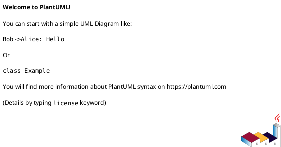
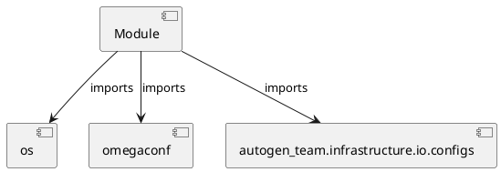

# Module Specification: test_configs

* **Source Reference:** `tests/infrastructure/io/test_configs.py`

## 1. Architectural Role & Responsibilities
**Purpose:**
Provides functionality related to test configs.

**Architecture Layer:**
- Infrastructure/Other

**Responsibilities:**
- Manage and execute operations for test_configs.

**Main Workflow:**
- Initialize components and process requests for test_configs.

## 2. Dependencies
**Imports:**
- `os`
- `omegaconf`
- `autogen_team.infrastructure.io.configs`

**Exported Classes:**
- None

**Exported Functions:**
- `test_parse_file`
- `test_parse_string`
- `test_merge_configs`
- `test_to_object`

## 3. Architecture & Execution
### Internal Architecture
Follows standard modular design, encapsulating state and behavior within defined classes and functions.

### Execution Flow
Sequential execution of defined functions and class methods.

### Sequence Explanation
Clients instantiate classes or call functions, which execute business logic and return results.

## 4. UML 2.0 Diagrams
### Class Diagram

### Dependency Graph

## 5. Class & Method Specifications
## 6. Module Functions
### `test_parse_file(tmp_path: str)`
Executes the test_parse_file operation.

**Inputs:**
- `tmp_path`: str

**Output:**
- Return Type: `None`

### `test_parse_string()`
Executes the test_parse_string operation.

**Inputs:**
- None

**Output:**
- Return Type: `None`

### `test_merge_configs()`
Executes the test_merge_configs operation.

**Inputs:**
- None

**Output:**
- Return Type: `None`

### `test_to_object()`
Executes the test_to_object operation.

**Inputs:**
- None

**Output:**
- Return Type: `None`
