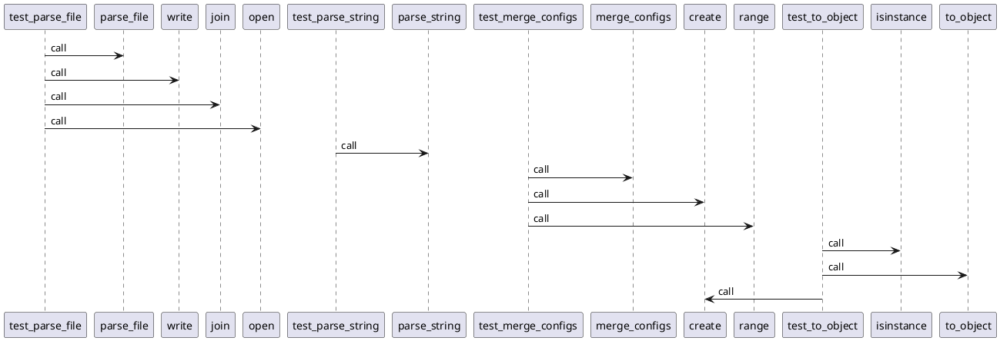
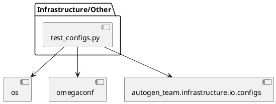
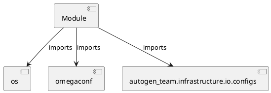
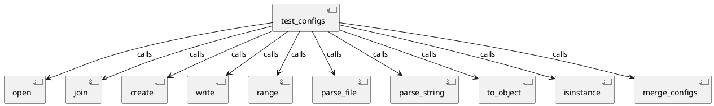

# Module Specification: test_configs

* **Source Reference:** `tests/infrastructure/io/test_configs.py`

## 1. Architectural Role & Responsibilities
**Purpose:**
Provides functionality related to test configs.

**Architecture Layer:**
- Infrastructure/Other

**Responsibilities:**
- Manages operations and logic for test configs.

**Main Workflow:**
- Executes the primary flow defined by test configs functions and classes.

## 2. Dependencies
**Imports:**
- `os`
- `omegaconf`
- `autogen_team.infrastructure.io.configs`

**Exported Classes:**
- None

**Exported Functions:**
- `test_parse_file`
- `test_parse_string`
- `test_merge_configs`
- `test_to_object`

**Exported Interfaces:**
- Not explicitly defined.

**Public API:**
- Not explicitly defined.

## 3. Architecture & Execution
### Internal Architecture
Not explicitly defined.

### Execution Flow
Not explicitly defined.

### Sequence Explanation
Not explicitly defined.

### Examples
Not explicitly defined.

## 4. UML 2.0 Diagrams
### Class Diagram

```plantuml
@startuml
    ' No classes found in module
@enduml
```

### Sequence Diagram

```plantuml
@startuml
    test_parse_file -> parse_file : call
    test_parse_file -> write : call
    test_parse_file -> join : call
    test_parse_file -> open : call
    test_parse_string -> parse_string : call
    test_merge_configs -> merge_configs : call
    test_merge_configs -> create : call
    test_merge_configs -> range : call
    test_to_object -> isinstance : call
    test_to_object -> to_object : call
    test_to_object -> create : call
@enduml
```

### Component Diagram

```plantuml
@startuml
    package "Infrastructure/Other" {
        [test_configs.py]
    }
    [test_configs.py] --> [os]
    [test_configs.py] --> [omegaconf]
    [test_configs.py] --> [autogen_team.infrastructure.io.configs]
@enduml
```

### Dependency Graph

```plantuml
@startuml
    [Module] --> [os] : imports
    [Module] --> [omegaconf] : imports
    [Module] --> [autogen_team.infrastructure.io.configs] : imports
@enduml
```

## 5. Class & Method Specifications
## 6. Module Functions
### `test_parse_file(tmp_path: str)`
Executes the test parse file operation.

**Inputs:**
- `tmp_path`
  - type: str
  - meaning: Represents the tmp path parameter.
  - valid values: Any valid str.
  - optional?: False
  - default value: None

**Output:**
- return type: `None`
- semantic meaning: Returns the result of test parse file.
- possible null values: Yes, if None allows it.
- exceptions: Standard execution exceptions.

**Side Effects:**
- Database updates: Not explicitly defined.
- File operations: Not explicitly defined.
- Network calls: Not explicitly defined.
- Cache: Not explicitly defined.
- State changes: Not explicitly defined.

### `test_parse_string()`
Executes the test parse string operation.

**Inputs:**
- None

**Output:**
- return type: `None`
- semantic meaning: Returns the result of test parse string.
- possible null values: Yes, if None allows it.
- exceptions: Standard execution exceptions.

**Side Effects:**
- Database updates: Not explicitly defined.
- File operations: Not explicitly defined.
- Network calls: Not explicitly defined.
- Cache: Not explicitly defined.
- State changes: Not explicitly defined.

### `test_merge_configs()`
Executes the test merge configs operation.

**Inputs:**
- None

**Output:**
- return type: `None`
- semantic meaning: Returns the result of test merge configs.
- possible null values: Yes, if None allows it.
- exceptions: Standard execution exceptions.

**Side Effects:**
- Database updates: Not explicitly defined.
- File operations: Not explicitly defined.
- Network calls: Not explicitly defined.
- Cache: Not explicitly defined.
- State changes: Not explicitly defined.

### `test_to_object()`
Executes the test to object operation.

**Inputs:**
- None

**Output:**
- return type: `None`
- semantic meaning: Returns the result of test to object.
- possible null values: Yes, if None allows it.
- exceptions: Standard execution exceptions.

**Side Effects:**
- Database updates: Not explicitly defined.
- File operations: Not explicitly defined.
- Network calls: Not explicitly defined.
- Cache: Not explicitly defined.
- State changes: Not explicitly defined.

## 7. Call Graph

```plantuml
@startuml
[test_configs] --> [open] : calls
[test_configs] --> [join] : calls
[test_configs] --> [create] : calls
[test_configs] --> [write] : calls
[test_configs] --> [range] : calls
[test_configs] --> [parse_file] : calls
[test_configs] --> [parse_string] : calls
[test_configs] --> [to_object] : calls
[test_configs] --> [isinstance] : calls
[test_configs] --> [merge_configs] : calls
@enduml
```

## 8. Cross References
- **Parent module:** None
- **Child modules:** None
- **Dependencies:** `os`, `omegaconf`, `autogen_team.infrastructure.io.configs`
- **Used by:** None
- **Calls:** open, join, create, write, range, parse_file, parse_string, to_object, isinstance, merge_configs
- **Called from:** None
- **Related classes:** [Classes](../../../../classes/index.md)
- **Related interfaces:** Not explicitly defined.
- **Related diagrams:** [Diagrams](../../../../diagrams/index.md)
