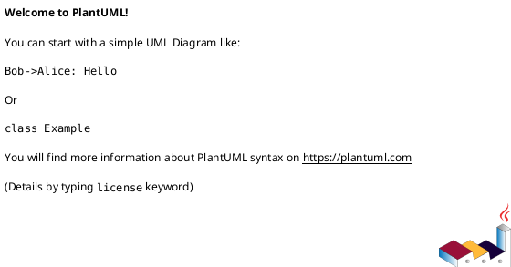
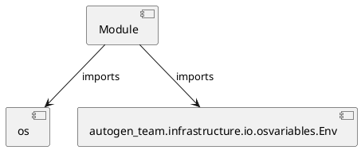

# Module Specification: test_osvariables_fix

* **Source Reference:** `tests/infrastructure/io/test_osvariables_fix.py`

## 1. Architectural Role & Responsibilities
**Purpose:**
Provides functionality related to test osvariables fix.

**Architecture Layer:**
- Infrastructure/Other

**Responsibilities:**
- Manage and execute operations for test_osvariables_fix.

**Main Workflow:**
- Initialize components and process requests for test_osvariables_fix.

## 2. Dependencies
**Imports:**
- `os`
- `autogen_team.infrastructure.io.osvariables.Env`

**Exported Classes:**
- None

**Exported Functions:**
- `test_mcp_port_collision_avoidance`
- `test_mcp_port_custom_value`

## 3. Architecture & Execution
### Internal Architecture
Follows standard modular design, encapsulating state and behavior within defined classes and functions.

### Execution Flow
Sequential execution of defined functions and class methods.

### Sequence Explanation
Clients instantiate classes or call functions, which execute business logic and return results.

## 4. UML 2.0 Diagrams
### Class Diagram

### Dependency Graph

## 5. Class & Method Specifications
## 6. Module Functions
### `test_mcp_port_collision_avoidance()`
Executes the test_mcp_port_collision_avoidance operation.

**Inputs:**
- None

**Output:**
- Return Type: `None`

### `test_mcp_port_custom_value()`
Executes the test_mcp_port_custom_value operation.

**Inputs:**
- None

**Output:**
- Return Type: `None`
