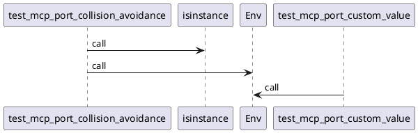
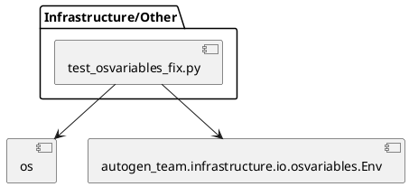
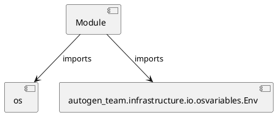
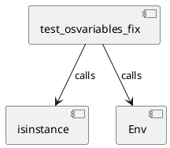

# Module Specification: test_osvariables_fix

* **Source Reference:** `tests/infrastructure/io/test_osvariables_fix.py`

## 1. Architectural Role & Responsibilities
**Purpose:**
Provides functionality related to test osvariables fix.

**Architecture Layer:**
- Infrastructure/Other

**Responsibilities:**
- Manages operations and logic for test osvariables fix.

**Main Workflow:**
- Executes the primary flow defined by test osvariables fix functions and classes.

## 2. Dependencies
**Imports:**
- `os`
- `autogen_team.infrastructure.io.osvariables.Env`

**Exported Classes:**
- None

**Exported Functions:**
- `test_mcp_port_collision_avoidance`
- `test_mcp_port_custom_value`

**Exported Interfaces:**
- Not explicitly defined.

**Public API:**
- Not explicitly defined.

## 3. Architecture & Execution
### Internal Architecture
Not explicitly defined.

### Execution Flow
Not explicitly defined.

### Sequence Explanation
Not explicitly defined.

### Examples
Not explicitly defined.

## 4. UML 2.0 Diagrams
### Class Diagram

```plantuml
@startuml
    ' No classes found in module
@enduml
```

### Sequence Diagram

```plantuml
@startuml
    test_mcp_port_collision_avoidance -> isinstance : call
    test_mcp_port_collision_avoidance -> Env : call
    test_mcp_port_custom_value -> Env : call
@enduml
```

### Component Diagram

```plantuml
@startuml
    package "Infrastructure/Other" {
        [test_osvariables_fix.py]
    }
    [test_osvariables_fix.py] --> [os]
    [test_osvariables_fix.py] --> [autogen_team.infrastructure.io.osvariables.Env]
@enduml
```

### Dependency Graph

```plantuml
@startuml
    [Module] --> [os] : imports
    [Module] --> [autogen_team.infrastructure.io.osvariables.Env] : imports
@enduml
```

## 5. Class & Method Specifications
## 6. Module Functions
### `test_mcp_port_collision_avoidance()`
Executes the test mcp port collision avoidance operation.

**Inputs:**
- None

**Output:**
- return type: `None`
- semantic meaning: Returns the result of test mcp port collision avoidance.
- possible null values: Yes, if None allows it.
- exceptions: Standard execution exceptions.

**Side Effects:**
- Database updates: Not explicitly defined.
- File operations: Not explicitly defined.
- Network calls: Not explicitly defined.
- Cache: Not explicitly defined.
- State changes: Not explicitly defined.

### `test_mcp_port_custom_value()`
Executes the test mcp port custom value operation.

**Inputs:**
- None

**Output:**
- return type: `None`
- semantic meaning: Returns the result of test mcp port custom value.
- possible null values: Yes, if None allows it.
- exceptions: Standard execution exceptions.

**Side Effects:**
- Database updates: Not explicitly defined.
- File operations: Not explicitly defined.
- Network calls: Not explicitly defined.
- Cache: Not explicitly defined.
- State changes: Not explicitly defined.

## 7. Call Graph

```plantuml
@startuml
[test_osvariables_fix] --> [isinstance] : calls
[test_osvariables_fix] --> [Env] : calls
@enduml
```

## 8. Cross References
- **Parent module:** None
- **Child modules:** None
- **Dependencies:** `os`, `autogen_team.infrastructure.io.osvariables.Env`
- **Used by:** None
- **Calls:** isinstance, Env
- **Called from:** None
- **Related classes:** [Classes](../../../../classes/index.md)
- **Related interfaces:** Not explicitly defined.
- **Related diagrams:** [Diagrams](../../../../diagrams/index.md)
