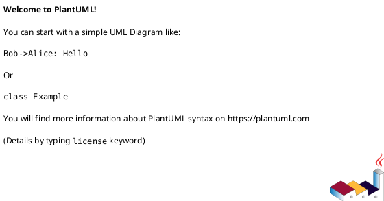

# Module Specification: test_kafka_app

* **Source Reference:** `tests/infrastructure/messaging/test_kafka_app.py`

## 1. Architectural Role & Responsibilities
**Purpose:**
Provides functionality related to test kafka app.

**Architecture Layer:**
- Infrastructure/Other

**Responsibilities:**
- Manage and execute operations for test_kafka_app.

**Main Workflow:**
- Initialize components and process requests for test_kafka_app.

## 2. Dependencies
**Imports:**
- `json`
- `os`
- `signal`
- `typing.Any`
- `typing.Dict`
- `typing.Generator`
- `unittest.mock.MagicMock`
- `unittest.mock.patch`
- `pytest`
- `autogen_team.infrastructure.messaging.kafka_app.DEFAULT_FASTAPI_HOST`
- `autogen_team.infrastructure.messaging.kafka_app.DEFAULT_FASTAPI_PORT`
- `autogen_team.infrastructure.messaging.kafka_app.FastAPIKafkaService`
- `autogen_team.infrastructure.messaging.kafka_app.PredictionResponse`
- `autogen_team.infrastructure.messaging.kafka_app.app`
- `confluent_kafka.KafkaError`

**Exported Classes:**
- None

**Exported Functions:**
- `mock_kafka_service`
- `test_initialization`
- `test_delivery_report`
- `test_start_producer_failure`
- `test_start_consumer_failure`
- `test_run_server`
- `test_run_server_failure`
- `test_consume_messages`
- `test_consume_messages_with_error`
- `test_poll_message`
- `test_poll_message_no_consumer`
- `test_handle_message_error_partition_eof`
- `test_handle_message_error_other_error`
- `test_process_message`
- `test_process_message_json_decode_error`
- `test_process_message_prediction_error`
- `test_close_consumer`
- `test_stop`
- `test_main_function`
- `test_process_message_producer_none`
- `test_process_message_exception_on_produce`
- `test_main_prediction_callback_numpy`
- `test_main_prediction_callback_error`

## 3. Architecture & Execution
### Internal Architecture
Follows standard modular design, encapsulating state and behavior within defined classes and functions.

### Execution Flow
Sequential execution of defined functions and class methods.

### Sequence Explanation
Clients instantiate classes or call functions, which execute business logic and return results.

## 4. UML 2.0 Diagrams
### Class Diagram

### Dependency Graph

```plantuml
@startuml
    [Module] --> [json] : imports
    [Module] --> [os] : imports
    [Module] --> [signal] : imports
    [Module] --> [typing.Any] : imports
    [Module] --> [typing.Dict] : imports
    [Module] --> [typing.Generator] : imports
    [Module] --> [unittest.mock.MagicMock] : imports
    [Module] --> [unittest.mock.patch] : imports
    [Module] --> [pytest] : imports
    [Module] --> [autogen_team.infrastructure.messaging.kafka_app.DEFAULT_FASTAPI_HOST] : imports
    [Module] --> [autogen_team.infrastructure.messaging.kafka_app.DEFAULT_FASTAPI_PORT] : imports
    [Module] --> [autogen_team.infrastructure.messaging.kafka_app.FastAPIKafkaService] : imports
    [Module] --> [autogen_team.infrastructure.messaging.kafka_app.PredictionResponse] : imports
    [Module] --> [autogen_team.infrastructure.messaging.kafka_app.app] : imports
    [Module] --> [confluent_kafka.KafkaError] : imports
@enduml
```

## 5. Class & Method Specifications
## 6. Module Functions
### `mock_kafka_service()`
Fixture to create a mocked FastAPIKafkaService.

**Inputs:**
- None

**Output:**
- Return Type: `Any`

### `test_initialization(mock_kafka_service: tuple[...])`
Test FastAPIKafkaService initialization.

**Inputs:**
- `mock_kafka_service`: tuple[...]

**Output:**
- Return Type: `None`

### `test_delivery_report(mock_kafka_service: tuple[...])`
Test delivery report logging.

**Inputs:**
- `mock_kafka_service`: tuple[...]

**Output:**
- Return Type: `None`

### `test_start_producer_failure(mock_kafka_service: tuple[...])`
Test start method when producer initialization fails.

**Inputs:**
- `mock_kafka_service`: tuple[...]

**Output:**
- Return Type: `None`

### `test_start_consumer_failure(mock_kafka_service: tuple[...])`
Test start method when consumer initialization fails.

**Inputs:**
- `mock_kafka_service`: tuple[...]

**Output:**
- Return Type: `None`

### `test_run_server(mock_kafka_service: tuple[...])`
Test the _run_server method.

**Inputs:**
- `mock_kafka_service`: tuple[...]

**Output:**
- Return Type: `None`

### `test_run_server_failure(mock_kafka_service: tuple[...])`
Test the _run_server method when uvicorn fails.

**Inputs:**
- `mock_kafka_service`: tuple[...]

**Output:**
- Return Type: `None`

### `test_consume_messages(mock_kafka_service: tuple[...])`
Test the _consume_messages method.

**Inputs:**
- `mock_kafka_service`: tuple[...]

**Output:**
- Return Type: `None`

### `test_consume_messages_with_error(mock_kafka_service: tuple[...])`
Test _consume_messages handles message errors.

**Inputs:**
- `mock_kafka_service`: tuple[...]

**Output:**
- Return Type: `None`

### `test_poll_message(mock_kafka_service: tuple[...])`
Test the _poll_message method.

**Inputs:**
- `mock_kafka_service`: tuple[...]

**Output:**
- Return Type: `None`

### `test_poll_message_no_consumer(mock_kafka_service: tuple[...])`
Test _poll_message handles missing consumer.

**Inputs:**
- `mock_kafka_service`: tuple[...]

**Output:**
- Return Type: `None`

### `test_handle_message_error_partition_eof(mock_kafka_service: tuple[...])`
Test _handle_message_error handles partition EOF.

**Inputs:**
- `mock_kafka_service`: tuple[...]

**Output:**
- Return Type: `None`

### `test_handle_message_error_other_error(mock_kafka_service: tuple[...])`
Test _handle_message_error handles other Kafka errors.

**Inputs:**
- `mock_kafka_service`: tuple[...]

**Output:**
- Return Type: `None`

### `test_process_message(mock_json_loads: MagicMock, mock_kafka_service: tuple[...])`
Test the _process_message method.

**Inputs:**
- `mock_json_loads`: MagicMock
- `mock_kafka_service`: tuple[...]

**Output:**
- Return Type: `None`

### `test_process_message_json_decode_error(mock_json_loads: MagicMock, mock_kafka_service: tuple[...])`
Test _process_message handles JSON decoding errors.

**Inputs:**
- `mock_json_loads`: MagicMock
- `mock_kafka_service`: tuple[...]

**Output:**
- Return Type: `None`

### `test_process_message_prediction_error(mock_json_loads: MagicMock, mock_kafka_service: tuple[...])`
Test _process_message handles prediction callback errors.

**Inputs:**
- `mock_json_loads`: MagicMock
- `mock_kafka_service`: tuple[...]

**Output:**
- Return Type: `None`

### `test_close_consumer(mock_kafka_service: tuple[...])`
Test the _close_consumer method.

**Inputs:**
- `mock_kafka_service`: tuple[...]

**Output:**
- Return Type: `None`

### `test_stop(mock_os_kill: MagicMock, mock_kafka_service: tuple[...])`
Test the stop method.

**Inputs:**
- `mock_os_kill`: MagicMock
- `mock_kafka_service`: tuple[...]

**Output:**
- Return Type: `None`

### `test_main_function()`
Test the main function.

**Inputs:**
- None

**Output:**
- Return Type: `None`

### `test_process_message_producer_none(mock_kafka_service: tuple[...])`
Test _process_message when producer is None (line 215).

**Inputs:**
- `mock_kafka_service`: tuple[...]

**Output:**
- Return Type: `None`

### `test_process_message_exception_on_produce(mock_kafka_service: tuple[...])`
Test _process_message when produce raises exception (line 219).

**Inputs:**
- `mock_kafka_service`: tuple[...]

**Output:**
- Return Type: `None`

### `test_main_prediction_callback_numpy()`
Test the prediction callback inside main with numpy output.

**Inputs:**
- None

**Output:**
- Return Type: `None`

### `test_main_prediction_callback_error()`
Test the prediction callback inside main when predict fails.

**Inputs:**
- None

**Output:**
- Return Type: `None`
