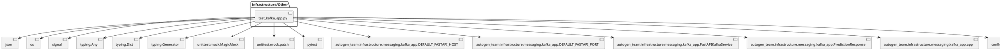
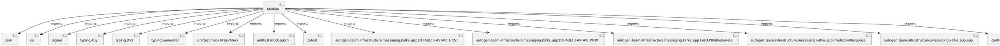
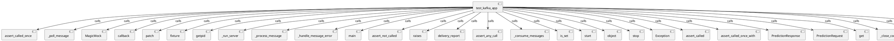

# Module Specification: test_kafka_app

* **Source Reference:** `tests/infrastructure/messaging/test_kafka_app.py`

## 1. Architectural Role & Responsibilities
**Purpose:**
Provides functionality related to test kafka app.

**Architecture Layer:**
- Infrastructure/Other

**Responsibilities:**
- Manages operations and logic for test kafka app.

**Main Workflow:**
- Executes the primary flow defined by test kafka app functions and classes.

## 2. Dependencies
**Imports:**
- `json`
- `os`
- `signal`
- `typing.Any`
- `typing.Dict`
- `typing.Generator`
- `unittest.mock.MagicMock`
- `unittest.mock.patch`
- `pytest`
- `autogen_team.infrastructure.messaging.kafka_app.DEFAULT_FASTAPI_HOST`
- `autogen_team.infrastructure.messaging.kafka_app.DEFAULT_FASTAPI_PORT`
- `autogen_team.infrastructure.messaging.kafka_app.FastAPIKafkaService`
- `autogen_team.infrastructure.messaging.kafka_app.PredictionResponse`
- `autogen_team.infrastructure.messaging.kafka_app.app`
- `confluent_kafka.KafkaError`

**Exported Classes:**
- None

**Exported Functions:**
- `mock_kafka_service`
- `test_initialization`
- `test_delivery_report`
- `test_start_producer_failure`
- `test_start_consumer_failure`
- `test_run_server`
- `test_run_server_failure`
- `test_consume_messages`
- `test_consume_messages_with_error`
- `test_poll_message`
- `test_poll_message_no_consumer`
- `test_handle_message_error_partition_eof`
- `test_handle_message_error_other_error`
- `test_process_message`
- `test_process_message_json_decode_error`
- `test_process_message_prediction_error`
- `test_close_consumer`
- `test_stop`
- `test_main_function`
- `test_process_message_producer_none`
- `test_process_message_exception_on_produce`
- `test_main_prediction_callback_numpy`
- `test_main_prediction_callback_error`

**Exported Interfaces:**
- Not explicitly defined.

**Public API:**
- Not explicitly defined.

## 3. Architecture & Execution
### Internal Architecture
Not explicitly defined.

### Execution Flow
Not explicitly defined.

### Sequence Explanation
Not explicitly defined.

### Examples
Not explicitly defined.

## 4. UML 2.0 Diagrams
### Class Diagram

```plantuml
@startuml
    ' No classes found in module
@enduml
```

### Sequence Diagram

```plantuml
@startuml
    mock_kafka_service -> PredictionResponse : call
    mock_kafka_service -> MagicMock : call
    mock_kafka_service -> patch : call
    mock_kafka_service -> fixture : call
    mock_kafka_service -> FastAPIKafkaService : call
    test_delivery_report -> MagicMock : call
    test_delivery_report -> patch : call
    test_delivery_report -> assert_called_once : call
    test_delivery_report -> delivery_report : call
    test_start_producer_failure -> start : call
    test_start_producer_failure -> Exception : call
    test_start_producer_failure -> raises : call
    test_start_consumer_failure -> start : call
    test_start_consumer_failure -> Exception : call
    test_start_consumer_failure -> raises : call
    test_run_server -> _run_server : call
    test_run_server -> patch : call
    test_run_server -> assert_called_once_with : call
    test_run_server_failure -> _run_server : call
    test_run_server_failure -> patch : call
    test_run_server_failure -> Exception : call
    test_consume_messages -> MagicMock : call
    test_consume_messages -> _consume_messages : call
    test_consume_messages -> assert_called_once : call
    test_consume_messages_with_error -> MagicMock : call
    test_consume_messages_with_error -> _consume_messages : call
    test_consume_messages_with_error -> assert_called_once : call
    test_consume_messages_with_error -> assert_not_called : call
    test_poll_message -> MagicMock : call
    test_poll_message -> assert_called_once_with : call
    test_poll_message -> _poll_message : call
    test_poll_message_no_consumer -> patch : call
    test_poll_message_no_consumer -> assert_called_once : call
    test_poll_message_no_consumer -> _poll_message : call
    test_handle_message_error_partition_eof -> MagicMock : call
    test_handle_message_error_partition_eof -> patch : call
    test_handle_message_error_partition_eof -> assert_called_once : call
    test_handle_message_error_partition_eof -> _handle_message_error : call
    test_handle_message_error_other_error -> MagicMock : call
    test_handle_message_error_other_error -> patch : call
    test_handle_message_error_other_error -> assert_called_once : call
    test_handle_message_error_other_error -> _handle_message_error : call
    test_process_message -> assert_called_once_with : call
    test_process_message -> PredictionResponse : call
    test_process_message -> assert_called_once : call
    test_process_message -> MagicMock : call
    test_process_message -> patch : call
    test_process_message -> _process_message : call
    test_process_message_json_decode_error -> assert_not_called : call
    test_process_message_json_decode_error -> assert_called_once : call
    test_process_message_json_decode_error -> MagicMock : call
    test_process_message_json_decode_error -> patch : call
    test_process_message_json_decode_error -> _process_message : call
    test_process_message_json_decode_error -> assert_called : call
    test_process_message_json_decode_error -> JSONDecodeError : call
    test_process_message_prediction_error -> assert_called_once : call
    test_process_message_prediction_error -> MagicMock : call
    test_process_message_prediction_error -> patch : call
    test_process_message_prediction_error -> _process_message : call
    test_process_message_prediction_error -> Exception : call
    test_process_message_prediction_error -> assert_called : call
    test_close_consumer -> assert_called_once : call
    test_close_consumer -> MagicMock : call
    test_close_consumer -> patch : call
    test_close_consumer -> _close_consumer : call
    test_close_consumer -> assert_called : call
    test_stop -> assert_called_once_with : call
    test_stop -> assert_called_once : call
    test_stop -> is_set : call
    test_stop -> MagicMock : call
    test_stop -> patch : call
    test_stop -> getpid : call
    test_stop -> stop : call
    test_main_function -> main : call
    test_main_function -> assert_called_once_with : call
    test_main_function -> assert_called_once : call
    test_main_function -> MagicMock : call
    test_main_function -> patch : call
    test_main_function -> assert_called : call
    test_process_message_producer_none -> MagicMock : call
    test_process_message_producer_none -> patch : call
    test_process_message_producer_none -> _process_message : call
    test_process_message_producer_none -> assert_any_call : call
    test_process_message_exception_on_produce -> MagicMock : call
    test_process_message_exception_on_produce -> patch : call
    test_process_message_exception_on_produce -> assert_any_call : call
    test_process_message_exception_on_produce -> _process_message : call
    test_process_message_exception_on_produce -> Exception : call
    test_main_prediction_callback_numpy -> main : call
    test_main_prediction_callback_numpy -> PredictionRequest : call
    test_main_prediction_callback_numpy -> MagicMock : call
    test_main_prediction_callback_numpy -> callback : call
    test_main_prediction_callback_numpy -> patch : call
    test_main_prediction_callback_numpy -> get : call
    test_main_prediction_callback_numpy -> object : call
    test_main_prediction_callback_error -> main : call
    test_main_prediction_callback_error -> PredictionRequest : call
    test_main_prediction_callback_error -> MagicMock : call
    test_main_prediction_callback_error -> callback : call
    test_main_prediction_callback_error -> patch : call
    test_main_prediction_callback_error -> get : call
    test_main_prediction_callback_error -> Exception : call
@enduml
```

### Component Diagram

```plantuml
@startuml
    package "Infrastructure/Other" {
        [test_kafka_app.py]
    }
    [test_kafka_app.py] --> [json]
    [test_kafka_app.py] --> [os]
    [test_kafka_app.py] --> [signal]
    [test_kafka_app.py] --> [typing.Any]
    [test_kafka_app.py] --> [typing.Dict]
    [test_kafka_app.py] --> [typing.Generator]
    [test_kafka_app.py] --> [unittest.mock.MagicMock]
    [test_kafka_app.py] --> [unittest.mock.patch]
    [test_kafka_app.py] --> [pytest]
    [test_kafka_app.py] --> [autogen_team.infrastructure.messaging.kafka_app.DEFAULT_FASTAPI_HOST]
    [test_kafka_app.py] --> [autogen_team.infrastructure.messaging.kafka_app.DEFAULT_FASTAPI_PORT]
    [test_kafka_app.py] --> [autogen_team.infrastructure.messaging.kafka_app.FastAPIKafkaService]
    [test_kafka_app.py] --> [autogen_team.infrastructure.messaging.kafka_app.PredictionResponse]
    [test_kafka_app.py] --> [autogen_team.infrastructure.messaging.kafka_app.app]
    [test_kafka_app.py] --> [confluent_kafka.KafkaError]
@enduml
```

### Dependency Graph

```plantuml
@startuml
    [Module] --> [json] : imports
    [Module] --> [os] : imports
    [Module] --> [signal] : imports
    [Module] --> [typing.Any] : imports
    [Module] --> [typing.Dict] : imports
    [Module] --> [typing.Generator] : imports
    [Module] --> [unittest.mock.MagicMock] : imports
    [Module] --> [unittest.mock.patch] : imports
    [Module] --> [pytest] : imports
    [Module] --> [autogen_team.infrastructure.messaging.kafka_app.DEFAULT_FASTAPI_HOST] : imports
    [Module] --> [autogen_team.infrastructure.messaging.kafka_app.DEFAULT_FASTAPI_PORT] : imports
    [Module] --> [autogen_team.infrastructure.messaging.kafka_app.FastAPIKafkaService] : imports
    [Module] --> [autogen_team.infrastructure.messaging.kafka_app.PredictionResponse] : imports
    [Module] --> [autogen_team.infrastructure.messaging.kafka_app.app] : imports
    [Module] --> [confluent_kafka.KafkaError] : imports
@enduml
```

## 5. Class & Method Specifications
## 6. Module Functions
### `mock_kafka_service()`
Fixture to create a mocked FastAPIKafkaService.

**Inputs:**
- None

**Output:**
- return type: `Generator[tuple[FastAPIKafkaService, MagicMock, MagicMock, MagicMock, MagicMock], None, None]`
- semantic meaning: Returns the result of mock kafka service.
- possible null values: Yes, if Generator[tuple[FastAPIKafkaService, MagicMock, MagicMock, MagicMock, MagicMock], None, None] allows it.
- exceptions: Standard execution exceptions.

**Side Effects:**
- Database updates: Not explicitly defined.
- File operations: Not explicitly defined.
- Network calls: Not explicitly defined.
- Cache: Not explicitly defined.
- State changes: Not explicitly defined.

### `test_initialization(mock_kafka_service: tuple[FastAPIKafkaService, MagicMock, MagicMock, MagicMock, MagicMock, Dict[str, Any]])`
Test FastAPIKafkaService initialization.

**Inputs:**
- `mock_kafka_service`
  - type: tuple[FastAPIKafkaService, MagicMock, MagicMock, MagicMock, MagicMock, Dict[str, Any]]
  - meaning: Represents the mock kafka service parameter.
  - valid values: Any valid tuple[FastAPIKafkaService, MagicMock, MagicMock, MagicMock, MagicMock, Dict[str, Any]].
  - optional?: False
  - default value: None

**Output:**
- return type: `None`
- semantic meaning: Returns the result of test initialization.
- possible null values: Yes, if None allows it.
- exceptions: Standard execution exceptions.

**Side Effects:**
- Database updates: Not explicitly defined.
- File operations: Not explicitly defined.
- Network calls: Not explicitly defined.
- Cache: Not explicitly defined.
- State changes: Not explicitly defined.

### `test_delivery_report(mock_kafka_service: tuple[FastAPIKafkaService, MagicMock, MagicMock, MagicMock, MagicMock])`
Test delivery report logging.

**Inputs:**
- `mock_kafka_service`
  - type: tuple[FastAPIKafkaService, MagicMock, MagicMock, MagicMock, MagicMock]
  - meaning: Represents the mock kafka service parameter.
  - valid values: Any valid tuple[FastAPIKafkaService, MagicMock, MagicMock, MagicMock, MagicMock].
  - optional?: False
  - default value: None

**Output:**
- return type: `None`
- semantic meaning: Returns the result of test delivery report.
- possible null values: Yes, if None allows it.
- exceptions: Standard execution exceptions.

**Side Effects:**
- Database updates: Not explicitly defined.
- File operations: Not explicitly defined.
- Network calls: Not explicitly defined.
- Cache: Not explicitly defined.
- State changes: Not explicitly defined.

### `test_start_producer_failure(mock_kafka_service: tuple[FastAPIKafkaService, MagicMock, MagicMock, MagicMock, MagicMock])`
Test start method when producer initialization fails.

**Inputs:**
- `mock_kafka_service`
  - type: tuple[FastAPIKafkaService, MagicMock, MagicMock, MagicMock, MagicMock]
  - meaning: Represents the mock kafka service parameter.
  - valid values: Any valid tuple[FastAPIKafkaService, MagicMock, MagicMock, MagicMock, MagicMock].
  - optional?: False
  - default value: None

**Output:**
- return type: `None`
- semantic meaning: Returns the result of test start producer failure.
- possible null values: Yes, if None allows it.
- exceptions: Standard execution exceptions.

**Side Effects:**
- Database updates: Not explicitly defined.
- File operations: Not explicitly defined.
- Network calls: Not explicitly defined.
- Cache: Not explicitly defined.
- State changes: Not explicitly defined.

### `test_start_consumer_failure(mock_kafka_service: tuple[FastAPIKafkaService, MagicMock, MagicMock, MagicMock, MagicMock])`
Test start method when consumer initialization fails.

**Inputs:**
- `mock_kafka_service`
  - type: tuple[FastAPIKafkaService, MagicMock, MagicMock, MagicMock, MagicMock]
  - meaning: Represents the mock kafka service parameter.
  - valid values: Any valid tuple[FastAPIKafkaService, MagicMock, MagicMock, MagicMock, MagicMock].
  - optional?: False
  - default value: None

**Output:**
- return type: `None`
- semantic meaning: Returns the result of test start consumer failure.
- possible null values: Yes, if None allows it.
- exceptions: Standard execution exceptions.

**Side Effects:**
- Database updates: Not explicitly defined.
- File operations: Not explicitly defined.
- Network calls: Not explicitly defined.
- Cache: Not explicitly defined.
- State changes: Not explicitly defined.

### `test_run_server(mock_kafka_service: tuple[FastAPIKafkaService, MagicMock, MagicMock, MagicMock, MagicMock])`
Test the _run_server method.

**Inputs:**
- `mock_kafka_service`
  - type: tuple[FastAPIKafkaService, MagicMock, MagicMock, MagicMock, MagicMock]
  - meaning: Represents the mock kafka service parameter.
  - valid values: Any valid tuple[FastAPIKafkaService, MagicMock, MagicMock, MagicMock, MagicMock].
  - optional?: False
  - default value: None

**Output:**
- return type: `None`
- semantic meaning: Returns the result of test run server.
- possible null values: Yes, if None allows it.
- exceptions: Standard execution exceptions.

**Side Effects:**
- Database updates: Not explicitly defined.
- File operations: Not explicitly defined.
- Network calls: Not explicitly defined.
- Cache: Not explicitly defined.
- State changes: Not explicitly defined.

### `test_run_server_failure(mock_kafka_service: tuple[FastAPIKafkaService, MagicMock, MagicMock, MagicMock, MagicMock])`
Test the _run_server method when uvicorn fails.

**Inputs:**
- `mock_kafka_service`
  - type: tuple[FastAPIKafkaService, MagicMock, MagicMock, MagicMock, MagicMock]
  - meaning: Represents the mock kafka service parameter.
  - valid values: Any valid tuple[FastAPIKafkaService, MagicMock, MagicMock, MagicMock, MagicMock].
  - optional?: False
  - default value: None

**Output:**
- return type: `None`
- semantic meaning: Returns the result of test run server failure.
- possible null values: Yes, if None allows it.
- exceptions: Standard execution exceptions.

**Side Effects:**
- Database updates: Not explicitly defined.
- File operations: Not explicitly defined.
- Network calls: Not explicitly defined.
- Cache: Not explicitly defined.
- State changes: Not explicitly defined.

### `test_consume_messages(mock_kafka_service: tuple[FastAPIKafkaService, MagicMock, MagicMock, MagicMock, MagicMock])`
Test the _consume_messages method.

**Inputs:**
- `mock_kafka_service`
  - type: tuple[FastAPIKafkaService, MagicMock, MagicMock, MagicMock, MagicMock]
  - meaning: Represents the mock kafka service parameter.
  - valid values: Any valid tuple[FastAPIKafkaService, MagicMock, MagicMock, MagicMock, MagicMock].
  - optional?: False
  - default value: None

**Output:**
- return type: `None`
- semantic meaning: Returns the result of test consume messages.
- possible null values: Yes, if None allows it.
- exceptions: Standard execution exceptions.

**Side Effects:**
- Database updates: Not explicitly defined.
- File operations: Not explicitly defined.
- Network calls: Not explicitly defined.
- Cache: Not explicitly defined.
- State changes: Not explicitly defined.

### `test_consume_messages_with_error(mock_kafka_service: tuple[FastAPIKafkaService, MagicMock, MagicMock, MagicMock, MagicMock])`
Test _consume_messages handles message errors.

**Inputs:**
- `mock_kafka_service`
  - type: tuple[FastAPIKafkaService, MagicMock, MagicMock, MagicMock, MagicMock]
  - meaning: Represents the mock kafka service parameter.
  - valid values: Any valid tuple[FastAPIKafkaService, MagicMock, MagicMock, MagicMock, MagicMock].
  - optional?: False
  - default value: None

**Output:**
- return type: `None`
- semantic meaning: Returns the result of test consume messages with error.
- possible null values: Yes, if None allows it.
- exceptions: Standard execution exceptions.

**Side Effects:**
- Database updates: Not explicitly defined.
- File operations: Not explicitly defined.
- Network calls: Not explicitly defined.
- Cache: Not explicitly defined.
- State changes: Not explicitly defined.

### `test_poll_message(mock_kafka_service: tuple[FastAPIKafkaService, MagicMock, MagicMock, MagicMock, MagicMock])`
Test the _poll_message method.

**Inputs:**
- `mock_kafka_service`
  - type: tuple[FastAPIKafkaService, MagicMock, MagicMock, MagicMock, MagicMock]
  - meaning: Represents the mock kafka service parameter.
  - valid values: Any valid tuple[FastAPIKafkaService, MagicMock, MagicMock, MagicMock, MagicMock].
  - optional?: False
  - default value: None

**Output:**
- return type: `None`
- semantic meaning: Returns the result of test poll message.
- possible null values: Yes, if None allows it.
- exceptions: Standard execution exceptions.

**Side Effects:**
- Database updates: Not explicitly defined.
- File operations: Not explicitly defined.
- Network calls: Not explicitly defined.
- Cache: Not explicitly defined.
- State changes: Not explicitly defined.

### `test_poll_message_no_consumer(mock_kafka_service: tuple[FastAPIKafkaService, MagicMock, MagicMock, MagicMock, MagicMock])`
Test _poll_message handles missing consumer.

**Inputs:**
- `mock_kafka_service`
  - type: tuple[FastAPIKafkaService, MagicMock, MagicMock, MagicMock, MagicMock]
  - meaning: Represents the mock kafka service parameter.
  - valid values: Any valid tuple[FastAPIKafkaService, MagicMock, MagicMock, MagicMock, MagicMock].
  - optional?: False
  - default value: None

**Output:**
- return type: `None`
- semantic meaning: Returns the result of test poll message no consumer.
- possible null values: Yes, if None allows it.
- exceptions: Standard execution exceptions.

**Side Effects:**
- Database updates: Not explicitly defined.
- File operations: Not explicitly defined.
- Network calls: Not explicitly defined.
- Cache: Not explicitly defined.
- State changes: Not explicitly defined.

### `test_handle_message_error_partition_eof(mock_kafka_service: tuple[FastAPIKafkaService, MagicMock, MagicMock, MagicMock, MagicMock])`
Test _handle_message_error handles partition EOF.

**Inputs:**
- `mock_kafka_service`
  - type: tuple[FastAPIKafkaService, MagicMock, MagicMock, MagicMock, MagicMock]
  - meaning: Represents the mock kafka service parameter.
  - valid values: Any valid tuple[FastAPIKafkaService, MagicMock, MagicMock, MagicMock, MagicMock].
  - optional?: False
  - default value: None

**Output:**
- return type: `None`
- semantic meaning: Returns the result of test handle message error partition eof.
- possible null values: Yes, if None allows it.
- exceptions: Standard execution exceptions.

**Side Effects:**
- Database updates: Not explicitly defined.
- File operations: Not explicitly defined.
- Network calls: Not explicitly defined.
- Cache: Not explicitly defined.
- State changes: Not explicitly defined.

### `test_handle_message_error_other_error(mock_kafka_service: tuple[FastAPIKafkaService, MagicMock, MagicMock, MagicMock, MagicMock])`
Test _handle_message_error handles other Kafka errors.

**Inputs:**
- `mock_kafka_service`
  - type: tuple[FastAPIKafkaService, MagicMock, MagicMock, MagicMock, MagicMock]
  - meaning: Represents the mock kafka service parameter.
  - valid values: Any valid tuple[FastAPIKafkaService, MagicMock, MagicMock, MagicMock, MagicMock].
  - optional?: False
  - default value: None

**Output:**
- return type: `None`
- semantic meaning: Returns the result of test handle message error other error.
- possible null values: Yes, if None allows it.
- exceptions: Standard execution exceptions.

**Side Effects:**
- Database updates: Not explicitly defined.
- File operations: Not explicitly defined.
- Network calls: Not explicitly defined.
- Cache: Not explicitly defined.
- State changes: Not explicitly defined.

### `test_process_message(mock_json_loads: MagicMock, mock_kafka_service: tuple[FastAPIKafkaService, MagicMock, MagicMock, MagicMock, MagicMock])`
Test the _process_message method.

**Inputs:**
- `mock_json_loads`
  - type: MagicMock
  - meaning: Represents the mock json loads parameter.
  - valid values: Any valid MagicMock.
  - optional?: False
  - default value: None
- `mock_kafka_service`
  - type: tuple[FastAPIKafkaService, MagicMock, MagicMock, MagicMock, MagicMock]
  - meaning: Represents the mock kafka service parameter.
  - valid values: Any valid tuple[FastAPIKafkaService, MagicMock, MagicMock, MagicMock, MagicMock].
  - optional?: False
  - default value: None

**Output:**
- return type: `None`
- semantic meaning: Returns the result of test process message.
- possible null values: Yes, if None allows it.
- exceptions: Standard execution exceptions.

**Side Effects:**
- Database updates: Not explicitly defined.
- File operations: Not explicitly defined.
- Network calls: Not explicitly defined.
- Cache: Not explicitly defined.
- State changes: Not explicitly defined.

### `test_process_message_json_decode_error(mock_json_loads: MagicMock, mock_kafka_service: tuple[FastAPIKafkaService, MagicMock, MagicMock, MagicMock, MagicMock])`
Test _process_message handles JSON decoding errors.

**Inputs:**
- `mock_json_loads`
  - type: MagicMock
  - meaning: Represents the mock json loads parameter.
  - valid values: Any valid MagicMock.
  - optional?: False
  - default value: None
- `mock_kafka_service`
  - type: tuple[FastAPIKafkaService, MagicMock, MagicMock, MagicMock, MagicMock]
  - meaning: Represents the mock kafka service parameter.
  - valid values: Any valid tuple[FastAPIKafkaService, MagicMock, MagicMock, MagicMock, MagicMock].
  - optional?: False
  - default value: None

**Output:**
- return type: `None`
- semantic meaning: Returns the result of test process message json decode error.
- possible null values: Yes, if None allows it.
- exceptions: Standard execution exceptions.

**Side Effects:**
- Database updates: Not explicitly defined.
- File operations: Not explicitly defined.
- Network calls: Not explicitly defined.
- Cache: Not explicitly defined.
- State changes: Not explicitly defined.

### `test_process_message_prediction_error(mock_json_loads: MagicMock, mock_kafka_service: tuple[FastAPIKafkaService, MagicMock, MagicMock, MagicMock, MagicMock])`
Test _process_message handles prediction callback errors.

**Inputs:**
- `mock_json_loads`
  - type: MagicMock
  - meaning: Represents the mock json loads parameter.
  - valid values: Any valid MagicMock.
  - optional?: False
  - default value: None
- `mock_kafka_service`
  - type: tuple[FastAPIKafkaService, MagicMock, MagicMock, MagicMock, MagicMock]
  - meaning: Represents the mock kafka service parameter.
  - valid values: Any valid tuple[FastAPIKafkaService, MagicMock, MagicMock, MagicMock, MagicMock].
  - optional?: False
  - default value: None

**Output:**
- return type: `None`
- semantic meaning: Returns the result of test process message prediction error.
- possible null values: Yes, if None allows it.
- exceptions: Standard execution exceptions.

**Side Effects:**
- Database updates: Not explicitly defined.
- File operations: Not explicitly defined.
- Network calls: Not explicitly defined.
- Cache: Not explicitly defined.
- State changes: Not explicitly defined.

### `test_close_consumer(mock_kafka_service: tuple[FastAPIKafkaService, MagicMock, MagicMock, MagicMock, MagicMock])`
Test the _close_consumer method.

**Inputs:**
- `mock_kafka_service`
  - type: tuple[FastAPIKafkaService, MagicMock, MagicMock, MagicMock, MagicMock]
  - meaning: Represents the mock kafka service parameter.
  - valid values: Any valid tuple[FastAPIKafkaService, MagicMock, MagicMock, MagicMock, MagicMock].
  - optional?: False
  - default value: None

**Output:**
- return type: `None`
- semantic meaning: Returns the result of test close consumer.
- possible null values: Yes, if None allows it.
- exceptions: Standard execution exceptions.

**Side Effects:**
- Database updates: Not explicitly defined.
- File operations: Not explicitly defined.
- Network calls: Not explicitly defined.
- Cache: Not explicitly defined.
- State changes: Not explicitly defined.

### `test_stop(mock_os_kill: MagicMock, mock_kafka_service: tuple[FastAPIKafkaService, MagicMock, MagicMock, MagicMock, MagicMock])`
Test the stop method.

**Inputs:**
- `mock_os_kill`
  - type: MagicMock
  - meaning: Represents the mock os kill parameter.
  - valid values: Any valid MagicMock.
  - optional?: False
  - default value: None
- `mock_kafka_service`
  - type: tuple[FastAPIKafkaService, MagicMock, MagicMock, MagicMock, MagicMock]
  - meaning: Represents the mock kafka service parameter.
  - valid values: Any valid tuple[FastAPIKafkaService, MagicMock, MagicMock, MagicMock, MagicMock].
  - optional?: False
  - default value: None

**Output:**
- return type: `None`
- semantic meaning: Returns the result of test stop.
- possible null values: Yes, if None allows it.
- exceptions: Standard execution exceptions.

**Side Effects:**
- Database updates: Not explicitly defined.
- File operations: Not explicitly defined.
- Network calls: Not explicitly defined.
- Cache: Not explicitly defined.
- State changes: Not explicitly defined.

### `test_main_function()`
Test the main function.

**Inputs:**
- None

**Output:**
- return type: `None`
- semantic meaning: Returns the result of test main function.
- possible null values: Yes, if None allows it.
- exceptions: Standard execution exceptions.

**Side Effects:**
- Database updates: Not explicitly defined.
- File operations: Not explicitly defined.
- Network calls: Not explicitly defined.
- Cache: Not explicitly defined.
- State changes: Not explicitly defined.

### `test_process_message_producer_none(mock_kafka_service: tuple[FastAPIKafkaService, MagicMock, MagicMock, MagicMock, MagicMock])`
Test _process_message when producer is None (line 215).

**Inputs:**
- `mock_kafka_service`
  - type: tuple[FastAPIKafkaService, MagicMock, MagicMock, MagicMock, MagicMock]
  - meaning: Represents the mock kafka service parameter.
  - valid values: Any valid tuple[FastAPIKafkaService, MagicMock, MagicMock, MagicMock, MagicMock].
  - optional?: False
  - default value: None

**Output:**
- return type: `None`
- semantic meaning: Returns the result of test process message producer none.
- possible null values: Yes, if None allows it.
- exceptions: Standard execution exceptions.

**Side Effects:**
- Database updates: Not explicitly defined.
- File operations: Not explicitly defined.
- Network calls: Not explicitly defined.
- Cache: Not explicitly defined.
- State changes: Not explicitly defined.

### `test_process_message_exception_on_produce(mock_kafka_service: tuple[FastAPIKafkaService, MagicMock, MagicMock, MagicMock, MagicMock])`
Test _process_message when produce raises exception (line 219).

**Inputs:**
- `mock_kafka_service`
  - type: tuple[FastAPIKafkaService, MagicMock, MagicMock, MagicMock, MagicMock]
  - meaning: Represents the mock kafka service parameter.
  - valid values: Any valid tuple[FastAPIKafkaService, MagicMock, MagicMock, MagicMock, MagicMock].
  - optional?: False
  - default value: None

**Output:**
- return type: `None`
- semantic meaning: Returns the result of test process message exception on produce.
- possible null values: Yes, if None allows it.
- exceptions: Standard execution exceptions.

**Side Effects:**
- Database updates: Not explicitly defined.
- File operations: Not explicitly defined.
- Network calls: Not explicitly defined.
- Cache: Not explicitly defined.
- State changes: Not explicitly defined.

### `test_main_prediction_callback_numpy()`
Test the prediction callback inside main with numpy output.

**Inputs:**
- None

**Output:**
- return type: `None`
- semantic meaning: Returns the result of test main prediction callback numpy.
- possible null values: Yes, if None allows it.
- exceptions: Standard execution exceptions.

**Side Effects:**
- Database updates: Not explicitly defined.
- File operations: Not explicitly defined.
- Network calls: Not explicitly defined.
- Cache: Not explicitly defined.
- State changes: Not explicitly defined.

### `test_main_prediction_callback_error()`
Test the prediction callback inside main when predict fails.

**Inputs:**
- None

**Output:**
- return type: `None`
- semantic meaning: Returns the result of test main prediction callback error.
- possible null values: Yes, if None allows it.
- exceptions: Standard execution exceptions.

**Side Effects:**
- Database updates: Not explicitly defined.
- File operations: Not explicitly defined.
- Network calls: Not explicitly defined.
- Cache: Not explicitly defined.
- State changes: Not explicitly defined.

## 7. Call Graph

```plantuml
@startuml
[test_kafka_app] --> [assert_called_once] : calls
[test_kafka_app] --> [_poll_message] : calls
[test_kafka_app] --> [MagicMock] : calls
[test_kafka_app] --> [callback] : calls
[test_kafka_app] --> [patch] : calls
[test_kafka_app] --> [fixture] : calls
[test_kafka_app] --> [getpid] : calls
[test_kafka_app] --> [_run_server] : calls
[test_kafka_app] --> [_process_message] : calls
[test_kafka_app] --> [_handle_message_error] : calls
[test_kafka_app] --> [main] : calls
[test_kafka_app] --> [assert_not_called] : calls
[test_kafka_app] --> [raises] : calls
[test_kafka_app] --> [delivery_report] : calls
[test_kafka_app] --> [assert_any_call] : calls
[test_kafka_app] --> [_consume_messages] : calls
[test_kafka_app] --> [is_set] : calls
[test_kafka_app] --> [start] : calls
[test_kafka_app] --> [object] : calls
[test_kafka_app] --> [stop] : calls
[test_kafka_app] --> [Exception] : calls
[test_kafka_app] --> [assert_called] : calls
[test_kafka_app] --> [assert_called_once_with] : calls
[test_kafka_app] --> [PredictionResponse] : calls
[test_kafka_app] --> [PredictionRequest] : calls
[test_kafka_app] --> [get] : calls
[test_kafka_app] --> [_close_consumer] : calls
[test_kafka_app] --> [FastAPIKafkaService] : calls
[test_kafka_app] --> [JSONDecodeError] : calls
@enduml
```

## 8. Cross References
- **Parent module:** None
- **Child modules:** None
- **Dependencies:** `os`, `autogen_team.infrastructure.messaging.kafka_app.DEFAULT_FASTAPI_HOST`, `confluent_kafka.KafkaError`, `signal`, `pytest`, `autogen_team.infrastructure.messaging.kafka_app.PredictionResponse`, `typing.Generator`, `unittest.mock.patch`, `typing.Dict`, `autogen_team.infrastructure.messaging.kafka_app.FastAPIKafkaService`, `typing.Any`, `json`, `autogen_team.infrastructure.messaging.kafka_app.app`, `autogen_team.infrastructure.messaging.kafka_app.DEFAULT_FASTAPI_PORT`, `unittest.mock.MagicMock`
- **Used by:** None
- **Calls:** assert_called_once, _poll_message, MagicMock, callback, patch, fixture, getpid, _run_server, _process_message, _handle_message_error, main, assert_not_called, raises, delivery_report, assert_any_call, _consume_messages, is_set, start, object, stop, Exception, assert_called, assert_called_once_with, PredictionResponse, PredictionRequest, get, _close_consumer, FastAPIKafkaService, JSONDecodeError
- **Called from:** None
- **Related classes:** [Classes](../../../../classes/index.md)
- **Related interfaces:** Not explicitly defined.
- **Related diagrams:** [Diagrams](../../../../diagrams/index.md)
