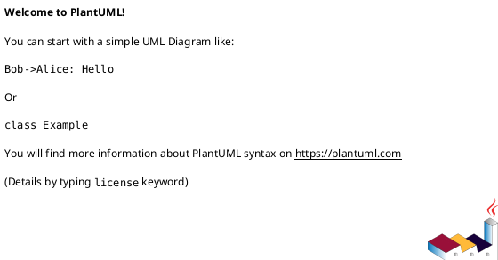
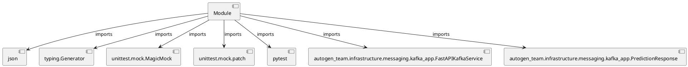

# Module Specification: test_kafka_security

* **Source Reference:** `tests/infrastructure/messaging/test_kafka_security.py`

## 1. Architectural Role & Responsibilities
**Purpose:**
Provides functionality related to test kafka security.

**Architecture Layer:**
- Infrastructure/Other

**Responsibilities:**
- Not explicitly defined.

**Main Workflow:**
- Not explicitly defined.

## 2. Dependencies
**Imports:**
- `json`
- `typing.Generator`
- `unittest.mock.MagicMock`
- `unittest.mock.patch`
- `pytest`
- `autogen_team.infrastructure.messaging.kafka_app.FastAPIKafkaService`
- `autogen_team.infrastructure.messaging.kafka_app.PredictionResponse`

**Exported Classes:**
- None

**Exported Functions:**
- `mock_kafka_service`
- `test_process_message_generic_error_on_exception`
- `test_process_message_no_pii_logging`

## 3. Architecture & Execution
### Internal Architecture
Not explicitly defined.

### Execution Flow
Not explicitly defined.

### Sequence Explanation
Not explicitly defined.

## 4. UML 2.0 Diagrams
### Class Diagram

### Dependency Graph

## 5. Class & Method Specifications
## 6. Module Functions
### `mock_kafka_service()`
Fixture to create a mocked FastAPIKafkaService.

**Inputs:**
- None

**Output:**
- Return Type: `Generator[FastAPIKafkaService, None, None]`

### `test_process_message_generic_error_on_exception(mock_kafka_service: FastAPIKafkaService)`
Test that _process_message returns a generic error message on exception.

**Inputs:**
- `mock_kafka_service`: FastAPIKafkaService

**Output:**
- Return Type: `None`

### `test_process_message_no_pii_logging(mock_kafka_service: FastAPIKafkaService)`
Test that _process_message does not log raw input data.

**Inputs:**
- `mock_kafka_service`: FastAPIKafkaService

**Output:**
- Return Type: `None`
