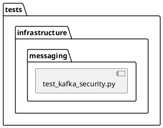
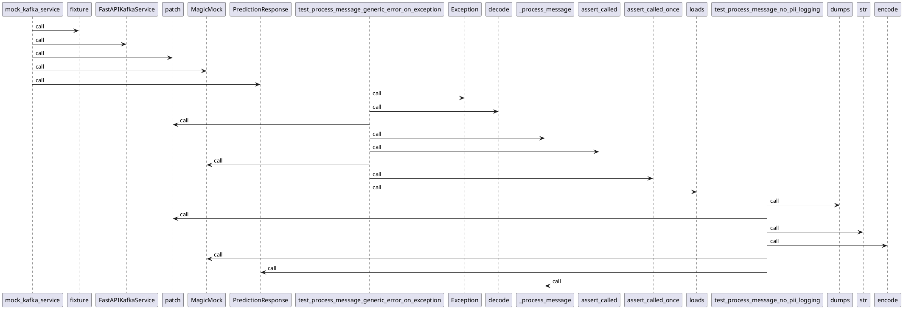
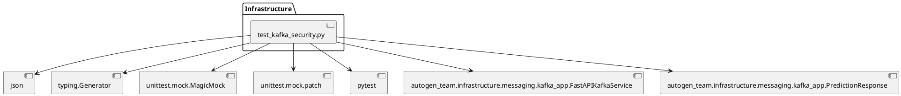
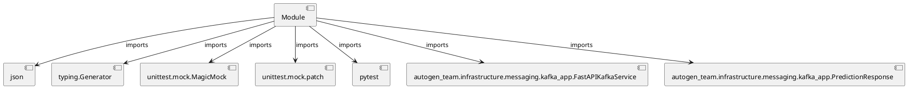
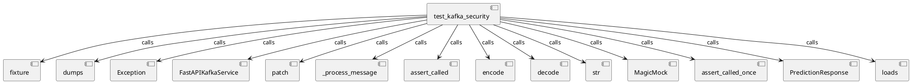

# Module Specification: test_kafka_security

* **Source Reference:** `tests/infrastructure/messaging/test_kafka_security.py`

## 1. Architectural Role & Responsibilities
**Purpose:**
Provides functionality related to test kafka security.

**Architecture Layer:**
- Infrastructure

**Responsibilities:**
- Not explicitly defined.

**Main Workflow:**
- Not explicitly defined.

## 2. Dependencies
**Imports:**
- `json`
- `typing.Generator`
- `unittest.mock.MagicMock`
- `unittest.mock.patch`
- `pytest`
- `autogen_team.infrastructure.messaging.kafka_app.FastAPIKafkaService`
- `autogen_team.infrastructure.messaging.kafka_app.PredictionResponse`

**Exported Classes:**
- None

**Exported Functions:**
- `mock_kafka_service`
- `test_process_message_generic_error_on_exception`
- `test_process_message_no_pii_logging`

**Exported Interfaces:**
- Not explicitly defined.

**Public API:**
- Not explicitly defined.

## 3. Architecture & Execution
### Internal Architecture
Not explicitly defined.

### Execution Flow
Not explicitly defined.

### Sequence Explanation
Not explicitly defined.

### Examples
Not explicitly defined.

## 4. UML 2.0 Diagrams
### Class Diagram

```plantuml
@startuml
    ' No classes found in module
@enduml
```

### Package Diagram

```plantuml
@startuml
    package "tests" {
        package "infrastructure" {
            package "messaging" {
                [test_kafka_security.py]
            }
        }
    }
@enduml
```

### Sequence Diagram

```plantuml
@startuml
    mock_kafka_service -> fixture : call
    mock_kafka_service -> FastAPIKafkaService : call
    mock_kafka_service -> patch : call
    mock_kafka_service -> MagicMock : call
    mock_kafka_service -> PredictionResponse : call
    test_process_message_generic_error_on_exception -> Exception : call
    test_process_message_generic_error_on_exception -> decode : call
    test_process_message_generic_error_on_exception -> patch : call
    test_process_message_generic_error_on_exception -> _process_message : call
    test_process_message_generic_error_on_exception -> assert_called : call
    test_process_message_generic_error_on_exception -> MagicMock : call
    test_process_message_generic_error_on_exception -> assert_called_once : call
    test_process_message_generic_error_on_exception -> loads : call
    test_process_message_no_pii_logging -> dumps : call
    test_process_message_no_pii_logging -> patch : call
    test_process_message_no_pii_logging -> str : call
    test_process_message_no_pii_logging -> encode : call
    test_process_message_no_pii_logging -> MagicMock : call
    test_process_message_no_pii_logging -> PredictionResponse : call
    test_process_message_no_pii_logging -> _process_message : call
@enduml
```

### Component Diagram

```plantuml
@startuml
    package "Infrastructure" {
        [test_kafka_security.py]
    }
    [test_kafka_security.py] --> [json]
    [test_kafka_security.py] --> [typing.Generator]
    [test_kafka_security.py] --> [unittest.mock.MagicMock]
    [test_kafka_security.py] --> [unittest.mock.patch]
    [test_kafka_security.py] --> [pytest]
    [test_kafka_security.py] --> [autogen_team.infrastructure.messaging.kafka_app.FastAPIKafkaService]
    [test_kafka_security.py] --> [autogen_team.infrastructure.messaging.kafka_app.PredictionResponse]
@enduml
```

### Dependency Graph

```plantuml
@startuml
    [Module] --> [json] : imports
    [Module] --> [typing.Generator] : imports
    [Module] --> [unittest.mock.MagicMock] : imports
    [Module] --> [unittest.mock.patch] : imports
    [Module] --> [pytest] : imports
    [Module] --> [autogen_team.infrastructure.messaging.kafka_app.FastAPIKafkaService] : imports
    [Module] --> [autogen_team.infrastructure.messaging.kafka_app.PredictionResponse] : imports
@enduml
```

## 5. Class & Method Specifications
## 6. Module Functions
### `mock_kafka_service() -> Generator[FastAPIKafkaService, None, None]` (Public)
**Description:** Fixture to create a mocked FastAPIKafkaService.

**Inputs:**
- None

**Output:**
- return type: `Generator[FastAPIKafkaService, None, None]`
- semantic meaning: Not explicitly defined.
- possible null values: Not explicitly defined.
- exceptions: Not explicitly defined.

**Side Effects:**
- Database updates: Not explicitly defined.
- File operations: Not explicitly defined.
- Network calls: Not explicitly defined.
- Cache: Not explicitly defined.
- State changes: Not explicitly defined.

**Complexity:**
- Time Complexity: Not explicitly defined.
- Space Complexity: Not explicitly defined.

**Example:**
```python
result = mock_kafka_service()
```

### `test_process_message_generic_error_on_exception(mock_kafka_service: FastAPIKafkaService) -> None` (Public)
**Description:** Test that _process_message returns a generic error message on exception.

**Inputs:**
- `mock_kafka_service`
  - type: FastAPIKafkaService
  - meaning: Not explicitly defined.
  - valid values: Not explicitly defined.
  - optional?: False
  - default value: None

**Output:**
- return type: `None`
- semantic meaning: Not explicitly defined.
- possible null values: Not explicitly defined.
- exceptions: Not explicitly defined.

**Side Effects:**
- Database updates: Not explicitly defined.
- File operations: Not explicitly defined.
- Network calls: Not explicitly defined.
- Cache: Not explicitly defined.
- State changes: Not explicitly defined.

**Complexity:**
- Time Complexity: Not explicitly defined.
- Space Complexity: Not explicitly defined.

**Example:**
```python
result = test_process_message_generic_error_on_exception(...)
```

### `test_process_message_no_pii_logging(mock_kafka_service: FastAPIKafkaService) -> None` (Public)
**Description:** Test that _process_message does not log raw input data.

**Inputs:**
- `mock_kafka_service`
  - type: FastAPIKafkaService
  - meaning: Not explicitly defined.
  - valid values: Not explicitly defined.
  - optional?: False
  - default value: None

**Output:**
- return type: `None`
- semantic meaning: Not explicitly defined.
- possible null values: Not explicitly defined.
- exceptions: Not explicitly defined.

**Side Effects:**
- Database updates: Not explicitly defined.
- File operations: Not explicitly defined.
- Network calls: Not explicitly defined.
- Cache: Not explicitly defined.
- State changes: Not explicitly defined.

**Complexity:**
- Time Complexity: Not explicitly defined.
- Space Complexity: Not explicitly defined.

**Example:**
```python
result = test_process_message_no_pii_logging(...)
```

## 7. Call Graph

```plantuml
@startuml
[test_kafka_security] --> [fixture] : calls
[test_kafka_security] --> [dumps] : calls
[test_kafka_security] --> [Exception] : calls
[test_kafka_security] --> [FastAPIKafkaService] : calls
[test_kafka_security] --> [patch] : calls
[test_kafka_security] --> [_process_message] : calls
[test_kafka_security] --> [assert_called] : calls
[test_kafka_security] --> [encode] : calls
[test_kafka_security] --> [decode] : calls
[test_kafka_security] --> [str] : calls
[test_kafka_security] --> [MagicMock] : calls
[test_kafka_security] --> [assert_called_once] : calls
[test_kafka_security] --> [PredictionResponse] : calls
[test_kafka_security] --> [loads] : calls
@enduml
```

## 8. Cross References
- **Dependencies:** [Dependencies](../../../../dependencies/index.md)
- **Used by:** None
- **Calls:** fixture, dumps, Exception, FastAPIKafkaService, patch, _process_message, assert_called, encode, decode, str, MagicMock, assert_called_once, PredictionResponse, loads
- **Called from:** None
- **Related classes:** [Classes](../../../../classes/index.md)
- **Related diagrams:** [Diagrams](../../../../diagrams/index.md)
