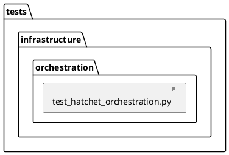
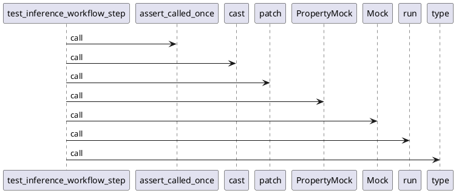
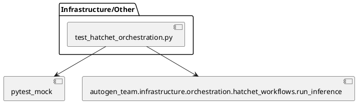
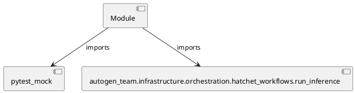
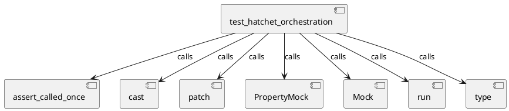

# Module Specification: test_hatchet_orchestration

* **Source Reference:** `tests/infrastructure/orchestration/test_hatchet_orchestration.py`

## 1. Architectural Role & Responsibilities
**Purpose:**
Provides functionality related to test hatchet orchestration.

**Architecture Layer:**
- Infrastructure/Other

**Responsibilities:**
- Not explicitly defined.

**Main Workflow:**
- Not explicitly defined.

## 2. Dependencies
**Imports:**
- `pytest_mock`
- `autogen_team.infrastructure.orchestration.hatchet_workflows.run_inference`

**Exported Classes:**
- None

**Exported Functions:**
- `test_inference_workflow_step`

**Exported Interfaces:**
- Not explicitly defined.

**Public API:**
- Not explicitly defined.

## 3. Architecture & Execution
### Internal Architecture
Not explicitly defined.

### Execution Flow
Not explicitly defined.

### Sequence Explanation
Not explicitly defined.

### Examples
Not explicitly defined.

## 4. UML 2.0 Diagrams
### Class Diagram

```plantuml
@startuml
    ' No classes found in module
@enduml
```

### Package Diagram

```plantuml
@startuml
    package "tests" {
        package "infrastructure" {
            package "orchestration" {
                [test_hatchet_orchestration.py]
            }
        }
    }
@enduml
```

### Sequence Diagram

```plantuml
@startuml
    test_inference_workflow_step -> assert_called_once : call
    test_inference_workflow_step -> cast : call
    test_inference_workflow_step -> patch : call
    test_inference_workflow_step -> PropertyMock : call
    test_inference_workflow_step -> Mock : call
    test_inference_workflow_step -> run : call
    test_inference_workflow_step -> type : call
@enduml
```

### Component Diagram

```plantuml
@startuml
    package "Infrastructure/Other" {
        [test_hatchet_orchestration.py]
    }
    [test_hatchet_orchestration.py] --> [pytest_mock]
    [test_hatchet_orchestration.py] --> [autogen_team.infrastructure.orchestration.hatchet_workflows.run_inference]
@enduml
```

### Dependency Graph

```plantuml
@startuml
    [Module] --> [pytest_mock] : imports
    [Module] --> [autogen_team.infrastructure.orchestration.hatchet_workflows.run_inference] : imports
@enduml
```

## 5. Class & Method Specifications
## 6. Module Functions
### `test_inference_workflow_step(mocker: pm.MockerFixture) -> None` (Public)
**Description:** No description provided.

**Inputs:**
- `mocker`
  - type: pm.MockerFixture
  - meaning: Not explicitly defined.
  - valid values: Not explicitly defined.
  - optional?: False
  - default value: None

**Output:**
- return type: `None`
- semantic meaning: Not explicitly defined.
- possible null values: Not explicitly defined.
- exceptions: Not explicitly defined.

**Side Effects:**
- Database updates: Not explicitly defined.
- File operations: Not explicitly defined.
- Network calls: Not explicitly defined.
- Cache: Not explicitly defined.
- State changes: Not explicitly defined.

**Complexity:**
- Time Complexity: Not explicitly defined.
- Space Complexity: Not explicitly defined.

**Example:**
```python
result = test_inference_workflow_step(...)
```

## 7. Call Graph

```plantuml
@startuml
[test_hatchet_orchestration] --> [assert_called_once] : calls
[test_hatchet_orchestration] --> [cast] : calls
[test_hatchet_orchestration] --> [patch] : calls
[test_hatchet_orchestration] --> [PropertyMock] : calls
[test_hatchet_orchestration] --> [Mock] : calls
[test_hatchet_orchestration] --> [run] : calls
[test_hatchet_orchestration] --> [type] : calls
@enduml
```

## 8. Cross References
- **Dependencies:** [Dependencies](../../../../dependencies/index.md)
- **Used by:** None
- **Calls:** assert_called_once, cast, patch, PropertyMock, Mock, run, type
- **Called from:** None
- **Related classes:** [Classes](../../../../classes/index.md)
- **Related diagrams:** [Diagrams](../../../../diagrams/index.md)
