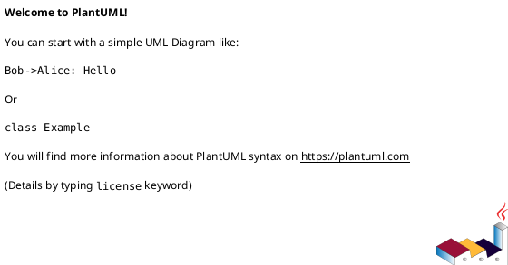
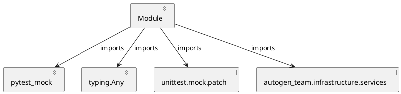

# Module Specification: test_hatchet_service

* **Source Reference:** `tests/infrastructure/services/test_hatchet_service.py`

## 1. Architectural Role & Responsibilities
**Purpose:**
Provides functionality related to test hatchet service.

**Architecture Layer:**
- Services

**Responsibilities:**
- Not explicitly defined.

**Main Workflow:**
- Not explicitly defined.

## 2. Dependencies
**Imports:**
- `pytest_mock`
- `typing.Any`
- `unittest.mock.patch`
- `autogen_team.infrastructure.services`

**Exported Classes:**
- None

**Exported Functions:**
- `test_hatchet_service_fallback`
- `test_hatchet_service_stop`
- `test_hatchet_service_failure`

## 3. Architecture & Execution
### Internal Architecture
Not explicitly defined.

### Execution Flow
Not explicitly defined.

### Sequence Explanation
Not explicitly defined.

## 4. UML 2.0 Diagrams
### Class Diagram

### Dependency Graph

## 5. Class & Method Specifications
## 6. Module Functions
### `test_hatchet_service_fallback(mocker: pm.MockerFixture)`
Test fallback mock creation when real Hatchet is not used.

**Inputs:**
- `mocker`: pm.MockerFixture

**Output:**
- Return Type: `None`

### `test_hatchet_service_stop(mocker: pm.MockerFixture)`
Test HatchetService.stop.

**Inputs:**
- `mocker`: pm.MockerFixture

**Output:**
- Return Type: `None`

### `test_hatchet_service_failure(mocker: pm.MockerFixture)`
Test HatchetService property failure when start fails.

**Inputs:**
- `mocker`: pm.MockerFixture

**Output:**
- Return Type: `None`
