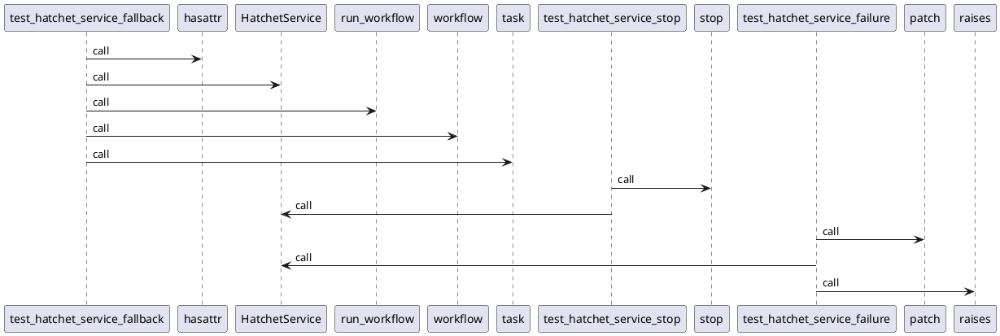
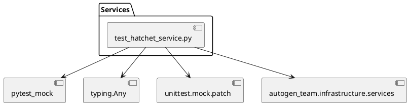
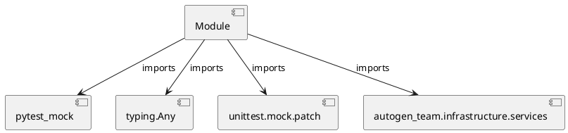
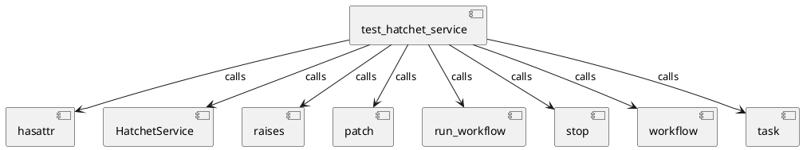

# Module Specification: test_hatchet_service

* **Source Reference:** `tests/infrastructure/services/test_hatchet_service.py`

## 1. Architectural Role & Responsibilities
**Purpose:**
Provides functionality related to test hatchet service.

**Architecture Layer:**
- Services

**Responsibilities:**
- Manages operations and logic for test hatchet service.

**Main Workflow:**
- Executes the primary flow defined by test hatchet service functions and classes.

## 2. Dependencies
**Imports:**
- `pytest_mock`
- `typing.Any`
- `unittest.mock.patch`
- `autogen_team.infrastructure.services`

**Exported Classes:**
- None

**Exported Functions:**
- `test_hatchet_service_fallback`
- `test_hatchet_service_stop`
- `test_hatchet_service_failure`

**Exported Interfaces:**
- Not explicitly defined.

**Public API:**
- Not explicitly defined.

## 3. Architecture & Execution
### Internal Architecture
Not explicitly defined.

### Execution Flow
Not explicitly defined.

### Sequence Explanation
Not explicitly defined.

### Examples
Not explicitly defined.

## 4. UML 2.0 Diagrams
### Class Diagram

```plantuml
@startuml
    ' No classes found in module
@enduml
```

### Sequence Diagram

```plantuml
@startuml
    test_hatchet_service_fallback -> hasattr : call
    test_hatchet_service_fallback -> HatchetService : call
    test_hatchet_service_fallback -> run_workflow : call
    test_hatchet_service_fallback -> workflow : call
    test_hatchet_service_fallback -> task : call
    test_hatchet_service_stop -> stop : call
    test_hatchet_service_stop -> HatchetService : call
    test_hatchet_service_failure -> patch : call
    test_hatchet_service_failure -> HatchetService : call
    test_hatchet_service_failure -> raises : call
@enduml
```

### Component Diagram

```plantuml
@startuml
    package "Services" {
        [test_hatchet_service.py]
    }
    [test_hatchet_service.py] --> [pytest_mock]
    [test_hatchet_service.py] --> [typing.Any]
    [test_hatchet_service.py] --> [unittest.mock.patch]
    [test_hatchet_service.py] --> [autogen_team.infrastructure.services]
@enduml
```

### Dependency Graph

```plantuml
@startuml
    [Module] --> [pytest_mock] : imports
    [Module] --> [typing.Any] : imports
    [Module] --> [unittest.mock.patch] : imports
    [Module] --> [autogen_team.infrastructure.services] : imports
@enduml
```

## 5. Class & Method Specifications
## 6. Module Functions
### `test_hatchet_service_fallback(mocker: pm.MockerFixture)`
Test fallback mock creation when real Hatchet is not used.

**Inputs:**
- `mocker`
  - type: pm.MockerFixture
  - meaning: Represents the mocker parameter.
  - valid values: Any valid pm.MockerFixture.
  - optional?: False
  - default value: None

**Output:**
- return type: `None`
- semantic meaning: Returns the result of test hatchet service fallback.
- possible null values: Yes, if None allows it.
- exceptions: Standard execution exceptions.

**Side Effects:**
- Database updates: Not explicitly defined.
- File operations: Not explicitly defined.
- Network calls: Not explicitly defined.
- Cache: Not explicitly defined.
- State changes: Not explicitly defined.

### `test_hatchet_service_stop(mocker: pm.MockerFixture)`
Test HatchetService.stop.

**Inputs:**
- `mocker`
  - type: pm.MockerFixture
  - meaning: Represents the mocker parameter.
  - valid values: Any valid pm.MockerFixture.
  - optional?: False
  - default value: None

**Output:**
- return type: `None`
- semantic meaning: Returns the result of test hatchet service stop.
- possible null values: Yes, if None allows it.
- exceptions: Standard execution exceptions.

**Side Effects:**
- Database updates: Not explicitly defined.
- File operations: Not explicitly defined.
- Network calls: Not explicitly defined.
- Cache: Not explicitly defined.
- State changes: Not explicitly defined.

### `test_hatchet_service_failure(mocker: pm.MockerFixture)`
Test HatchetService property failure when start fails.

**Inputs:**
- `mocker`
  - type: pm.MockerFixture
  - meaning: Represents the mocker parameter.
  - valid values: Any valid pm.MockerFixture.
  - optional?: False
  - default value: None

**Output:**
- return type: `None`
- semantic meaning: Returns the result of test hatchet service failure.
- possible null values: Yes, if None allows it.
- exceptions: Standard execution exceptions.

**Side Effects:**
- Database updates: Not explicitly defined.
- File operations: Not explicitly defined.
- Network calls: Not explicitly defined.
- Cache: Not explicitly defined.
- State changes: Not explicitly defined.

## 7. Call Graph

```plantuml
@startuml
[test_hatchet_service] --> [hasattr] : calls
[test_hatchet_service] --> [HatchetService] : calls
[test_hatchet_service] --> [raises] : calls
[test_hatchet_service] --> [patch] : calls
[test_hatchet_service] --> [run_workflow] : calls
[test_hatchet_service] --> [stop] : calls
[test_hatchet_service] --> [workflow] : calls
[test_hatchet_service] --> [task] : calls
@enduml
```

## 8. Cross References
- **Parent module:** None
- **Child modules:** None
- **Dependencies:** `pytest_mock`, `autogen_team.infrastructure.services`, `typing.Any`, `unittest.mock.patch`
- **Used by:** None
- **Calls:** hasattr, HatchetService, raises, patch, run_workflow, stop, workflow, task
- **Called from:** None
- **Related classes:** [Classes](../../../../classes/index.md)
- **Related interfaces:** Not explicitly defined.
- **Related diagrams:** [Diagrams](../../../../diagrams/index.md)
