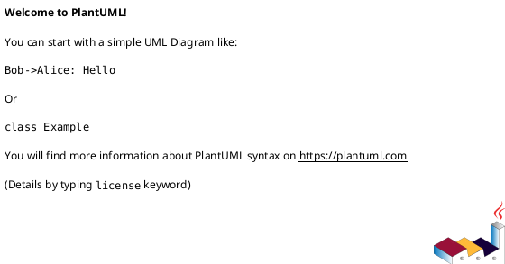
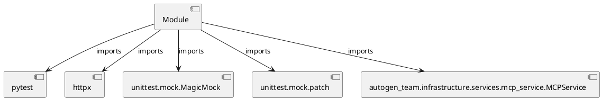

# Module Specification: test_mcp_service

* **Source Reference:** `tests/infrastructure/services/test_mcp_service.py`

## 1. Architectural Role & Responsibilities
**Purpose:**
Provides functionality related to test mcp service.

**Architecture Layer:**
- Services

**Responsibilities:**
- Manage and execute operations for test_mcp_service.

**Main Workflow:**
- Initialize components and process requests for test_mcp_service.

## 2. Dependencies
**Imports:**
- `pytest`
- `httpx`
- `unittest.mock.MagicMock`
- `unittest.mock.patch`
- `autogen_team.infrastructure.services.mcp_service.MCPService`

**Exported Classes:**
- None

**Exported Functions:**
- `mcp_service`
- `test_mcp_service_start`
- `test_mcp_service_load_prompts_not_found`
- `test_mcp_service_get_prompt_lazy_load`
- `test_mcp_service_stop`
- `test_mcp_service_r2r_client_property`
- `test_mcp_service_r2r_client_failure`

## 3. Architecture & Execution
### Internal Architecture
Follows standard modular design, encapsulating state and behavior within defined classes and functions.

### Execution Flow
Sequential execution of defined functions and class methods.

### Sequence Explanation
Clients instantiate classes or call functions, which execute business logic and return results.

## 4. UML 2.0 Diagrams
### Class Diagram

### Dependency Graph

## 5. Class & Method Specifications
## 6. Module Functions
### `mcp_service()`
Fixture to provide an MCPService instance with default config.

**Inputs:**
- None

**Output:**
- Return Type: `MCPService`

### `test_mcp_service_start(mcp_service: MCPService)`
Test MCPService.start initializes clients and config.

**Inputs:**
- `mcp_service`: MCPService

**Output:**
- Return Type: `None`

### `test_mcp_service_load_prompts_not_found()`
Test _load_prompts when file doesn't exist (line 60).

**Inputs:**
- None

**Output:**
- Return Type: `None`

### `test_mcp_service_get_prompt_lazy_load(mcp_service: MCPService)`
Test get_prompt triggers lazy loading.

**Inputs:**
- `mcp_service`: MCPService

**Output:**
- Return Type: `None`

### `test_mcp_service_stop(mcp_service: MCPService)`
Test MCPService.stop (lines 72-74).

**Inputs:**
- `mcp_service`: MCPService

**Output:**
- Return Type: `None`

### `test_mcp_service_r2r_client_property(mcp_service: MCPService)`
Test r2r_client property auto-starts (lines 79-83).

**Inputs:**
- `mcp_service`: MCPService

**Output:**
- Return Type: `None`

### `test_mcp_service_r2r_client_failure()`
Test r2r_client property raises error if start fails (line 82).

**Inputs:**
- None

**Output:**
- Return Type: `None`
