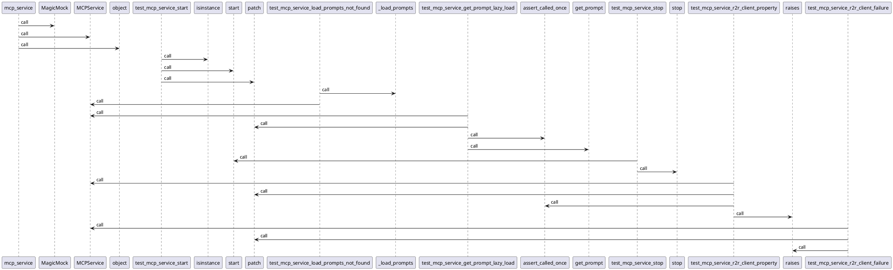
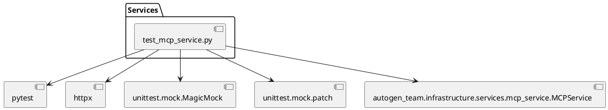
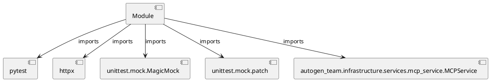
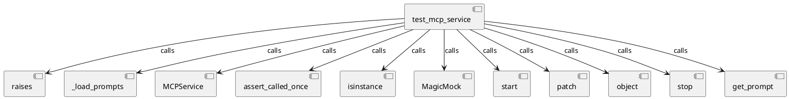

# Module Specification: test_mcp_service

* **Source Reference:** `tests/infrastructure/services/test_mcp_service.py`

## 1. Architectural Role & Responsibilities
**Purpose:**
Provides functionality related to test mcp service.

**Architecture Layer:**
- Services

**Responsibilities:**
- Manages operations and logic for test mcp service.

**Main Workflow:**
- Executes the primary flow defined by test mcp service functions and classes.

## 2. Dependencies
**Imports:**
- `pytest`
- `httpx`
- `unittest.mock.MagicMock`
- `unittest.mock.patch`
- `autogen_team.infrastructure.services.mcp_service.MCPService`

**Exported Classes:**
- None

**Exported Functions:**
- `mcp_service`
- `test_mcp_service_start`
- `test_mcp_service_load_prompts_not_found`
- `test_mcp_service_get_prompt_lazy_load`
- `test_mcp_service_stop`
- `test_mcp_service_r2r_client_property`
- `test_mcp_service_r2r_client_failure`

**Exported Interfaces:**
- Not explicitly defined.

**Public API:**
- Not explicitly defined.

## 3. Architecture & Execution
### Internal Architecture
Not explicitly defined.

### Execution Flow
Not explicitly defined.

### Sequence Explanation
Not explicitly defined.

### Examples
Not explicitly defined.

## 4. UML 2.0 Diagrams
### Class Diagram

```plantuml
@startuml
    ' No classes found in module
@enduml
```

### Sequence Diagram

```plantuml
@startuml
    mcp_service -> MagicMock : call
    mcp_service -> MCPService : call
    mcp_service -> object : call
    test_mcp_service_start -> isinstance : call
    test_mcp_service_start -> start : call
    test_mcp_service_start -> patch : call
    test_mcp_service_load_prompts_not_found -> _load_prompts : call
    test_mcp_service_load_prompts_not_found -> MCPService : call
    test_mcp_service_get_prompt_lazy_load -> MCPService : call
    test_mcp_service_get_prompt_lazy_load -> patch : call
    test_mcp_service_get_prompt_lazy_load -> assert_called_once : call
    test_mcp_service_get_prompt_lazy_load -> get_prompt : call
    test_mcp_service_stop -> start : call
    test_mcp_service_stop -> stop : call
    test_mcp_service_r2r_client_property -> MCPService : call
    test_mcp_service_r2r_client_property -> patch : call
    test_mcp_service_r2r_client_property -> assert_called_once : call
    test_mcp_service_r2r_client_property -> raises : call
    test_mcp_service_r2r_client_failure -> MCPService : call
    test_mcp_service_r2r_client_failure -> patch : call
    test_mcp_service_r2r_client_failure -> raises : call
@enduml
```

### Component Diagram

```plantuml
@startuml
    package "Services" {
        [test_mcp_service.py]
    }
    [test_mcp_service.py] --> [pytest]
    [test_mcp_service.py] --> [httpx]
    [test_mcp_service.py] --> [unittest.mock.MagicMock]
    [test_mcp_service.py] --> [unittest.mock.patch]
    [test_mcp_service.py] --> [autogen_team.infrastructure.services.mcp_service.MCPService]
@enduml
```

### Dependency Graph

```plantuml
@startuml
    [Module] --> [pytest] : imports
    [Module] --> [httpx] : imports
    [Module] --> [unittest.mock.MagicMock] : imports
    [Module] --> [unittest.mock.patch] : imports
    [Module] --> [autogen_team.infrastructure.services.mcp_service.MCPService] : imports
@enduml
```

## 5. Class & Method Specifications
## 6. Module Functions
### `mcp_service()`
Fixture to provide an MCPService instance with default config.

**Inputs:**
- None

**Output:**
- return type: `MCPService`
- semantic meaning: Returns the result of mcp service.
- possible null values: Yes, if MCPService allows it.
- exceptions: Standard execution exceptions.

**Side Effects:**
- Database updates: Not explicitly defined.
- File operations: Not explicitly defined.
- Network calls: Not explicitly defined.
- Cache: Not explicitly defined.
- State changes: Not explicitly defined.

### `test_mcp_service_start(mcp_service: MCPService)`
Test MCPService.start initializes clients and config.

**Inputs:**
- `mcp_service`
  - type: MCPService
  - meaning: Represents the mcp service parameter.
  - valid values: Any valid MCPService.
  - optional?: False
  - default value: None

**Output:**
- return type: `None`
- semantic meaning: Returns the result of test mcp service start.
- possible null values: Yes, if None allows it.
- exceptions: Standard execution exceptions.

**Side Effects:**
- Database updates: Not explicitly defined.
- File operations: Not explicitly defined.
- Network calls: Not explicitly defined.
- Cache: Not explicitly defined.
- State changes: Not explicitly defined.

### `test_mcp_service_load_prompts_not_found()`
Test _load_prompts when file doesn't exist (line 60).

**Inputs:**
- None

**Output:**
- return type: `None`
- semantic meaning: Returns the result of test mcp service load prompts not found.
- possible null values: Yes, if None allows it.
- exceptions: Standard execution exceptions.

**Side Effects:**
- Database updates: Not explicitly defined.
- File operations: Not explicitly defined.
- Network calls: Not explicitly defined.
- Cache: Not explicitly defined.
- State changes: Not explicitly defined.

### `test_mcp_service_get_prompt_lazy_load(mcp_service: MCPService)`
Test get_prompt triggers lazy loading.

**Inputs:**
- `mcp_service`
  - type: MCPService
  - meaning: Represents the mcp service parameter.
  - valid values: Any valid MCPService.
  - optional?: False
  - default value: None

**Output:**
- return type: `None`
- semantic meaning: Returns the result of test mcp service get prompt lazy load.
- possible null values: Yes, if None allows it.
- exceptions: Standard execution exceptions.

**Side Effects:**
- Database updates: Not explicitly defined.
- File operations: Not explicitly defined.
- Network calls: Not explicitly defined.
- Cache: Not explicitly defined.
- State changes: Not explicitly defined.

### `test_mcp_service_stop(mcp_service: MCPService)`
Test MCPService.stop (lines 72-74).

**Inputs:**
- `mcp_service`
  - type: MCPService
  - meaning: Represents the mcp service parameter.
  - valid values: Any valid MCPService.
  - optional?: False
  - default value: None

**Output:**
- return type: `None`
- semantic meaning: Returns the result of test mcp service stop.
- possible null values: Yes, if None allows it.
- exceptions: Standard execution exceptions.

**Side Effects:**
- Database updates: Not explicitly defined.
- File operations: Not explicitly defined.
- Network calls: Not explicitly defined.
- Cache: Not explicitly defined.
- State changes: Not explicitly defined.

### `test_mcp_service_r2r_client_property(mcp_service: MCPService)`
Test r2r_client property auto-starts (lines 79-83).

**Inputs:**
- `mcp_service`
  - type: MCPService
  - meaning: Represents the mcp service parameter.
  - valid values: Any valid MCPService.
  - optional?: False
  - default value: None

**Output:**
- return type: `None`
- semantic meaning: Returns the result of test mcp service r2r client property.
- possible null values: Yes, if None allows it.
- exceptions: Standard execution exceptions.

**Side Effects:**
- Database updates: Not explicitly defined.
- File operations: Not explicitly defined.
- Network calls: Not explicitly defined.
- Cache: Not explicitly defined.
- State changes: Not explicitly defined.

### `test_mcp_service_r2r_client_failure()`
Test r2r_client property raises error if start fails (line 82).

**Inputs:**
- None

**Output:**
- return type: `None`
- semantic meaning: Returns the result of test mcp service r2r client failure.
- possible null values: Yes, if None allows it.
- exceptions: Standard execution exceptions.

**Side Effects:**
- Database updates: Not explicitly defined.
- File operations: Not explicitly defined.
- Network calls: Not explicitly defined.
- Cache: Not explicitly defined.
- State changes: Not explicitly defined.

## 7. Call Graph

```plantuml
@startuml
[test_mcp_service] --> [raises] : calls
[test_mcp_service] --> [_load_prompts] : calls
[test_mcp_service] --> [MCPService] : calls
[test_mcp_service] --> [assert_called_once] : calls
[test_mcp_service] --> [isinstance] : calls
[test_mcp_service] --> [MagicMock] : calls
[test_mcp_service] --> [start] : calls
[test_mcp_service] --> [patch] : calls
[test_mcp_service] --> [object] : calls
[test_mcp_service] --> [stop] : calls
[test_mcp_service] --> [get_prompt] : calls
@enduml
```

## 8. Cross References
- **Parent module:** None
- **Child modules:** None
- **Dependencies:** `autogen_team.infrastructure.services.mcp_service.MCPService`, `pytest`, `unittest.mock.patch`, `httpx`, `unittest.mock.MagicMock`
- **Used by:** None
- **Calls:** raises, _load_prompts, MCPService, assert_called_once, isinstance, MagicMock, start, patch, object, stop, get_prompt
- **Called from:** None
- **Related classes:** [Classes](../../../../classes/index.md)
- **Related interfaces:** Not explicitly defined.
- **Related diagrams:** [Diagrams](../../../../diagrams/index.md)
