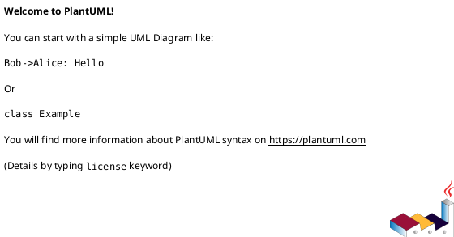
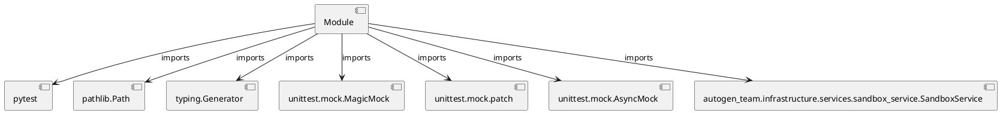

# Module Specification: test_sandbox_service

* **Source Reference:** `tests/infrastructure/services/test_sandbox_service.py`

## 1. Architectural Role & Responsibilities
**Purpose:**
Provides functionality related to test sandbox service.

**Architecture Layer:**
- Services

**Responsibilities:**
- Not explicitly defined.

**Main Workflow:**
- Not explicitly defined.

## 2. Dependencies
**Imports:**
- `pytest`
- `pathlib.Path`
- `typing.Generator`
- `unittest.mock.MagicMock`
- `unittest.mock.patch`
- `unittest.mock.AsyncMock`
- `autogen_team.infrastructure.services.sandbox_service.SandboxService`

**Exported Classes:**
- None

**Exported Functions:**
- `sandbox_service`
- `test_create_sandbox_e2b_success`
- `test_create_sandbox_e2b_failure`
- `test_create_sandbox_no_fallback`
- `test_execute_success`
- `test_execute_error`
- `test_execute_not_found`
- `test_destroy_success`
- `test_destroy_not_found`
- `test_upload_artifact`
- `test_run_python_tests`

## 3. Architecture & Execution
### Internal Architecture
Not explicitly defined.

### Execution Flow
Not explicitly defined.

### Sequence Explanation
Not explicitly defined.

## 4. UML 2.0 Diagrams
### Class Diagram

### Dependency Graph

## 5. Class & Method Specifications
## 6. Module Functions
### `sandbox_service()`
No description provided.

**Inputs:**
- None

**Output:**
- Return Type: `Generator[SandboxService, None, None]`

### `test_create_sandbox_e2b_success(sandbox_service: SandboxService)`
No description provided.

**Inputs:**
- `sandbox_service`: SandboxService

**Output:**
- Return Type: `None`

### `test_create_sandbox_e2b_failure(sandbox_service: SandboxService)`
No description provided.

**Inputs:**
- `sandbox_service`: SandboxService

**Output:**
- Return Type: `None`

### `test_create_sandbox_no_fallback(sandbox_service: SandboxService)`
No description provided.

**Inputs:**
- `sandbox_service`: SandboxService

**Output:**
- Return Type: `None`

### `test_execute_success(sandbox_service: SandboxService)`
No description provided.

**Inputs:**
- `sandbox_service`: SandboxService

**Output:**
- Return Type: `None`

### `test_execute_error(sandbox_service: SandboxService)`
No description provided.

**Inputs:**
- `sandbox_service`: SandboxService

**Output:**
- Return Type: `None`

### `test_execute_not_found(sandbox_service: SandboxService)`
No description provided.

**Inputs:**
- `sandbox_service`: SandboxService

**Output:**
- Return Type: `None`

### `test_destroy_success(sandbox_service: SandboxService)`
No description provided.

**Inputs:**
- `sandbox_service`: SandboxService

**Output:**
- Return Type: `None`

### `test_destroy_not_found(sandbox_service: SandboxService)`
No description provided.

**Inputs:**
- `sandbox_service`: SandboxService

**Output:**
- Return Type: `None`

### `test_upload_artifact(sandbox_service: SandboxService, tmp_path: Path)`
No description provided.

**Inputs:**
- `sandbox_service`: SandboxService
- `tmp_path`: Path

**Output:**
- Return Type: `None`

### `test_run_python_tests(sandbox_service: SandboxService)`
No description provided.

**Inputs:**
- `sandbox_service`: SandboxService

**Output:**
- Return Type: `None`
