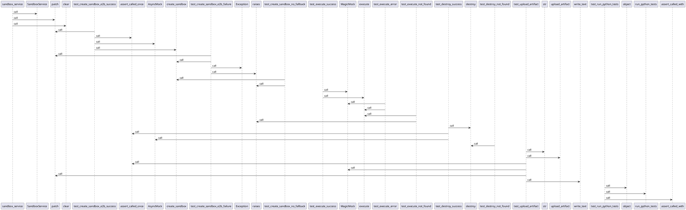
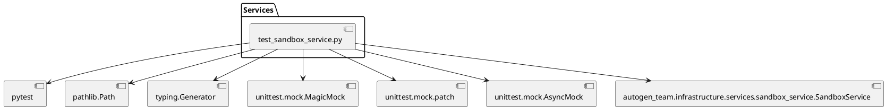
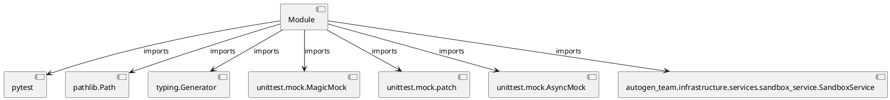

# Module Specification: test_sandbox_service

* **Source Reference:** `tests/infrastructure/services/test_sandbox_service.py`

## 1. Architectural Role & Responsibilities
**Purpose:**
Provides functionality related to test sandbox service.

**Architecture Layer:**
- Services

**Responsibilities:**
- Manages operations and logic for test sandbox service.

**Main Workflow:**
- Executes the primary flow defined by test sandbox service functions and classes.

## 2. Dependencies
**Imports:**
- `pytest`
- `pathlib.Path`
- `typing.Generator`
- `unittest.mock.MagicMock`
- `unittest.mock.patch`
- `unittest.mock.AsyncMock`
- `autogen_team.infrastructure.services.sandbox_service.SandboxService`

**Exported Classes:**
- None

**Exported Functions:**
- `sandbox_service`
- `test_create_sandbox_e2b_success`
- `test_create_sandbox_e2b_failure`
- `test_create_sandbox_no_fallback`
- `test_execute_success`
- `test_execute_error`
- `test_execute_not_found`
- `test_destroy_success`
- `test_destroy_not_found`
- `test_upload_artifact`
- `test_run_python_tests`

**Exported Interfaces:**
- Not explicitly defined.

**Public API:**
- Not explicitly defined.

## 3. Architecture & Execution
### Internal Architecture
Not explicitly defined.

### Execution Flow
Not explicitly defined.

### Sequence Explanation
Not explicitly defined.

### Examples
Not explicitly defined.

## 4. UML 2.0 Diagrams
### Class Diagram

```plantuml
@startuml
    ' No classes found in module
@enduml
```

### Sequence Diagram

```plantuml
@startuml
    sandbox_service -> SandboxService : call
    sandbox_service -> patch : call
    sandbox_service -> clear : call
    test_create_sandbox_e2b_success -> patch : call
    test_create_sandbox_e2b_success -> assert_called_once : call
    test_create_sandbox_e2b_success -> AsyncMock : call
    test_create_sandbox_e2b_success -> create_sandbox : call
    test_create_sandbox_e2b_failure -> patch : call
    test_create_sandbox_e2b_failure -> create_sandbox : call
    test_create_sandbox_e2b_failure -> Exception : call
    test_create_sandbox_e2b_failure -> raises : call
    test_create_sandbox_no_fallback -> create_sandbox : call
    test_create_sandbox_no_fallback -> raises : call
    test_execute_success -> MagicMock : call
    test_execute_success -> execute : call
    test_execute_error -> MagicMock : call
    test_execute_error -> execute : call
    test_execute_not_found -> execute : call
    test_execute_not_found -> raises : call
    test_destroy_success -> destroy : call
    test_destroy_success -> assert_called_once : call
    test_destroy_success -> AsyncMock : call
    test_destroy_not_found -> destroy : call
    test_upload_artifact -> str : call
    test_upload_artifact -> upload_artifact : call
    test_upload_artifact -> assert_called_once : call
    test_upload_artifact -> MagicMock : call
    test_upload_artifact -> patch : call
    test_upload_artifact -> write_text : call
    test_run_python_tests -> object : call
    test_run_python_tests -> run_python_tests : call
    test_run_python_tests -> assert_called_with : call
@enduml
```

### Component Diagram

```plantuml
@startuml
    package "Services" {
        [test_sandbox_service.py]
    }
    [test_sandbox_service.py] --> [pytest]
    [test_sandbox_service.py] --> [pathlib.Path]
    [test_sandbox_service.py] --> [typing.Generator]
    [test_sandbox_service.py] --> [unittest.mock.MagicMock]
    [test_sandbox_service.py] --> [unittest.mock.patch]
    [test_sandbox_service.py] --> [unittest.mock.AsyncMock]
    [test_sandbox_service.py] --> [autogen_team.infrastructure.services.sandbox_service.SandboxService]
@enduml
```

### Dependency Graph

```plantuml
@startuml
    [Module] --> [pytest] : imports
    [Module] --> [pathlib.Path] : imports
    [Module] --> [typing.Generator] : imports
    [Module] --> [unittest.mock.MagicMock] : imports
    [Module] --> [unittest.mock.patch] : imports
    [Module] --> [unittest.mock.AsyncMock] : imports
    [Module] --> [autogen_team.infrastructure.services.sandbox_service.SandboxService] : imports
@enduml
```

## 5. Class & Method Specifications
## 6. Module Functions
### `sandbox_service()`
Executes the sandbox service operation.

**Inputs:**
- None

**Output:**
- return type: `Generator[SandboxService, None, None]`
- semantic meaning: Returns the result of sandbox service.
- possible null values: Yes, if Generator[SandboxService, None, None] allows it.
- exceptions: Standard execution exceptions.

**Side Effects:**
- Database updates: Not explicitly defined.
- File operations: Not explicitly defined.
- Network calls: Not explicitly defined.
- Cache: Not explicitly defined.
- State changes: Not explicitly defined.

### `test_create_sandbox_e2b_success(sandbox_service: SandboxService)`
Executes the test create sandbox e2b success operation.

**Inputs:**
- `sandbox_service`
  - type: SandboxService
  - meaning: Represents the sandbox service parameter.
  - valid values: Any valid SandboxService.
  - optional?: False
  - default value: None

**Output:**
- return type: `None`
- semantic meaning: Returns the result of test create sandbox e2b success.
- possible null values: Yes, if None allows it.
- exceptions: Standard execution exceptions.

**Side Effects:**
- Database updates: Not explicitly defined.
- File operations: Not explicitly defined.
- Network calls: Not explicitly defined.
- Cache: Not explicitly defined.
- State changes: Not explicitly defined.

### `test_create_sandbox_e2b_failure(sandbox_service: SandboxService)`
Executes the test create sandbox e2b failure operation.

**Inputs:**
- `sandbox_service`
  - type: SandboxService
  - meaning: Represents the sandbox service parameter.
  - valid values: Any valid SandboxService.
  - optional?: False
  - default value: None

**Output:**
- return type: `None`
- semantic meaning: Returns the result of test create sandbox e2b failure.
- possible null values: Yes, if None allows it.
- exceptions: Standard execution exceptions.

**Side Effects:**
- Database updates: Not explicitly defined.
- File operations: Not explicitly defined.
- Network calls: Not explicitly defined.
- Cache: Not explicitly defined.
- State changes: Not explicitly defined.

### `test_create_sandbox_no_fallback(sandbox_service: SandboxService)`
Executes the test create sandbox no fallback operation.

**Inputs:**
- `sandbox_service`
  - type: SandboxService
  - meaning: Represents the sandbox service parameter.
  - valid values: Any valid SandboxService.
  - optional?: False
  - default value: None

**Output:**
- return type: `None`
- semantic meaning: Returns the result of test create sandbox no fallback.
- possible null values: Yes, if None allows it.
- exceptions: Standard execution exceptions.

**Side Effects:**
- Database updates: Not explicitly defined.
- File operations: Not explicitly defined.
- Network calls: Not explicitly defined.
- Cache: Not explicitly defined.
- State changes: Not explicitly defined.

### `test_execute_success(sandbox_service: SandboxService)`
Executes the test execute success operation.

**Inputs:**
- `sandbox_service`
  - type: SandboxService
  - meaning: Represents the sandbox service parameter.
  - valid values: Any valid SandboxService.
  - optional?: False
  - default value: None

**Output:**
- return type: `None`
- semantic meaning: Returns the result of test execute success.
- possible null values: Yes, if None allows it.
- exceptions: Standard execution exceptions.

**Side Effects:**
- Database updates: Not explicitly defined.
- File operations: Not explicitly defined.
- Network calls: Not explicitly defined.
- Cache: Not explicitly defined.
- State changes: Not explicitly defined.

### `test_execute_error(sandbox_service: SandboxService)`
Executes the test execute error operation.

**Inputs:**
- `sandbox_service`
  - type: SandboxService
  - meaning: Represents the sandbox service parameter.
  - valid values: Any valid SandboxService.
  - optional?: False
  - default value: None

**Output:**
- return type: `None`
- semantic meaning: Returns the result of test execute error.
- possible null values: Yes, if None allows it.
- exceptions: Standard execution exceptions.

**Side Effects:**
- Database updates: Not explicitly defined.
- File operations: Not explicitly defined.
- Network calls: Not explicitly defined.
- Cache: Not explicitly defined.
- State changes: Not explicitly defined.

### `test_execute_not_found(sandbox_service: SandboxService)`
Executes the test execute not found operation.

**Inputs:**
- `sandbox_service`
  - type: SandboxService
  - meaning: Represents the sandbox service parameter.
  - valid values: Any valid SandboxService.
  - optional?: False
  - default value: None

**Output:**
- return type: `None`
- semantic meaning: Returns the result of test execute not found.
- possible null values: Yes, if None allows it.
- exceptions: Standard execution exceptions.

**Side Effects:**
- Database updates: Not explicitly defined.
- File operations: Not explicitly defined.
- Network calls: Not explicitly defined.
- Cache: Not explicitly defined.
- State changes: Not explicitly defined.

### `test_destroy_success(sandbox_service: SandboxService)`
Executes the test destroy success operation.

**Inputs:**
- `sandbox_service`
  - type: SandboxService
  - meaning: Represents the sandbox service parameter.
  - valid values: Any valid SandboxService.
  - optional?: False
  - default value: None

**Output:**
- return type: `None`
- semantic meaning: Returns the result of test destroy success.
- possible null values: Yes, if None allows it.
- exceptions: Standard execution exceptions.

**Side Effects:**
- Database updates: Not explicitly defined.
- File operations: Not explicitly defined.
- Network calls: Not explicitly defined.
- Cache: Not explicitly defined.
- State changes: Not explicitly defined.

### `test_destroy_not_found(sandbox_service: SandboxService)`
Executes the test destroy not found operation.

**Inputs:**
- `sandbox_service`
  - type: SandboxService
  - meaning: Represents the sandbox service parameter.
  - valid values: Any valid SandboxService.
  - optional?: False
  - default value: None

**Output:**
- return type: `None`
- semantic meaning: Returns the result of test destroy not found.
- possible null values: Yes, if None allows it.
- exceptions: Standard execution exceptions.

**Side Effects:**
- Database updates: Not explicitly defined.
- File operations: Not explicitly defined.
- Network calls: Not explicitly defined.
- Cache: Not explicitly defined.
- State changes: Not explicitly defined.

### `test_upload_artifact(sandbox_service: SandboxService, tmp_path: Path)`
Executes the test upload artifact operation.

**Inputs:**
- `sandbox_service`
  - type: SandboxService
  - meaning: Represents the sandbox service parameter.
  - valid values: Any valid SandboxService.
  - optional?: False
  - default value: None
- `tmp_path`
  - type: Path
  - meaning: Represents the tmp path parameter.
  - valid values: Any valid Path.
  - optional?: False
  - default value: None

**Output:**
- return type: `None`
- semantic meaning: Returns the result of test upload artifact.
- possible null values: Yes, if None allows it.
- exceptions: Standard execution exceptions.

**Side Effects:**
- Database updates: Not explicitly defined.
- File operations: Not explicitly defined.
- Network calls: Not explicitly defined.
- Cache: Not explicitly defined.
- State changes: Not explicitly defined.

### `test_run_python_tests(sandbox_service: SandboxService)`
Executes the test run python tests operation.

**Inputs:**
- `sandbox_service`
  - type: SandboxService
  - meaning: Represents the sandbox service parameter.
  - valid values: Any valid SandboxService.
  - optional?: False
  - default value: None

**Output:**
- return type: `None`
- semantic meaning: Returns the result of test run python tests.
- possible null values: Yes, if None allows it.
- exceptions: Standard execution exceptions.

**Side Effects:**
- Database updates: Not explicitly defined.
- File operations: Not explicitly defined.
- Network calls: Not explicitly defined.
- Cache: Not explicitly defined.
- State changes: Not explicitly defined.

## 7. Call Graph

```plantuml
@startuml
[test_sandbox_service] --> [str] : calls
[test_sandbox_service] --> [upload_artifact] : calls
[test_sandbox_service] --> [raises] : calls
[test_sandbox_service] --> [assert_called_with] : calls
[test_sandbox_service] --> [execute] : calls
[test_sandbox_service] --> [assert_called_once] : calls
[test_sandbox_service] --> [run_python_tests] : calls
[test_sandbox_service] --> [AsyncMock] : calls
[test_sandbox_service] --> [clear] : calls
[test_sandbox_service] --> [MagicMock] : calls
[test_sandbox_service] --> [SandboxService] : calls
[test_sandbox_service] --> [patch] : calls
[test_sandbox_service] --> [write_text] : calls
[test_sandbox_service] --> [object] : calls
[test_sandbox_service] --> [destroy] : calls
[test_sandbox_service] --> [create_sandbox] : calls
[test_sandbox_service] --> [Exception] : calls
@enduml
```

## 8. Cross References
- **Parent module:** None
- **Child modules:** None
- **Dependencies:** `pathlib.Path`, `pytest`, `unittest.mock.patch`, `typing.Generator`, `unittest.mock.AsyncMock`, `autogen_team.infrastructure.services.sandbox_service.SandboxService`, `unittest.mock.MagicMock`
- **Used by:** None
- **Calls:** str, upload_artifact, raises, assert_called_with, execute, assert_called_once, run_python_tests, AsyncMock, clear, MagicMock, SandboxService, patch, write_text, object, destroy, create_sandbox, Exception
- **Called from:** None
- **Related classes:** [Classes](../../../../classes/index.md)
- **Related interfaces:** Not explicitly defined.
- **Related diagrams:** [Diagrams](../../../../diagrams/index.md)
