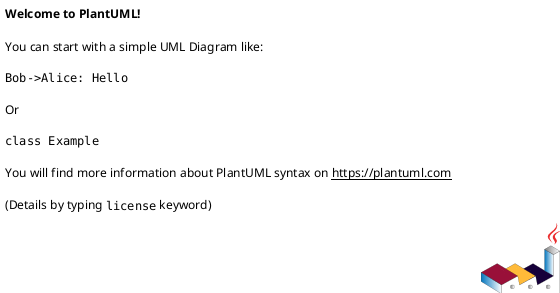
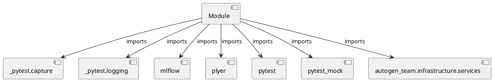

# Module Specification: test_services

* **Source Reference:** `tests/infrastructure/services/test_services.py`

## 1. Architectural Role & Responsibilities
**Purpose:**
Provides functionality related to test services.

**Architecture Layer:**
- Services

**Responsibilities:**
- Not explicitly defined.

**Main Workflow:**
- Not explicitly defined.

## 2. Dependencies
**Imports:**
- `_pytest.capture`
- `_pytest.logging`
- `mlflow`
- `plyer`
- `pytest`
- `pytest_mock`
- `autogen_team.infrastructure.services`

**Exported Classes:**
- None

**Exported Functions:**
- `test_logger_service`
- `test_alerts_service`
- `test_mlflow_service`

## 3. Architecture & Execution
### Internal Architecture
Not explicitly defined.

### Execution Flow
Not explicitly defined.

### Sequence Explanation
Not explicitly defined.

## 4. UML 2.0 Diagrams
### Class Diagram

### Dependency Graph

## 5. Class & Method Specifications
## 6. Module Functions
### `test_logger_service(logger_service: services.LoggerService, logger_caplog: pl.LogCaptureFixture)`
No description provided.

**Inputs:**
- `logger_service`: services.LoggerService
- `logger_caplog`: pl.LogCaptureFixture

**Output:**
- Return Type: `None`

### `test_alerts_service(enable: bool, mocker: pm.MockerFixture, capsys: pc.CaptureFixture[str])`
No description provided.

**Inputs:**
- `enable`: bool
- `mocker`: pm.MockerFixture
- `capsys`: pc.CaptureFixture[str]

**Output:**
- Return Type: `None`

### `test_mlflow_service(mlflow_service: services.MlflowService)`
No description provided.

**Inputs:**
- `mlflow_service`: services.MlflowService

**Output:**
- Return Type: `None`
