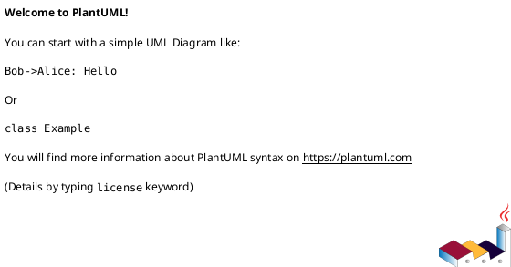
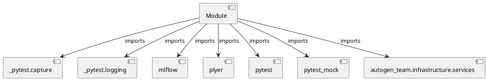

# Module Specification: test_services

* **Source Reference:** `tests/infrastructure/services/test_services.py`

## 1. Architectural Role & Responsibilities
**Purpose:**
Provides functionality related to test services.

**Architecture Layer:**
- Services

**Responsibilities:**
- Manage and execute operations for test_services.

**Main Workflow:**
- Initialize components and process requests for test_services.

## 2. Dependencies
**Imports:**
- `_pytest.capture`
- `_pytest.logging`
- `mlflow`
- `plyer`
- `pytest`
- `pytest_mock`
- `autogen_team.infrastructure.services`

**Exported Classes:**
- None

**Exported Functions:**
- `test_logger_service`
- `test_alerts_service`
- `test_mlflow_service`

## 3. Architecture & Execution
### Internal Architecture
Follows standard modular design, encapsulating state and behavior within defined classes and functions.

### Execution Flow
Sequential execution of defined functions and class methods.

### Sequence Explanation
Clients instantiate classes or call functions, which execute business logic and return results.

## 4. UML 2.0 Diagrams
### Class Diagram

### Dependency Graph

## 5. Class & Method Specifications
## 6. Module Functions
### `test_logger_service(logger_service: Any, logger_caplog: Any)`
Executes the test_logger_service operation.

**Inputs:**
- `logger_service`: Any
- `logger_caplog`: Any

**Output:**
- Return Type: `None`

### `test_alerts_service(enable: bool, mocker: Any, capsys: Any)`
Executes the test_alerts_service operation.

**Inputs:**
- `enable`: bool
- `mocker`: Any
- `capsys`: Any

**Output:**
- Return Type: `None`

### `test_mlflow_service(mlflow_service: Any)`
Executes the test_mlflow_service operation.

**Inputs:**
- `mlflow_service`: Any

**Output:**
- Return Type: `None`
