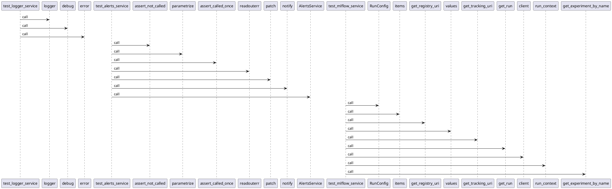
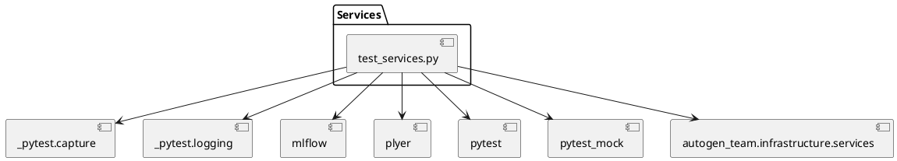
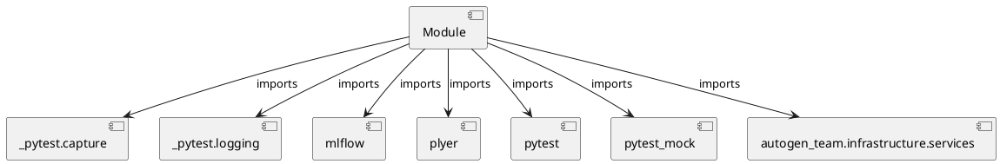

# Module Specification: test_services

* **Source Reference:** `tests/infrastructure/services/test_services.py`

## 1. Architectural Role & Responsibilities
**Purpose:**
Provides functionality related to test services.

**Architecture Layer:**
- Services

**Responsibilities:**
- Manages operations and logic for test services.

**Main Workflow:**
- Executes the primary flow defined by test services functions and classes.

## 2. Dependencies
**Imports:**
- `_pytest.capture`
- `_pytest.logging`
- `mlflow`
- `plyer`
- `pytest`
- `pytest_mock`
- `autogen_team.infrastructure.services`

**Exported Classes:**
- None

**Exported Functions:**
- `test_logger_service`
- `test_alerts_service`
- `test_mlflow_service`

**Exported Interfaces:**
- Not explicitly defined.

**Public API:**
- Not explicitly defined.

## 3. Architecture & Execution
### Internal Architecture
Not explicitly defined.

### Execution Flow
Not explicitly defined.

### Sequence Explanation
Not explicitly defined.

### Examples
Not explicitly defined.

## 4. UML 2.0 Diagrams
### Class Diagram

```plantuml
@startuml
    ' No classes found in module
@enduml
```

### Sequence Diagram

```plantuml
@startuml
    test_logger_service -> logger : call
    test_logger_service -> debug : call
    test_logger_service -> error : call
    test_alerts_service -> assert_not_called : call
    test_alerts_service -> parametrize : call
    test_alerts_service -> assert_called_once : call
    test_alerts_service -> readouterr : call
    test_alerts_service -> patch : call
    test_alerts_service -> notify : call
    test_alerts_service -> AlertsService : call
    test_mlflow_service -> RunConfig : call
    test_mlflow_service -> items : call
    test_mlflow_service -> get_registry_uri : call
    test_mlflow_service -> values : call
    test_mlflow_service -> get_tracking_uri : call
    test_mlflow_service -> get_run : call
    test_mlflow_service -> client : call
    test_mlflow_service -> run_context : call
    test_mlflow_service -> get_experiment_by_name : call
@enduml
```

### Component Diagram

```plantuml
@startuml
    package "Services" {
        [test_services.py]
    }
    [test_services.py] --> [_pytest.capture]
    [test_services.py] --> [_pytest.logging]
    [test_services.py] --> [mlflow]
    [test_services.py] --> [plyer]
    [test_services.py] --> [pytest]
    [test_services.py] --> [pytest_mock]
    [test_services.py] --> [autogen_team.infrastructure.services]
@enduml
```

### Dependency Graph

```plantuml
@startuml
    [Module] --> [_pytest.capture] : imports
    [Module] --> [_pytest.logging] : imports
    [Module] --> [mlflow] : imports
    [Module] --> [plyer] : imports
    [Module] --> [pytest] : imports
    [Module] --> [pytest_mock] : imports
    [Module] --> [autogen_team.infrastructure.services] : imports
@enduml
```

## 5. Class & Method Specifications
## 6. Module Functions
### `test_logger_service(logger_service: services.LoggerService, logger_caplog: pl.LogCaptureFixture)`
Executes the test logger service operation.

**Inputs:**
- `logger_service`
  - type: services.LoggerService
  - meaning: Represents the logger service parameter.
  - valid values: Any valid services.LoggerService.
  - optional?: False
  - default value: None
- `logger_caplog`
  - type: pl.LogCaptureFixture
  - meaning: Represents the logger caplog parameter.
  - valid values: Any valid pl.LogCaptureFixture.
  - optional?: False
  - default value: None

**Output:**
- return type: `None`
- semantic meaning: Returns the result of test logger service.
- possible null values: Yes, if None allows it.
- exceptions: Standard execution exceptions.

**Side Effects:**
- Database updates: Not explicitly defined.
- File operations: Not explicitly defined.
- Network calls: Not explicitly defined.
- Cache: Not explicitly defined.
- State changes: Not explicitly defined.

### `test_alerts_service(enable: bool, mocker: pm.MockerFixture, capsys: pc.CaptureFixture[str])`
Executes the test alerts service operation.

**Inputs:**
- `enable`
  - type: bool
  - meaning: Represents the enable parameter.
  - valid values: Any valid bool.
  - optional?: False
  - default value: None
- `mocker`
  - type: pm.MockerFixture
  - meaning: Represents the mocker parameter.
  - valid values: Any valid pm.MockerFixture.
  - optional?: False
  - default value: None
- `capsys`
  - type: pc.CaptureFixture[str]
  - meaning: Represents the capsys parameter.
  - valid values: Any valid pc.CaptureFixture[str].
  - optional?: False
  - default value: None

**Output:**
- return type: `None`
- semantic meaning: Returns the result of test alerts service.
- possible null values: Yes, if None allows it.
- exceptions: Standard execution exceptions.

**Side Effects:**
- Database updates: Not explicitly defined.
- File operations: Not explicitly defined.
- Network calls: Not explicitly defined.
- Cache: Not explicitly defined.
- State changes: Not explicitly defined.

### `test_mlflow_service(mlflow_service: services.MlflowService)`
Executes the test mlflow service operation.

**Inputs:**
- `mlflow_service`
  - type: services.MlflowService
  - meaning: Represents the mlflow service parameter.
  - valid values: Any valid services.MlflowService.
  - optional?: False
  - default value: None

**Output:**
- return type: `None`
- semantic meaning: Returns the result of test mlflow service.
- possible null values: Yes, if None allows it.
- exceptions: Standard execution exceptions.

**Side Effects:**
- Database updates: Not explicitly defined.
- File operations: Not explicitly defined.
- Network calls: Not explicitly defined.
- Cache: Not explicitly defined.
- State changes: Not explicitly defined.

## 7. Call Graph

```plantuml
@startuml
[test_services] --> [RunConfig] : calls
[test_services] --> [parametrize] : calls
[test_services] --> [assert_called_once] : calls
[test_services] --> [error] : calls
[test_services] --> [patch] : calls
[test_services] --> [notify] : calls
[test_services] --> [run_context] : calls
[test_services] --> [logger] : calls
[test_services] --> [get_registry_uri] : calls
[test_services] --> [assert_not_called] : calls
[test_services] --> [readouterr] : calls
[test_services] --> [get_tracking_uri] : calls
[test_services] --> [get_experiment_by_name] : calls
[test_services] --> [debug] : calls
[test_services] --> [get_run] : calls
[test_services] --> [AlertsService] : calls
[test_services] --> [items] : calls
[test_services] --> [values] : calls
[test_services] --> [client] : calls
@enduml
```

## 8. Cross References
- **Parent module:** None
- **Child modules:** None
- **Dependencies:** `_pytest.capture`, `pytest`, `_pytest.logging`, `mlflow`, `plyer`, `autogen_team.infrastructure.services`, `pytest_mock`
- **Used by:** None
- **Calls:** RunConfig, parametrize, assert_called_once, error, patch, notify, run_context, logger, get_registry_uri, assert_not_called, readouterr, get_tracking_uri, get_experiment_by_name, debug, get_run, AlertsService, items, values, client
- **Called from:** None
- **Related classes:** [Classes](../../../../classes/index.md)
- **Related interfaces:** Not explicitly defined.
- **Related diagrams:** [Diagrams](../../../../diagrams/index.md)
