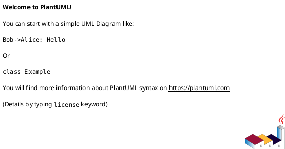
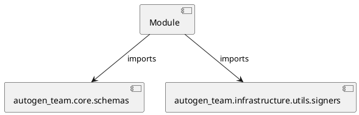

# Module Specification: test_signers

* **Source Reference:** `tests/infrastructure/utils/test_signers.py`

## 1. Architectural Role & Responsibilities
**Purpose:**
Provides functionality related to test signers.

**Architecture Layer:**
- Infrastructure/Other

**Responsibilities:**
- Not explicitly defined.

**Main Workflow:**
- Not explicitly defined.

## 2. Dependencies
**Imports:**
- `autogen_team.core.schemas`
- `autogen_team.infrastructure.utils.signers`

**Exported Classes:**
- None

**Exported Functions:**
- `test_infer_signer`

## 3. Architecture & Execution
### Internal Architecture
Not explicitly defined.

### Execution Flow
Not explicitly defined.

### Sequence Explanation
Not explicitly defined.

## 4. UML 2.0 Diagrams
### Class Diagram

### Dependency Graph

## 5. Class & Method Specifications
## 6. Module Functions
### `test_infer_signer(inputs: schemas.Inputs, outputs: schemas.Outputs)`
No description provided.

**Inputs:**
- `inputs`: schemas.Inputs
- `outputs`: schemas.Outputs

**Output:**
- Return Type: `None`
