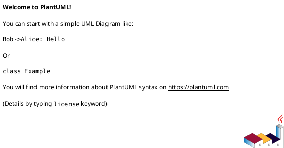
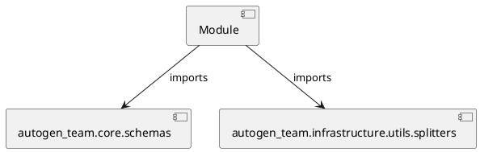

# Module Specification: test_splitters

* **Source Reference:** `tests/infrastructure/utils/test_splitters.py`

## 1. Architectural Role & Responsibilities
**Purpose:**
Provides functionality related to test splitters.

**Architecture Layer:**
- Infrastructure/Other

**Responsibilities:**
- Not explicitly defined.

**Main Workflow:**
- Not explicitly defined.

## 2. Dependencies
**Imports:**
- `autogen_team.core.schemas`
- `autogen_team.infrastructure.utils.splitters`

**Exported Classes:**
- None

**Exported Functions:**
- `test_train_test_splitter`
- `test_time_series_splitter`

## 3. Architecture & Execution
### Internal Architecture
Not explicitly defined.

### Execution Flow
Not explicitly defined.

### Sequence Explanation
Not explicitly defined.

## 4. UML 2.0 Diagrams
### Class Diagram

### Dependency Graph

## 5. Class & Method Specifications
## 6. Module Functions
### `test_train_test_splitter(inputs: schemas.Inputs, targets: schemas.Targets)`
No description provided.

**Inputs:**
- `inputs`: schemas.Inputs
- `targets`: schemas.Targets

**Output:**
- Return Type: `None`

### `test_time_series_splitter(inputs: schemas.Inputs, targets: schemas.Targets)`
No description provided.

**Inputs:**
- `inputs`: schemas.Inputs
- `targets`: schemas.Targets

**Output:**
- Return Type: `None`
