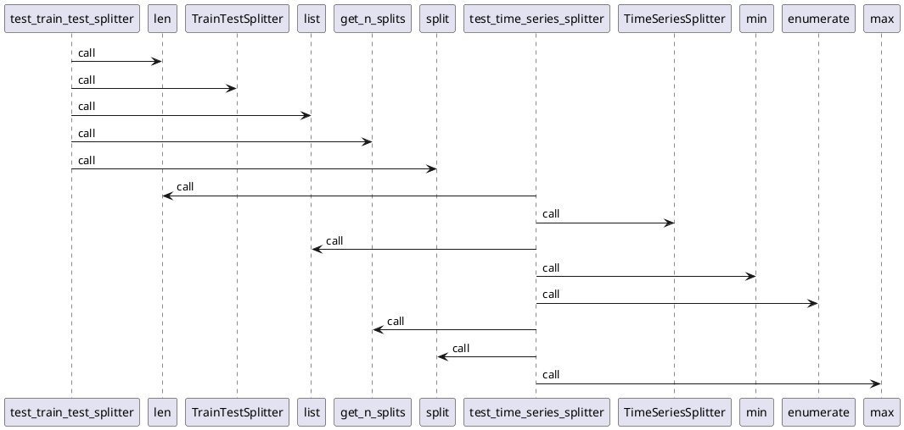
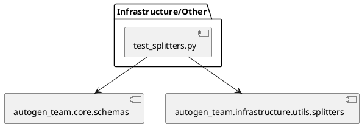
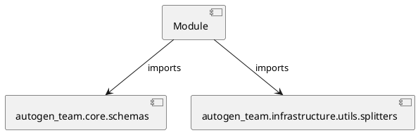
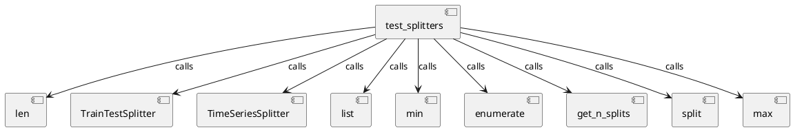

# Module Specification: test_splitters

* **Source Reference:** `tests/infrastructure/utils/test_splitters.py`

## 1. Architectural Role & Responsibilities
**Purpose:**
Provides functionality related to test splitters.

**Architecture Layer:**
- Infrastructure/Other

**Responsibilities:**
- Manages operations and logic for test splitters.

**Main Workflow:**
- Executes the primary flow defined by test splitters functions and classes.

## 2. Dependencies
**Imports:**
- `autogen_team.core.schemas`
- `autogen_team.infrastructure.utils.splitters`

**Exported Classes:**
- None

**Exported Functions:**
- `test_train_test_splitter`
- `test_time_series_splitter`

**Exported Interfaces:**
- Not explicitly defined.

**Public API:**
- Not explicitly defined.

## 3. Architecture & Execution
### Internal Architecture
Not explicitly defined.

### Execution Flow
Not explicitly defined.

### Sequence Explanation
Not explicitly defined.

### Examples
Not explicitly defined.

## 4. UML 2.0 Diagrams
### Class Diagram

```plantuml
@startuml
    ' No classes found in module
@enduml
```

### Sequence Diagram

```plantuml
@startuml
    test_train_test_splitter -> len : call
    test_train_test_splitter -> TrainTestSplitter : call
    test_train_test_splitter -> list : call
    test_train_test_splitter -> get_n_splits : call
    test_train_test_splitter -> split : call
    test_time_series_splitter -> len : call
    test_time_series_splitter -> TimeSeriesSplitter : call
    test_time_series_splitter -> list : call
    test_time_series_splitter -> min : call
    test_time_series_splitter -> enumerate : call
    test_time_series_splitter -> get_n_splits : call
    test_time_series_splitter -> split : call
    test_time_series_splitter -> max : call
@enduml
```

### Component Diagram

```plantuml
@startuml
    package "Infrastructure/Other" {
        [test_splitters.py]
    }
    [test_splitters.py] --> [autogen_team.core.schemas]
    [test_splitters.py] --> [autogen_team.infrastructure.utils.splitters]
@enduml
```

### Dependency Graph

```plantuml
@startuml
    [Module] --> [autogen_team.core.schemas] : imports
    [Module] --> [autogen_team.infrastructure.utils.splitters] : imports
@enduml
```

## 5. Class & Method Specifications
## 6. Module Functions
### `test_train_test_splitter(inputs: schemas.Inputs, targets: schemas.Targets)`
Executes the test train test splitter operation.

**Inputs:**
- `inputs`
  - type: schemas.Inputs
  - meaning: Represents the inputs parameter.
  - valid values: Any valid schemas.Inputs.
  - optional?: False
  - default value: None
- `targets`
  - type: schemas.Targets
  - meaning: Represents the targets parameter.
  - valid values: Any valid schemas.Targets.
  - optional?: False
  - default value: None

**Output:**
- return type: `None`
- semantic meaning: Returns the result of test train test splitter.
- possible null values: Yes, if None allows it.
- exceptions: Standard execution exceptions.

**Side Effects:**
- Database updates: Not explicitly defined.
- File operations: Not explicitly defined.
- Network calls: Not explicitly defined.
- Cache: Not explicitly defined.
- State changes: Not explicitly defined.

### `test_time_series_splitter(inputs: schemas.Inputs, targets: schemas.Targets)`
Executes the test time series splitter operation.

**Inputs:**
- `inputs`
  - type: schemas.Inputs
  - meaning: Represents the inputs parameter.
  - valid values: Any valid schemas.Inputs.
  - optional?: False
  - default value: None
- `targets`
  - type: schemas.Targets
  - meaning: Represents the targets parameter.
  - valid values: Any valid schemas.Targets.
  - optional?: False
  - default value: None

**Output:**
- return type: `None`
- semantic meaning: Returns the result of test time series splitter.
- possible null values: Yes, if None allows it.
- exceptions: Standard execution exceptions.

**Side Effects:**
- Database updates: Not explicitly defined.
- File operations: Not explicitly defined.
- Network calls: Not explicitly defined.
- Cache: Not explicitly defined.
- State changes: Not explicitly defined.

## 7. Call Graph

```plantuml
@startuml
[test_splitters] --> [len] : calls
[test_splitters] --> [TrainTestSplitter] : calls
[test_splitters] --> [TimeSeriesSplitter] : calls
[test_splitters] --> [list] : calls
[test_splitters] --> [min] : calls
[test_splitters] --> [enumerate] : calls
[test_splitters] --> [get_n_splits] : calls
[test_splitters] --> [split] : calls
[test_splitters] --> [max] : calls
@enduml
```

## 8. Cross References
- **Parent module:** None
- **Child modules:** None
- **Dependencies:** `autogen_team.core.schemas`, `autogen_team.infrastructure.utils.splitters`
- **Used by:** None
- **Calls:** len, TrainTestSplitter, TimeSeriesSplitter, list, min, enumerate, get_n_splits, split, max
- **Called from:** None
- **Related classes:** [Classes](../../../../classes/index.md)
- **Related interfaces:** Not explicitly defined.
- **Related diagrams:** [Diagrams](../../../../diagrams/index.md)
