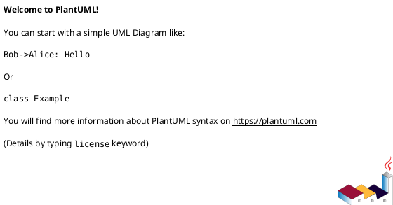
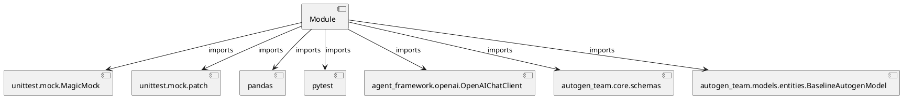

# Module Specification: test_models

* **Source Reference:** `tests/models/test_models.py`

## 1. Architectural Role & Responsibilities
**Purpose:**
Provides functionality related to test models.

**Architecture Layer:**
- Entities/Domain Models

**Responsibilities:**
- Manage and execute operations for test_models.

**Main Workflow:**
- Initialize components and process requests for test_models.

## 2. Dependencies
**Imports:**
- `unittest.mock.MagicMock`
- `unittest.mock.patch`
- `pandas`
- `pytest`
- `agent_framework.openai.OpenAIChatClient`
- `autogen_team.core.schemas`
- `autogen_team.models.entities.BaselineAutogenModel`

**Exported Classes:**
- None

**Exported Functions:**
- `baseline_model`
- `test_get_params`
- `test_set_params`
- `test_predict`
- `test_get_internal_model`
- `test_load_context`

## 3. Architecture & Execution
### Internal Architecture
Follows standard modular design, encapsulating state and behavior within defined classes and functions.

### Execution Flow
Sequential execution of defined functions and class methods.

### Sequence Explanation
Clients instantiate classes or call functions, which execute business logic and return results.

## 4. UML 2.0 Diagrams
### Class Diagram

### Dependency Graph

## 5. Class & Method Specifications
## 6. Module Functions
### `baseline_model()`
Fixture to create an instance of BaselineAutogenModel.

**Inputs:**
- None

**Output:**
- Return Type: `BaselineAutogenModel`

### `test_get_params(baseline_model: BaselineAutogenModel)`
Test the get_params method.

**Inputs:**
- `baseline_model`: BaselineAutogenModel

**Output:**
- Return Type: `None`

### `test_set_params(baseline_model: BaselineAutogenModel)`
Test the set_params method.

**Inputs:**
- `baseline_model`: BaselineAutogenModel

**Output:**
- Return Type: `None`

### `test_predict(baseline_model: BaselineAutogenModel)`
Test the predict method of BaselineAutogenModel.

**Inputs:**
- `baseline_model`: BaselineAutogenModel

**Output:**
- Return Type: `None`

### `test_get_internal_model(baseline_model: BaselineAutogenModel)`
Test get_internal_model returns the team.

**Inputs:**
- `baseline_model`: BaselineAutogenModel

**Output:**
- Return Type: `None`

### `test_load_context(baseline_model: BaselineAutogenModel)`
Executes the test_load_context operation.

**Inputs:**
- `baseline_model`: BaselineAutogenModel

**Output:**
- Return Type: `None`
