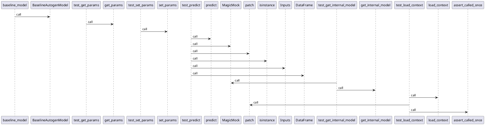
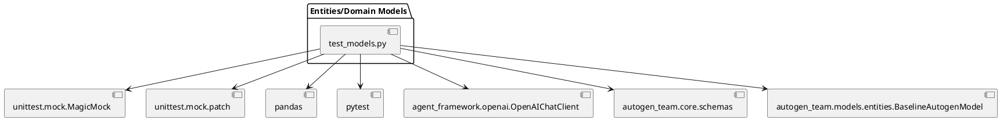
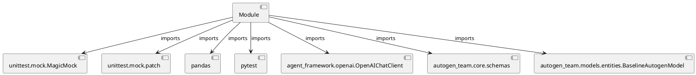
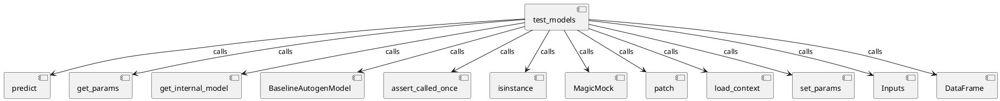

# Module Specification: test_models

* **Source Reference:** `tests/models/test_models.py`

## 1. Architectural Role & Responsibilities
**Purpose:**
Provides functionality related to test models.

**Architecture Layer:**
- Entities/Domain Models

**Responsibilities:**
- Manages operations and logic for test models.

**Main Workflow:**
- Executes the primary flow defined by test models functions and classes.

## 2. Dependencies
**Imports:**
- `unittest.mock.MagicMock`
- `unittest.mock.patch`
- `pandas`
- `pytest`
- `agent_framework.openai.OpenAIChatClient`
- `autogen_team.core.schemas`
- `autogen_team.models.entities.BaselineAutogenModel`

**Exported Classes:**
- None

**Exported Functions:**
- `baseline_model`
- `test_get_params`
- `test_set_params`
- `test_predict`
- `test_get_internal_model`
- `test_load_context`

**Exported Interfaces:**
- Not explicitly defined.

**Public API:**
- Not explicitly defined.

## 3. Architecture & Execution
### Internal Architecture
Not explicitly defined.

### Execution Flow
Not explicitly defined.

### Sequence Explanation
Not explicitly defined.

### Examples
Not explicitly defined.

## 4. UML 2.0 Diagrams
### Class Diagram

```plantuml
@startuml
    ' No classes found in module
@enduml
```

### Sequence Diagram

```plantuml
@startuml
    baseline_model -> BaselineAutogenModel : call
    test_get_params -> get_params : call
    test_set_params -> set_params : call
    test_predict -> predict : call
    test_predict -> MagicMock : call
    test_predict -> patch : call
    test_predict -> isinstance : call
    test_predict -> Inputs : call
    test_predict -> DataFrame : call
    test_get_internal_model -> MagicMock : call
    test_get_internal_model -> get_internal_model : call
    test_load_context -> load_context : call
    test_load_context -> patch : call
    test_load_context -> assert_called_once : call
@enduml
```

### Component Diagram

```plantuml
@startuml
    package "Entities/Domain Models" {
        [test_models.py]
    }
    [test_models.py] --> [unittest.mock.MagicMock]
    [test_models.py] --> [unittest.mock.patch]
    [test_models.py] --> [pandas]
    [test_models.py] --> [pytest]
    [test_models.py] --> [agent_framework.openai.OpenAIChatClient]
    [test_models.py] --> [autogen_team.core.schemas]
    [test_models.py] --> [autogen_team.models.entities.BaselineAutogenModel]
@enduml
```

### Dependency Graph

```plantuml
@startuml
    [Module] --> [unittest.mock.MagicMock] : imports
    [Module] --> [unittest.mock.patch] : imports
    [Module] --> [pandas] : imports
    [Module] --> [pytest] : imports
    [Module] --> [agent_framework.openai.OpenAIChatClient] : imports
    [Module] --> [autogen_team.core.schemas] : imports
    [Module] --> [autogen_team.models.entities.BaselineAutogenModel] : imports
@enduml
```

## 5. Class & Method Specifications
## 6. Module Functions
### `baseline_model()`
Fixture to create an instance of BaselineAutogenModel.

**Inputs:**
- None

**Output:**
- return type: `BaselineAutogenModel`
- semantic meaning: Returns the result of baseline model.
- possible null values: Yes, if BaselineAutogenModel allows it.
- exceptions: Standard execution exceptions.

**Side Effects:**
- Database updates: Not explicitly defined.
- File operations: Not explicitly defined.
- Network calls: Not explicitly defined.
- Cache: Not explicitly defined.
- State changes: Not explicitly defined.

### `test_get_params(baseline_model: BaselineAutogenModel)`
Test the get_params method.

**Inputs:**
- `baseline_model`
  - type: BaselineAutogenModel
  - meaning: Represents the baseline model parameter.
  - valid values: Any valid BaselineAutogenModel.
  - optional?: False
  - default value: None

**Output:**
- return type: `None`
- semantic meaning: Returns the result of test get params.
- possible null values: Yes, if None allows it.
- exceptions: Standard execution exceptions.

**Side Effects:**
- Database updates: Not explicitly defined.
- File operations: Not explicitly defined.
- Network calls: Not explicitly defined.
- Cache: Not explicitly defined.
- State changes: Not explicitly defined.

### `test_set_params(baseline_model: BaselineAutogenModel)`
Test the set_params method.

**Inputs:**
- `baseline_model`
  - type: BaselineAutogenModel
  - meaning: Represents the baseline model parameter.
  - valid values: Any valid BaselineAutogenModel.
  - optional?: False
  - default value: None

**Output:**
- return type: `None`
- semantic meaning: Returns the result of test set params.
- possible null values: Yes, if None allows it.
- exceptions: Standard execution exceptions.

**Side Effects:**
- Database updates: Not explicitly defined.
- File operations: Not explicitly defined.
- Network calls: Not explicitly defined.
- Cache: Not explicitly defined.
- State changes: Not explicitly defined.

### `test_predict(baseline_model: BaselineAutogenModel)`
Test the predict method of BaselineAutogenModel.

**Inputs:**
- `baseline_model`
  - type: BaselineAutogenModel
  - meaning: Represents the baseline model parameter.
  - valid values: Any valid BaselineAutogenModel.
  - optional?: False
  - default value: None

**Output:**
- return type: `None`
- semantic meaning: Returns the result of test predict.
- possible null values: Yes, if None allows it.
- exceptions: Standard execution exceptions.

**Side Effects:**
- Database updates: Not explicitly defined.
- File operations: Not explicitly defined.
- Network calls: Not explicitly defined.
- Cache: Not explicitly defined.
- State changes: Not explicitly defined.

### `test_get_internal_model(baseline_model: BaselineAutogenModel)`
Test get_internal_model returns the team.

**Inputs:**
- `baseline_model`
  - type: BaselineAutogenModel
  - meaning: Represents the baseline model parameter.
  - valid values: Any valid BaselineAutogenModel.
  - optional?: False
  - default value: None

**Output:**
- return type: `None`
- semantic meaning: Returns the result of test get internal model.
- possible null values: Yes, if None allows it.
- exceptions: Standard execution exceptions.

**Side Effects:**
- Database updates: Not explicitly defined.
- File operations: Not explicitly defined.
- Network calls: Not explicitly defined.
- Cache: Not explicitly defined.
- State changes: Not explicitly defined.

### `test_load_context(baseline_model: BaselineAutogenModel)`
Executes the test load context operation.

**Inputs:**
- `baseline_model`
  - type: BaselineAutogenModel
  - meaning: Represents the baseline model parameter.
  - valid values: Any valid BaselineAutogenModel.
  - optional?: False
  - default value: None

**Output:**
- return type: `None`
- semantic meaning: Returns the result of test load context.
- possible null values: Yes, if None allows it.
- exceptions: Standard execution exceptions.

**Side Effects:**
- Database updates: Not explicitly defined.
- File operations: Not explicitly defined.
- Network calls: Not explicitly defined.
- Cache: Not explicitly defined.
- State changes: Not explicitly defined.

## 7. Call Graph

```plantuml
@startuml
[test_models] --> [predict] : calls
[test_models] --> [get_params] : calls
[test_models] --> [get_internal_model] : calls
[test_models] --> [BaselineAutogenModel] : calls
[test_models] --> [assert_called_once] : calls
[test_models] --> [isinstance] : calls
[test_models] --> [MagicMock] : calls
[test_models] --> [patch] : calls
[test_models] --> [load_context] : calls
[test_models] --> [set_params] : calls
[test_models] --> [Inputs] : calls
[test_models] --> [DataFrame] : calls
@enduml
```

## 8. Cross References
- **Parent module:** None
- **Child modules:** None
- **Dependencies:** `agent_framework.openai.OpenAIChatClient`, `pandas`, `pytest`, `unittest.mock.patch`, `autogen_team.models.entities.BaselineAutogenModel`, `autogen_team.core.schemas`, `unittest.mock.MagicMock`
- **Used by:** None
- **Calls:** predict, get_params, get_internal_model, BaselineAutogenModel, assert_called_once, isinstance, MagicMock, patch, load_context, set_params, Inputs, DataFrame
- **Called from:** None
- **Related classes:** [Classes](../../../classes/index.md)
- **Related interfaces:** Not explicitly defined.
- **Related diagrams:** [Diagrams](../../../diagrams/index.md)
