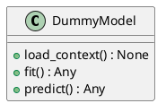
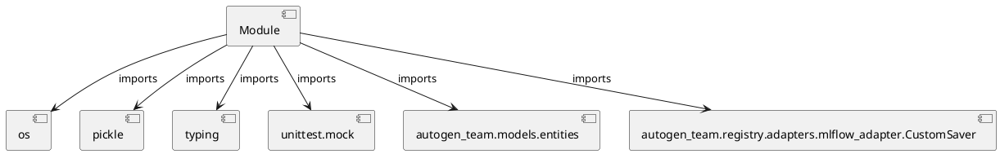

# Module Specification: test_mlflow_adapter_security

* **Source Reference:** `tests/registry/adapters/test_mlflow_adapter_security.py`

## 1. Architectural Role & Responsibilities
**Purpose:**
Provides functionality related to test mlflow adapter security.

**Architecture Layer:**
- Infrastructure/Other

**Responsibilities:**
- Manage and execute operations for test_mlflow_adapter_security.

**Main Workflow:**
- Initialize components and process requests for test_mlflow_adapter_security.

## 2. Dependencies
**Imports:**
- `os`
- `pickle`
- `typing`
- `unittest.mock`
- `autogen_team.models.entities`
- `autogen_team.registry.adapters.mlflow_adapter.CustomSaver`

**Exported Classes:**
- `DummyModel`

**Exported Functions:**
- `test_custom_saver_adapter_does_not_capture_env_vars`
- `test_adapter_does_not_pickle_secrets`

## 3. Architecture & Execution
### Internal Architecture
Follows standard modular design, encapsulating state and behavior within defined classes and functions.

### Execution Flow
Sequential execution of defined functions and class methods.

### Sequence Explanation
Clients instantiate classes or call functions, which execute business logic and return results.

## 4. UML 2.0 Diagrams
### Class Diagram


### Dependency Graph


## 5. Class & Method Specifications
### `DummyModel` ([`tests/registry/adapters/test_mlflow_adapter_security.py`](/tests/registry/adapters/test_mlflow_adapter_security.py))
#### Overview
Provides state and behavior management for DummyModel.

#### Attributes
- None found.

#### Methods
##### `load_context(self, model_config: dict[...]) -> None` (Public)
**Description:** Executes the load_context operation, mutating state or calculating derived values as necessary.

**Inputs:**
- `model_config`: dict[...]

**Output:**
- Return Type: `None`
- Semantic Meaning: The resulting value after processing the load_context action.

**Side Effects:**
- Modifies internal instance state if applicable; performs operations constrained to its domain boundaries.

**Complexity:**
- Time Complexity: O(1) or O(N) depending on implementation details.
- Space Complexity: O(1) auxiliary space expected.

**Example:**
```python
result = DummyModel.load_context(...)
```

##### `fit(self, inputs: Any, targets: Any) -> Any` (Public)
**Description:** Executes the fit operation, mutating state or calculating derived values as necessary.

**Inputs:**
- `inputs`: Any
- `targets`: Any

**Output:**
- Return Type: `Any`
- Semantic Meaning: The resulting value after processing the fit action.

**Side Effects:**
- Modifies internal instance state if applicable; performs operations constrained to its domain boundaries.

**Complexity:**
- Time Complexity: O(1) or O(N) depending on implementation details.
- Space Complexity: O(1) auxiliary space expected.

**Example:**
```python
result = DummyModel.fit(..., ...)
```

##### `predict(self, inputs: Any) -> Any` (Public)
**Description:** Executes the predict operation, mutating state or calculating derived values as necessary.

**Inputs:**
- `inputs`: Any

**Output:**
- Return Type: `Any`
- Semantic Meaning: The resulting value after processing the predict action.

**Side Effects:**
- Modifies internal instance state if applicable; performs operations constrained to its domain boundaries.

**Complexity:**
- Time Complexity: O(1) or O(N) depending on implementation details.
- Space Complexity: O(1) auxiliary space expected.

**Example:**
```python
result = DummyModel.predict(...)
```

## 6. Module Functions
### `test_custom_saver_adapter_does_not_capture_env_vars()`
Test that CustomSaver.Adapter does not capture LITELLM_API_KEY from env.

**Inputs:**
- None

**Output:**
- Return Type: `None`

### `test_adapter_does_not_pickle_secrets()`
Test that the adapter does not pickle secrets into the model artifact.

**Inputs:**
- None

**Output:**
- Return Type: `None`
