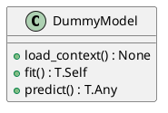
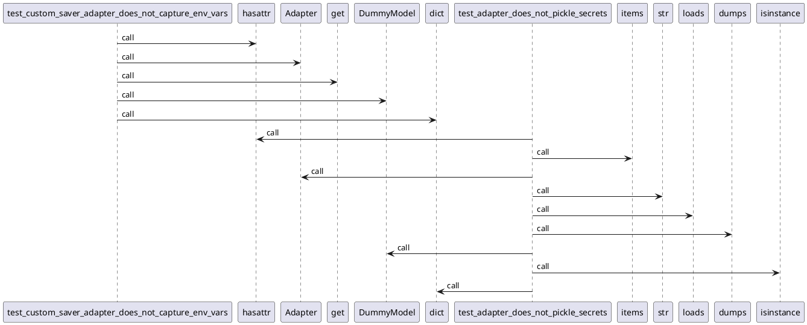
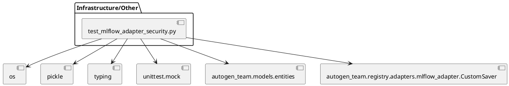
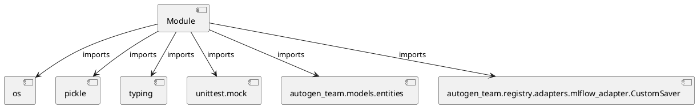
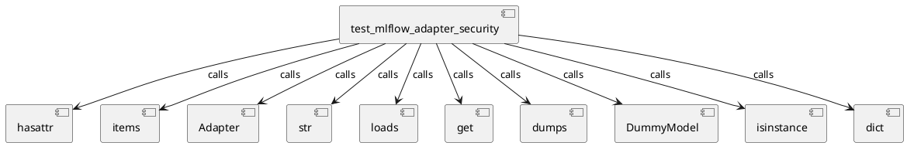

# Module Specification: test_mlflow_adapter_security

* **Source Reference:** `tests/registry/adapters/test_mlflow_adapter_security.py`

## 1. Architectural Role & Responsibilities
**Purpose:**
Provides functionality related to test mlflow adapter security.

**Architecture Layer:**
- Infrastructure/Other

**Responsibilities:**
- Manages operations and logic for test mlflow adapter security.

**Main Workflow:**
- Executes the primary flow defined by test mlflow adapter security functions and classes.

## 2. Dependencies
**Imports:**
- `os`
- `pickle`
- `typing`
- `unittest.mock`
- `autogen_team.models.entities`
- `autogen_team.registry.adapters.mlflow_adapter.CustomSaver`

**Exported Classes:**
- `DummyModel`

**Exported Functions:**
- `test_custom_saver_adapter_does_not_capture_env_vars`
- `test_adapter_does_not_pickle_secrets`

**Exported Interfaces:**
- Not explicitly defined.

**Public API:**
- Not explicitly defined.

## 3. Architecture & Execution
### Internal Architecture
Not explicitly defined.

### Execution Flow
Not explicitly defined.

### Sequence Explanation
Not explicitly defined.

### Examples
Not explicitly defined.

## 4. UML 2.0 Diagrams
### Class Diagram

```plantuml
@startuml
    class DummyModel {
        +load_context() : None
        +fit() : T.Self
        +predict() : T.Any
    }
@enduml
```

### Sequence Diagram

```plantuml
@startuml
    test_custom_saver_adapter_does_not_capture_env_vars -> hasattr : call
    test_custom_saver_adapter_does_not_capture_env_vars -> Adapter : call
    test_custom_saver_adapter_does_not_capture_env_vars -> get : call
    test_custom_saver_adapter_does_not_capture_env_vars -> DummyModel : call
    test_custom_saver_adapter_does_not_capture_env_vars -> dict : call
    test_adapter_does_not_pickle_secrets -> hasattr : call
    test_adapter_does_not_pickle_secrets -> items : call
    test_adapter_does_not_pickle_secrets -> Adapter : call
    test_adapter_does_not_pickle_secrets -> str : call
    test_adapter_does_not_pickle_secrets -> loads : call
    test_adapter_does_not_pickle_secrets -> dumps : call
    test_adapter_does_not_pickle_secrets -> DummyModel : call
    test_adapter_does_not_pickle_secrets -> isinstance : call
    test_adapter_does_not_pickle_secrets -> dict : call
@enduml
```

### Component Diagram

```plantuml
@startuml
    package "Infrastructure/Other" {
        [test_mlflow_adapter_security.py]
    }
    [test_mlflow_adapter_security.py] --> [os]
    [test_mlflow_adapter_security.py] --> [pickle]
    [test_mlflow_adapter_security.py] --> [typing]
    [test_mlflow_adapter_security.py] --> [unittest.mock]
    [test_mlflow_adapter_security.py] --> [autogen_team.models.entities]
    [test_mlflow_adapter_security.py] --> [autogen_team.registry.adapters.mlflow_adapter.CustomSaver]
@enduml
```

### Dependency Graph

```plantuml
@startuml
    [Module] --> [os] : imports
    [Module] --> [pickle] : imports
    [Module] --> [typing] : imports
    [Module] --> [unittest.mock] : imports
    [Module] --> [autogen_team.models.entities] : imports
    [Module] --> [autogen_team.registry.adapters.mlflow_adapter.CustomSaver] : imports
@enduml
```

## 5. Class & Method Specifications
### `DummyModel` ([`tests/registry/adapters/test_mlflow_adapter_security.py`](/tests/registry/adapters/test_mlflow_adapter_security.py))
#### Overview
Provides state and behavior management for DummyModel.

#### Attributes
- None found.

#### Methods
##### `load_context(self, model_config: dict[str, T.Any]) -> None` (Public)
**Description:** Executes the load context operation.

**Inputs:**
- `model_config`
  - type: dict[str, T.Any]
  - meaning: Represents the model config parameter.
  - valid values: Any valid dict[str, T.Any].
  - optional?: False
  - default value: None

**Output:**
- return type: `None`
- semantic meaning: Returns the result of load context.
- possible null values: Yes, if None allows it.
- exceptions: Standard execution exceptions.

**Side Effects:**
- Database updates: Not explicitly defined.
- File operations: Not explicitly defined.
- Network calls: Not explicitly defined.
- Cache: Not explicitly defined.
- State changes: Not explicitly defined.

**Complexity:**
- Time Complexity: Not explicitly defined.
- Space Complexity: Not explicitly defined.

**Example:**
```python
result = DummyModel.load_context(...)
```

##### `fit(self, inputs: T.Any, targets: T.Any) -> T.Self` (Public)
**Description:** Executes the fit operation.

**Inputs:**
- `inputs`
  - type: T.Any
  - meaning: Represents the inputs parameter.
  - valid values: Any valid T.Any.
  - optional?: False
  - default value: None
- `targets`
  - type: T.Any
  - meaning: Represents the targets parameter.
  - valid values: Any valid T.Any.
  - optional?: False
  - default value: None

**Output:**
- return type: `T.Self`
- semantic meaning: Returns the result of fit.
- possible null values: Yes, if T.Self allows it.
- exceptions: Standard execution exceptions.

**Side Effects:**
- Database updates: Not explicitly defined.
- File operations: Not explicitly defined.
- Network calls: Not explicitly defined.
- Cache: Not explicitly defined.
- State changes: Not explicitly defined.

**Complexity:**
- Time Complexity: Not explicitly defined.
- Space Complexity: Not explicitly defined.

**Example:**
```python
result = DummyModel.fit(..., ...)
```

##### `predict(self, inputs: T.Any) -> T.Any` (Public)
**Description:** Executes the predict operation.

**Inputs:**
- `inputs`
  - type: T.Any
  - meaning: Represents the inputs parameter.
  - valid values: Any valid T.Any.
  - optional?: False
  - default value: None

**Output:**
- return type: `T.Any`
- semantic meaning: Returns the result of predict.
- possible null values: Yes, if T.Any allows it.
- exceptions: Standard execution exceptions.

**Side Effects:**
- Database updates: Not explicitly defined.
- File operations: Not explicitly defined.
- Network calls: Not explicitly defined.
- Cache: Not explicitly defined.
- State changes: Not explicitly defined.

**Complexity:**
- Time Complexity: Not explicitly defined.
- Space Complexity: Not explicitly defined.

**Example:**
```python
result = DummyModel.predict(...)
```

## 6. Module Functions
### `test_custom_saver_adapter_does_not_capture_env_vars()`
Test that CustomSaver.Adapter does not capture LITELLM_API_KEY from env.

**Inputs:**
- None

**Output:**
- return type: `None`
- semantic meaning: Returns the result of test custom saver adapter does not capture env vars.
- possible null values: Yes, if None allows it.
- exceptions: Standard execution exceptions.

**Side Effects:**
- Database updates: Not explicitly defined.
- File operations: Not explicitly defined.
- Network calls: Not explicitly defined.
- Cache: Not explicitly defined.
- State changes: Not explicitly defined.

### `test_adapter_does_not_pickle_secrets()`
Test that the adapter does not pickle secrets into the model artifact.

**Inputs:**
- None

**Output:**
- return type: `None`
- semantic meaning: Returns the result of test adapter does not pickle secrets.
- possible null values: Yes, if None allows it.
- exceptions: Standard execution exceptions.

**Side Effects:**
- Database updates: Not explicitly defined.
- File operations: Not explicitly defined.
- Network calls: Not explicitly defined.
- Cache: Not explicitly defined.
- State changes: Not explicitly defined.

## 7. Call Graph

```plantuml
@startuml
[test_mlflow_adapter_security] --> [hasattr] : calls
[test_mlflow_adapter_security] --> [items] : calls
[test_mlflow_adapter_security] --> [Adapter] : calls
[test_mlflow_adapter_security] --> [str] : calls
[test_mlflow_adapter_security] --> [loads] : calls
[test_mlflow_adapter_security] --> [get] : calls
[test_mlflow_adapter_security] --> [dumps] : calls
[test_mlflow_adapter_security] --> [DummyModel] : calls
[test_mlflow_adapter_security] --> [isinstance] : calls
[test_mlflow_adapter_security] --> [dict] : calls
@enduml
```

## 8. Cross References
- **Parent module:** None
- **Child modules:** None
- **Dependencies:** `unittest.mock`, `os`, `typing`, `autogen_team.registry.adapters.mlflow_adapter.CustomSaver`, `autogen_team.models.entities`, `pickle`
- **Used by:** test_security_mlflow_adapter.md
- **Calls:** hasattr, items, Adapter, str, loads, get, dumps, DummyModel, isinstance, dict
- **Called from:** None
- **Related classes:** [Classes](../../../../classes/index.md)
- **Related interfaces:** Not explicitly defined.
- **Related diagrams:** [Diagrams](../../../../diagrams/index.md)
