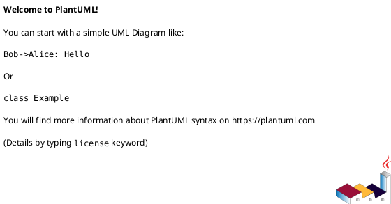
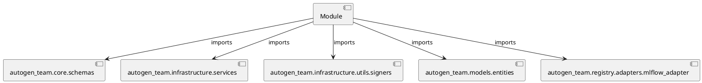

# Module Specification: test_registries

* **Source Reference:** `tests/registry/adapters/test_registries.py`

## 1. Architectural Role & Responsibilities
**Purpose:**
Provides functionality related to test registries.

**Architecture Layer:**
- Infrastructure/Other

**Responsibilities:**
- Not explicitly defined.

**Main Workflow:**
- Not explicitly defined.

## 2. Dependencies
**Imports:**
- `autogen_team.core.schemas`
- `autogen_team.infrastructure.services`
- `autogen_team.infrastructure.utils.signers`
- `autogen_team.models.entities`
- `autogen_team.registry.adapters.mlflow_adapter`

**Exported Classes:**
- None

**Exported Functions:**
- `test_uri_for_model_alias`
- `test_uri_for_model_version`
- `test_uri_for_model_alias_or_version`
- `test_custom_pipeline`

## 3. Architecture & Execution
### Internal Architecture
Not explicitly defined.

### Execution Flow
Not explicitly defined.

### Sequence Explanation
Not explicitly defined.

## 4. UML 2.0 Diagrams
### Class Diagram

### Dependency Graph

## 5. Class & Method Specifications
## 6. Module Functions
### `test_uri_for_model_alias()`
No description provided.

**Inputs:**
- None

**Output:**
- Return Type: `None`

### `test_uri_for_model_version()`
No description provided.

**Inputs:**
- None

**Output:**
- Return Type: `None`

### `test_uri_for_model_alias_or_version()`
No description provided.

**Inputs:**
- None

**Output:**
- Return Type: `None`

### `test_custom_pipeline(model: models.Model, inputs: schemas.Inputs, signature: signers.Signature, mlflow_service: services.MlflowService)`
No description provided.

**Inputs:**
- `model`: models.Model
- `inputs`: schemas.Inputs
- `signature`: signers.Signature
- `mlflow_service`: services.MlflowService

**Output:**
- Return Type: `None`
