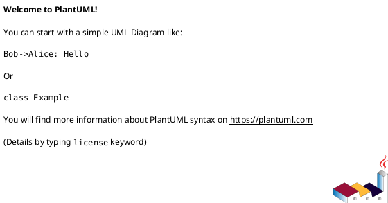
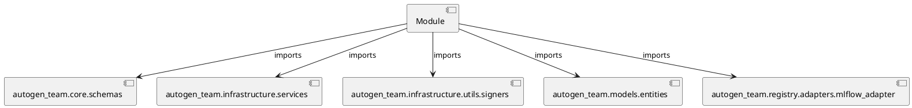

# Module Specification: test_registries

* **Source Reference:** `tests/registry/adapters/test_registries.py`

## 1. Architectural Role & Responsibilities
**Purpose:**
Provides functionality related to test registries.

**Architecture Layer:**
- Infrastructure/Other

**Responsibilities:**
- Manage and execute operations for test_registries.

**Main Workflow:**
- Initialize components and process requests for test_registries.

## 2. Dependencies
**Imports:**
- `autogen_team.core.schemas`
- `autogen_team.infrastructure.services`
- `autogen_team.infrastructure.utils.signers`
- `autogen_team.models.entities`
- `autogen_team.registry.adapters.mlflow_adapter`

**Exported Classes:**
- None

**Exported Functions:**
- `test_uri_for_model_alias`
- `test_uri_for_model_version`
- `test_uri_for_model_alias_or_version`
- `test_custom_pipeline`

## 3. Architecture & Execution
### Internal Architecture
Follows standard modular design, encapsulating state and behavior within defined classes and functions.

### Execution Flow
Sequential execution of defined functions and class methods.

### Sequence Explanation
Clients instantiate classes or call functions, which execute business logic and return results.

## 4. UML 2.0 Diagrams
### Class Diagram

### Dependency Graph

## 5. Class & Method Specifications
## 6. Module Functions
### `test_uri_for_model_alias()`
Executes the test_uri_for_model_alias operation.

**Inputs:**
- None

**Output:**
- Return Type: `None`

### `test_uri_for_model_version()`
Executes the test_uri_for_model_version operation.

**Inputs:**
- None

**Output:**
- Return Type: `None`

### `test_uri_for_model_alias_or_version()`
Executes the test_uri_for_model_alias_or_version operation.

**Inputs:**
- None

**Output:**
- Return Type: `None`

### `test_custom_pipeline(model: Any, inputs: Any, signature: Any, mlflow_service: Any)`
Executes the test_custom_pipeline operation.

**Inputs:**
- `model`: Any
- `inputs`: Any
- `signature`: Any
- `mlflow_service`: Any

**Output:**
- Return Type: `None`
